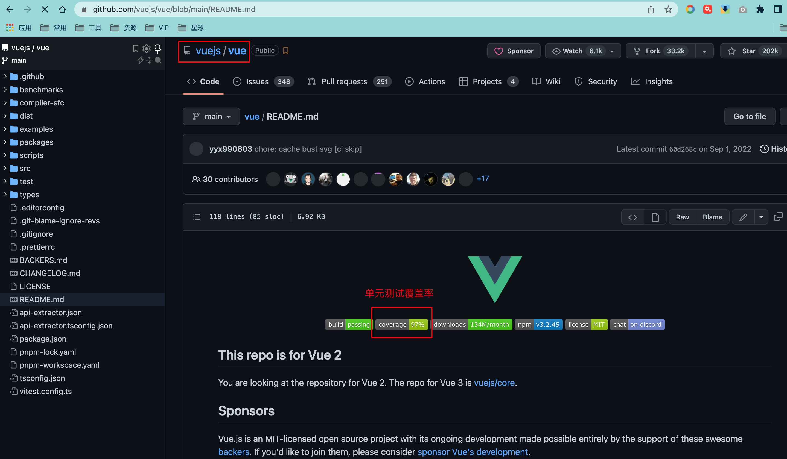
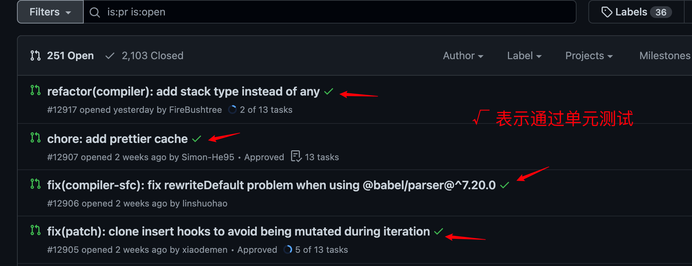
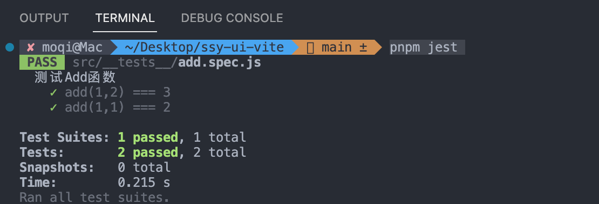
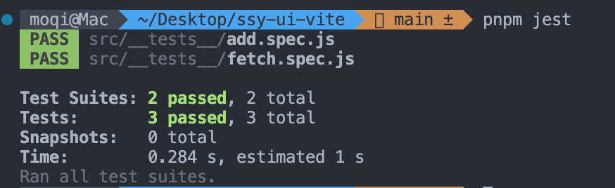
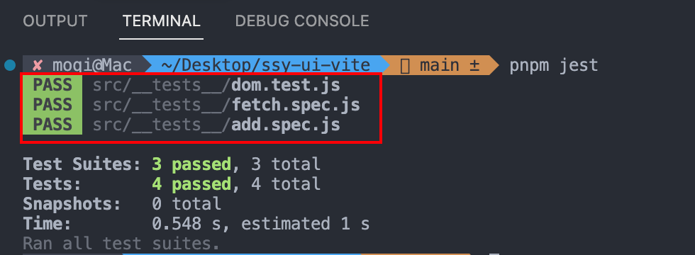

单元测试是软件质量的重要保证。在 Github 上查看一个软件，单元测试覆盖率是评价软件成熟度的一个重要指标。通常成熟可靠的开源产品都有完善的单元测试，并且覆盖率可以达到 80% 以上。



单元测试之所以这么重要，有以下三方面原因：

- 可以保证并且展示开发质量；
- 提高重构的信心；
- 是团队合作的基石；

**保证并且展示开发质量**，这点不必多说，没有人希望使用一个有大坑的项目。如果想要你的项目更加受欢迎，单元测试是必需的，并且要尽量提高覆盖率。不过，有的时候过度追求 100% 覆盖也会带来过多的开发成本。所以没必要一定要在初期过度提高覆盖率。

单元测试，很重要的一点是**提高重构的信心**。假设尤大神在编写 Vue 的时候，突然发现 dom diff 中可以用一种全新的算法来提高执行效率，但是他无法判断这种新的算法是否会对 Vue 的整体功能带来意想不到的 Bug，这个时候就该单元测试大显神威了。

由于单元测试是一套代码，可以自动判断程序的执行效果。他只需要在修改代码后重新运行单元测试，就可以分析出这个新特性的引入是否会对 Vue 整体带来影响。也正因为有了单元测试，我们不必过多考虑重构后的代码退化问题，增强重构信心。

开源社区中，团队合作面临很高的不确定性，因为没有当面的沟通，任何人都可能给你的项目提交贡献代码。单靠人工来判断每一个 PR 的代码质量是不可能的，这也需要单元测试来帮忙。

一般项目都会配置 CI 脚本，当有人提出 PullRequest 的时候，CI 服务都会自动运行单元测试来确定这次修改是否会对原来的代码功能造成影响。

下面这张图截取自 Vue 项目的 PR 列表，绿色的对钩就是表示通过的单元测试。这样代码的所有者只需要判断这个提交是否有意义就可以了，无需过多考虑对以前代码的影响。



关于如何在 CI 中配置自动运行单元测试，会在后续的章节中介绍。本节主要介绍单元测试的基础部分，目的是学会**如何使用 Jest 来进行前端项目的测试**，为后面的实战做好准备。

## User Story

使用 Jest 完成对一个前端页面的测试。

## 任务分解(Task)

- 搭建 Jest 环境
- 编写一个 Jest 函数 ;
- 引入 DOM 仿真，完成一个前端网页测试。

## 任务实现

Jest 是 Facebook 开发的 Javascript 测试框架，用于创建、运行和编写测试的 JavaScript 库。

Jest 作为 NPM 包发布，可以安装并运行在任何 JavaScript 项目中。

Jest 是目前前端最流行的测试库之一。

目前 Jest 是最为流行的前端测试框架。Vue、React 、Element 都是采用 Jest 框架。

### 测试 JS 函数

使用 Jest 进行单元测试，只需要在全局安装 jest 就可以了。

```bash
npm i jest -g
```

接下来尝试测试一个最基本的加法函数 。

src 根目录新建 add.js

```javascript
const add = (a, b) => a + b;
module.exports = add;
```

测试的目的就是确定这个加法函数确实可以正确返回结果：

```javascript
1 + 2 =3；

1 + 1 = 1；
```

接下来编写加法程序的测试用例。

新建 src/ **tests**/add.spec.js

```javascript
const add = require("../add");

describe("测试Add函数", () => {
  test("add(1,2) === 3", () => {
    expect(add(1, 2)).toBe(3);
  });
  test("add(1,1) === 2", () => {
    expect(add(1, 1)).toBe(2);
  });
});
```

- 根据 jest 的约定：

- 功能函数对应的测试函数放在当前目录的**tests**目录中；
- 测试的函数的文件名是 fun.spec.js。 比如 add.js => add.spec.js

- 建立一个 describe 测试分组， 在第一个参数中填写测试内容 “测试 Add 函数”
- 编写测试代码 test 函数：

- 每一个测试 test 函数是一个测试 case， 测试 Case 的第一个参数是测试内容

- 比如：add(1,2) === 3

- 使用 expect（运行结果）.toBe（期望结果）的形式编写断言

- 如果断言正确就代表测试通过 ，如果错误代表不通过

接下来在项目根目录执行 `pnpm jest`命令运行测试，Jest 会自动运行本软件包下的所有测试用例。



### 用 Mock 模拟无法执行的函数

如果被测试的代码调用了一个网络请求 API ，比如 Axios，但是那个网络地址并不存在或者没有联网，这个时候应该如何测试呢？

新建 src/fetch.js

```javascript
const axios = require("axios");
exports.getData = () => axios.get("/abc/bcd");
```

此时应该模拟一个 Axios 对象结果进行测试，这本身也符合单元测试的原则。

单元测试是针对开发的最小单位展开的测试，通常是函数。遇到函数调用函数的情况，比如 A 函数调用 B 函数，测试的主体是 A 函数，B 函数应该与测试无关，应该孤立 B 函数来测试 A 函数。

对于上面的 getData 函数来讲，调用了 axios.get 函数，应该模拟一个 axios.get 函数来替换掉原有的 axios.get 函数。模拟的 axios.get 函数不会调用网络请求，只具有根据输入返回相应结果的功能。这个就是**Mock 函数**。

**单元测试的任务是验证 getData 函数的功能是否正确，而不是 axios.get 函数或者网络接口是否正确。**

接下来我们实际操作一下。

首先使用 jest.mock 创建一个 Axios 的 mock 对象，实际上就是创建了一个虚拟的 axios 函数替换原函数。然后通过 mockResolvedValue 定义调用 axios.get 函数的返回值，这个时候再调用 getData() 方法的时候 ，函数内部的 axios.get 是虚拟 mock 函数。调用时不会发生真正的网络请求，只会返回预定的结果。

新建 src/**tests**/fetch.spec.js

```javascript
const { getData } = require("../fetch");
const axios = require("axios");
jest.mock("axios");
it("fetch", async () => {
  // 模拟第一次接收到的数据
  axios.get.mockResolvedValueOnce("123");
  // 模拟每一次接收到的数据
  axios.get.mockResolvedValue("456");
  const data1 = await getData();
  const data2 = await getData();
  expect(data1).toBe("123");
  expect(data2).toBe("456");
});
```

因为使用到了 axios，所以先安装 axios

```bash
pnpm i axios
```

再次运行 Jest，两个测试均通过了。



**Mock 函数的作用，就是为了有效孤立函数，实现真正的单元测试。**

### 测试前端页面

上面讲的都是测试一个纯 JS 函数，下面讲讲如何测试前端程序。

前端程序和纯 JS 的区别在于运行时不同。前端程序运行于浏览器端，会直接调用 DOM 对象，但是 Node 中并没有 DOM 模型。

- 解决的办法有两个 ：

- 将测试用例放到浏览器中运行；
- 用 dom 仿真模拟一个 dom 对象；

最佳的选择是后者，因为测试程序会放到不同的环境中执行，我们不可能要求 CI 服务器中也有浏览器，而且放入浏览器再执行，效率也是一个大问题。

**模拟一个 DOM 对象需要用到 DOM 仿真**，常见的有 jsdom、happydom 等。

先安装 jsdom

```bash
pnpm i jsdom -D
```

src 下新建 jsdom-config.js，用于在 jest 中引入 jsdom

```javascript
const jsdom = require("jsdom"); // eslint-disable-line
const { JSDOM } = jsdom;

const dom = new JSDOM("<!DOCTYPE html><head/><body></body>", {
  url: "http://localhost/",
  referrer: "https://example.com/",
  contentType: "text/html",
  userAgent: "Mellblomenator/9000",
  includeNodeLocations: true,
  storageQuota: 10000000,
});
global.window = dom.window;
global.document = window.document;
global.navigator = window.navigator;
```

src 下新建一个被测试函数 dom.js ，在该函数中创建一个 div 元素。

```javascript
exports.generateDiv = () => {
  const div = document.createElement("div");
  div.className = "c1";
  document.body.appendChild(div);
};
```

在测试程序中，被测试函数创建了一个 div 元素，接着就可以在 DOM 仿真中获取 div 元素了，也可以用断言来判断代码功能是否正常。

新建 src/**tests**/dom.test.js 测试程序

```javascript
const { generateDiv } = require("../dom");
require("../jsdom-config");
describe("Dom测试", () => {
  test("测试dom操作", () => {
    generateDiv();
    expect(document.getElementsByClassName("c1").length).toBe(1);
  });
});
```

再次运行测试，全部通过



这就是 DOM 测试，前端常用的 Vue 、React 程序也都可以使用这样的方法进行测试。

## 复盘

本节主要讲了单元测试的基础知识。组件库测试是单元测试的一个应用场景，了解单元测试的基础内容才能顺利的完成组件库的测试。

本节包含了单元测试的所有的基础概念，比如断言、分组、Mock 等内容，最后还介绍了前端单元测试的必备条件 —— DOM 仿真测试。

最后留一些思考题：

- 断言、分组都是什么？
- Mock 函数的使用场景是什么？
- 如何使用 DOM 仿真进行前端测试？
