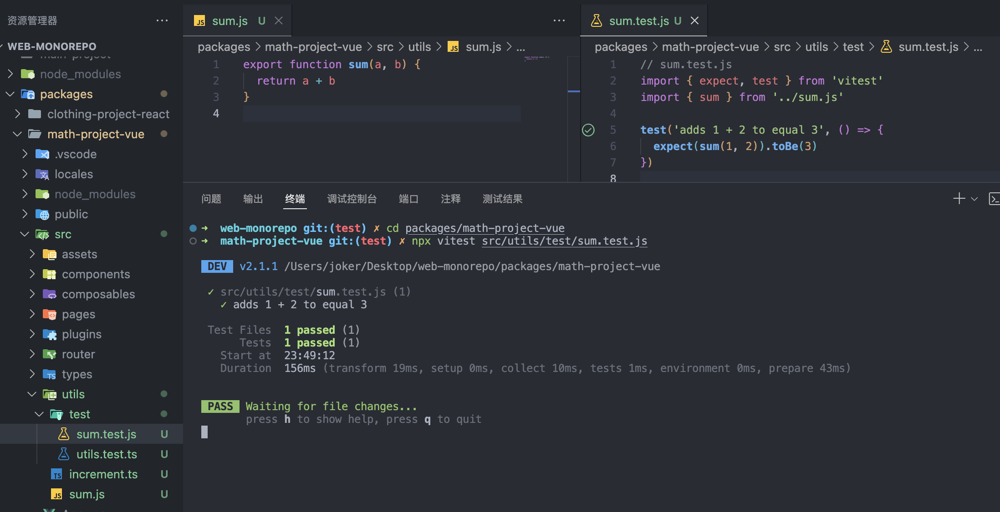

> [!WARNING]
>
> - 本文主要关注 Vite+Vue 项目的测试，使用的测试框架是 [Vitest](https://cn.vitest.dev/) (一个原生支持 Vite 的测试框架)
> - Vitest 需要 Vite >=v5.0.0 和 Node >=v18.0.0
> - 如果你是首次接触前端单元测试，那么先去了解下在测试框架领域占据了主导地位的 `Jest` 吧。
>   - [使用 Jest 进行前端单元测试](/blog/使用Jest进行前端单元测试.md)
> - 如果已用过单元测试框架，那么可以了解下 [Vitest 与其他测试框架对比](https://cn.vitest.dev/guide/comparisons)

::: tip 前端单元测试
[为什么需要测试](https://cn.vuejs.org/guide/scaling-up/testing)

自动化测试能够预防无意引入的 bug，并鼓励开发者将应用分解为可测试、可维护的函数、模块、类和组件。这能够帮助你和你的团队更快速、自信地构建复杂的应用。你的应用可能会以多种方式崩溃，因此，在发布前发现并解决这些问题就变得十分重要。
:::

> [vant ui](https://vant-ui.github.io/vant/#/zh-CN) 在首页的特性介绍里就明确说明了该组件库的 `单元测试覆盖率超过 90%，提供稳定性保障`，我们在学习单元测试的时候，也可以通过该组件库了解规范写法。

### 测试的类型 ​

当设计你的 Vue 应用的测试策略时，你应该利用以下几种测试类型：

- `单元测试`：检查给定函数、类或组合式函数的输入是否产生预期的输出或副作用。
- `组件测试`：检查你的组件是否正常挂载和渲染、是否可以与之互动，以及表现是否符合预期。这些测试比单元测试导入了更多的代码，更复杂，需要更多时间来执行。
- `端到端测试`：检查跨越多个页面的功能，并对生产构建的 Vue 应用进行实际的网络请求。这些测试通常涉及到建立一个数据库或其他后端。

每种测试类型在你的应用的测试策略中都发挥着作用，保护你免受不同类型的问题的影响。

## Quick Start

1. 安装 Vitest

   ```bash
   pnpm add -D vitest
   ```

2. 设置 eslint

   官方文档的示例里用的是 `test`关键字，而之前章节里配置的 antfu 的 eslint 规则会强制将其转换成`it`关键字，这两个的作用是一样的，但为了避免初学者造成误解，可以在 eslint 里修改规则。

   ```json
   {
     "test/consistent-test-it": ["error", { "withinDescribe": "test" }]
   }
   ```

3. 按照 Vitest 文档[编写测试](https://cn.vitest.dev/guide/#编写测试)，效果如下图：

   

   Vitest 也提供了一个[VSCode 插件](https://cn.vitest.dev/guide/ide.html)，可以方便定位那些地方写了测试方法，可一键启动测试，但我自己使用下来的体验一般，有缓存 bug，经常要手动刷新，不如直接运行命令稳定。

## Vue 应用测试

安装[@vue/test-utils](https://test-utils.vuejs.org/)

```bash
pnpm add --save-dev @vue/test-utils
```

配置 vite.config

```ts{1,6}
/// <reference types="vitest/config" />
import { defineConfig } from "vite";

export default defineConfig({
  test: {
    environment: "jsdom",
  },
});
```

### 测试组合式函数

::: code-tabs
@tab counter.ts

```ts
import { ref } from "vue";

export function useCounter(initial: number = 0) {
  const count = ref(initial);
  const inc = () => count.value++;
  const dec = () => count.value--;

  return {
    count,
    inc,
    dec,
  };
}
```

@tab counter.test.ts

```ts
import { expect, test } from "vitest";
import { useCounter } from "../counter";

test("useCounter", () => {
  const { count, inc, dec } = useCounter();
  expect(count.value).toBe(0);
  inc();
  expect(count.value).toBe(1);
  dec();
  expect(count.value).toBe(0);
});
```

:::

### 测试组件

::: code-tabs
@tab TheCounter.vue

```vue
<script setup lang="ts">
import { useCounter } from "@/composables/counter";

const props = defineProps<{
  initial: number;
}>();

const { count, inc, dec } = useCounter(props.initial);
</script>

<template>
  <div>
    {{ count }}
    <button class="inc" @click="inc()">+</button>
    <button class="dec" @click="dec()">-</button>
  </div>
</template>
```

@tab TheCounter.test.ts

```ts
import { mount } from "@vue/test-utils";
import { describe, expect, test } from "vitest";
import TheCounter from "../TheCounter.vue";

describe("component TheCounter.vue", () => {
  test("should render", () => {
    const wrapper = mount(TheCounter, { props: { initial: 10 } });
    expect(wrapper.text()).toContain("10");
    // 期望：快照 https://vitest.vuejs.ac.cn/api/expect#tomatchsnapshot
    expect(wrapper.html()).toMatchSnapshot();
  });

  test("should be interactive", async () => {
    const wrapper = mount(TheCounter, { props: { initial: 0 } });
    expect(wrapper.text()).toContain("0");

    // 存在具有特定css类的元素
    expect(wrapper.find(".inc").exists()).toBe(true);
    expect(wrapper.find(".dec").exists()).toBe(true);

    await wrapper.get(".inc").trigger("click");

    expect(wrapper.text()).toContain("1");

    await wrapper.get(".dec").trigger("click");

    expect(wrapper.text()).toContain("0");
  });
});
```

:::

### 测试 Provide/inject

这部分自己查看 vue 官方示例吧

- [Vue.js:测试组合式函数](https://cn.vuejs.org/guide/scaling-up/testing#testing-composables)
