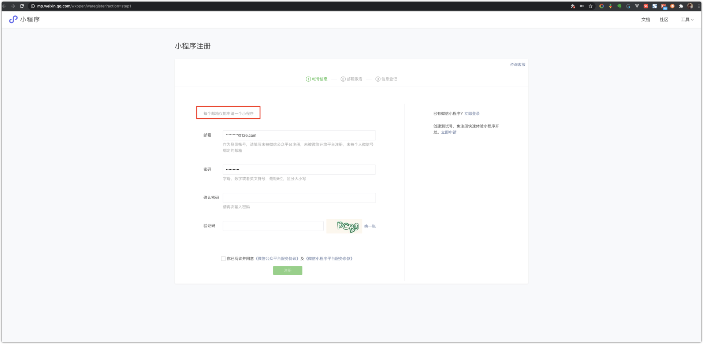
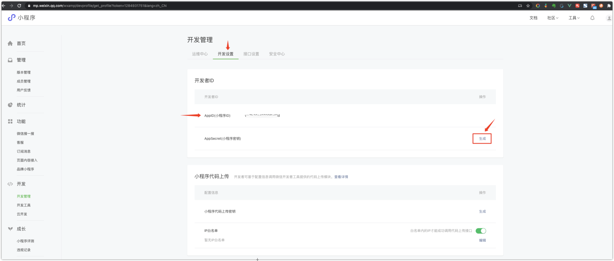
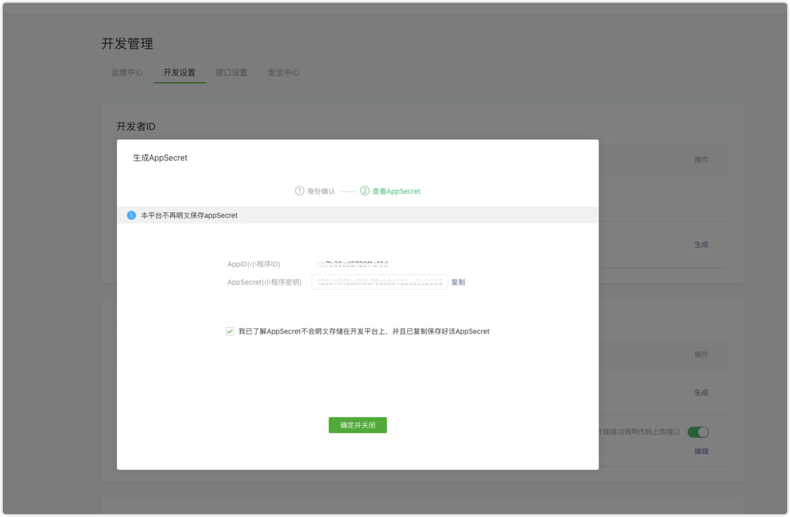
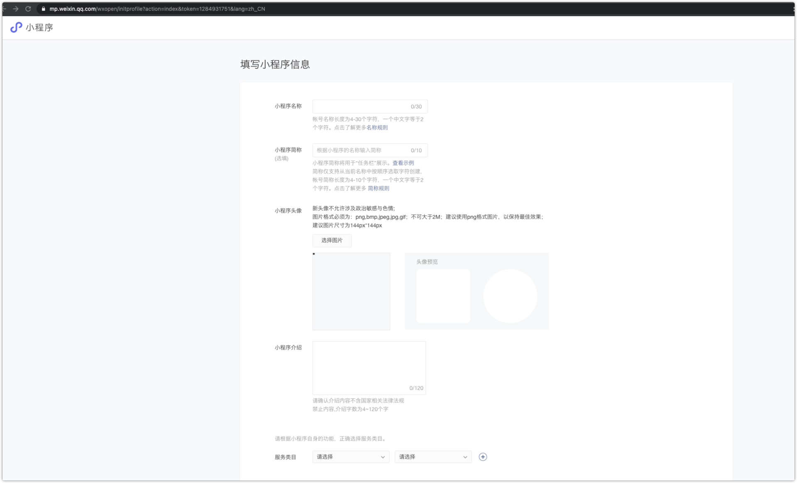
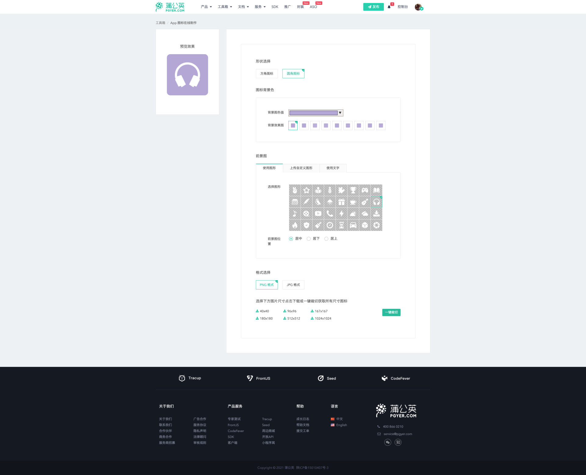
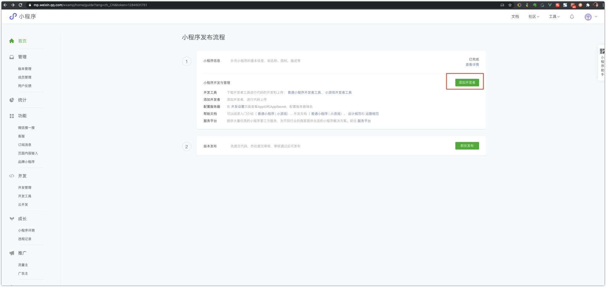
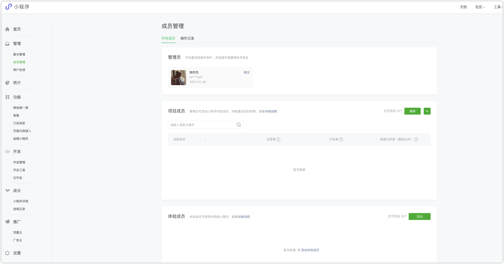
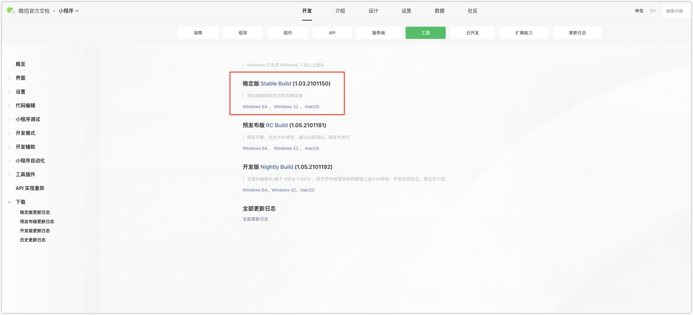

:::tip 小程序
2017 年左右，react 搞了个专利事件，让国内各大厂都自研前端框架阿里的 rax，京东 nerv，百度 san，去哪儿 anu，然后 react16 又改回了 MIT，此时，这些框架作者的框架，如果不想彻底死绝，就只有一个选择，那就是小程序。

所以百度基于 san 研发了自己的小程序框架， nerv 团队写了 taro，anu 也写了 nanachi，除了微信以外的小程序，都是国产前端框架的历史遗留而微信，其实它也是误打误撞，它最初也只是想搞个多 webview 框架，让 h5 更像原生一点直到很久很久以后，小程序的商业价值才日渐凸显，小程序也从技术框架变成了商业方案。
:::

接下来，从微信小程序开始，了解小程序的开发。

## 一、链接

| **名称**                                   | **链接**                                                                            |
| ------------------------------------------ | ----------------------------------------------------------------------------------- |
| 微信公众平台                               | https://mp.weixin.qq.com/                                                           |
| 微信官方文档                               | https://developers.weixin.qq.com/doc/                                               |
| 微信开发者工具（下载相应操作系统的稳定版） | https://developers.weixin.qq.com/miniprogram/dev/devtools/download.html             |
| 小程序开发文档                             | https://developers.weixin.qq.com/miniprogram/dev/framework/                         |
| 小程序微信云开发                           | https://developers.weixin.qq.com/miniprogram/dev/wxcloud/basis/getting-started.html |

## 二、准备

### 1. 小程序注册

[mp.weixin.qq.com/wxopen/waregister?action=step1](https://mp.weixin.qq.com/wxopen/waregister?action=step1)

按步骤操作申请即可

注册成功后，注意妥善保管好小程序的 AppID 和 AppSecret，点击链接

[https://mp.weixin.qq.com/wxamp/devprofile/get_profile](https://mp.weixin.qq.com/wxamp/devprofile/get_profile?token=1284931751&lang=zh_CN)

把 AppID 和 AppSecret 复制保存下来

然后去填写你的小程序信息

[https://mp.weixin.qq.com/wxopen/initprofile?action=index](https://mp.weixin.qq.com/wxopen/initprofile?action=index&token=1284931751&lang=zh_CN)

图标的话，简单点可以在蒲公英工具箱生成一个，如果自己会设计好看的 logo 最好。

https://www.pgyer.com/tools/appIcon

可以为自己的小程序添加开发者，可以添加项目成员、体验成员等

## 2. 微信开发者工具

- 下载相应操作系统的稳定版

https://developers.weixin.qq.com/miniprogram/dev/devtools/download.html

- 默认安装即可
  <!-- - 一定要多看官方文档！！！ -->
  <!-- - 完成如图所示和视频演示效果 -->

<!--  -->

<!-- 如果喜欢编辑器的深色模式，如图菜单选择即可 -->
