组件库在开发到一定阶段后需要进行版本发布，需要将版本提交到软件包仓库 Npm。对于版本发布，首先就需要确定版本编号。这里面就很有学问，比如 Vue 经历的三个大的版本，什么时候应该升级一个大的版本？大家常说的正式发布前的 alpha 版和 beta 版都是什么 ？

版本发布是将版本库中的代码进行编译打包，这个过程其实是一个 CD 持续交付过程。这个工具是如何使用工具完成的，答案都会在本章展开。

## 用户故事 (UserStory)

为组件库建立语义化版本，并且设置持续交付机制自动发布版本。

## 任务分解 (Task)

- 确定语义化版本；
- 设置持续交付过程 ;
- 引用自动发布徽章；

## 任务实现

### 使用语义化版本

由于软件的发行版本会不断更新，为了让用户可以用到确定功能的软件，必须制定一个版本号。最原始的版本号只需要使用自然递增就好了。比如 Ver1 ....Ver2， 但是软件都会有自己从不成熟到成熟再到转生的过程，只用一个自然递增的方法好像不太行，至少以下几个问题需要附加说明才能解决。

- 哪些是稳定的正式版本 ？
- 哪些是测试版，以及测试版本的完善程度如何 ？
- 哪些版本之间 API 已经出现了不兼容情况 ？
- 哪些版本只是修正了 Bug 放心升级就好 ？

假设所有的版本信息都需要附加说明，那就会变成这样：

- Ver 1： 测试版本；
- Ver 2： 预上线版本 ；
- Ver 3： 正式版本；
- Ver 4： 修复 Ver3 的 bug；
- Ver 5： 新 API 的测试版本，但是与 Ver 3、Ver4 有不兼容情况；
- Ver 6： Ver4 的后的 bug 修复版；
- Ver 7： Ver5 的正式版本，但是与 Ver3/4/6 都不兼容。

可见即使是有详细的说明，也会让整个版本混乱不堪，而且缺乏可读性。

为了解决这个问题，社区慢慢摸索出了语义化版本体系，目的就是让版本号中就包含了相邻版本间的底层代码和修改内容信息。

语义化版本最早是由 Gravatars 创办者兼 GitHub 共同创办者 Tom Preston-Werner 所建立的一个有关如何命名软件和库（包）版本的规范，用于解决在大型项目中对依赖的版本失去控制的问题（例如你可能因为害怕不兼容而不敢去更新**依赖**）。

现在 `Semantic Versioning` 已经在开源社区中得到了广泛的认同，Node.js 的包管理工具 npm 也完全基于 `Semantic Versioning` 来管理依赖的版本。

:::tip 语义化版本是这样规定的。

**版本格式** ：`主版本号.次版本号.修订号（MAJOR.MINOR.PATCH）`，版本号递增规则如下：

- 主版本号：当你做了不兼容的 API 修改；
- 次版本号：当你做了向下兼容的功能性新增；
- 修订号：当你做了向下兼容的问题修正。

:::

以 Vue 的版本为例 ：

- Vue 2.6.0
- Vue 2.7.0 - 新增 Composition API；
- Vue 2.7.1 - 修正 bug；
- Vue 3.0.0 - alpha - 新版本 Vue 的第一个预览版、与以前版本 API 不兼容；
- Vue 3.0.0 - alpha.2 - 第二个预览版；
- Vue 3.0.0 - beta - 测试版、也叫公开测试版；
- Vue 3.0.3 - RC - Release Condidate 已经具备正式上线条件的版本，也叫做上线候选版；
- Vue 3.0.0 - GA - General Availability 正式发布的版本；
- Vue 3.0.1 - 修正 bug。

这样就非常的清晰。

了解了语义化版本的知识，下面我们就可以按照社区通行的规则发布自己的版本了。

### 修改 Package 版本信息

发布一个版本首先要做的就是修改 package.json 上的版本信息。对于 npm 软件包管理器来讲， package 上的版本号就是唯一的版本标识。

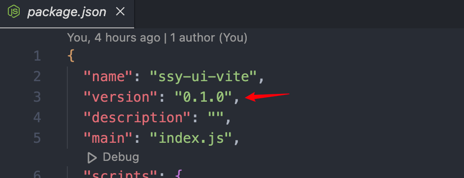

### 声明要发布的文件

通常只需要将打包后的 dist 文件夹发包就可以了，在 `package.json`里声明

```json
{
  "files": ["dist"]
}
```

### 设置 Git 版本库标签

Tag 是 git 版本库的一个标记， 指向某个 commit 的指针。

在 push 之前，给 git 打上一个 v.0.1.0 这样的版本标记 。

```bash
# 创建版本号对应的 git tag
git tag 0.1.0

# 将新的 git tag 推送到 github 上面
git push --tag
```

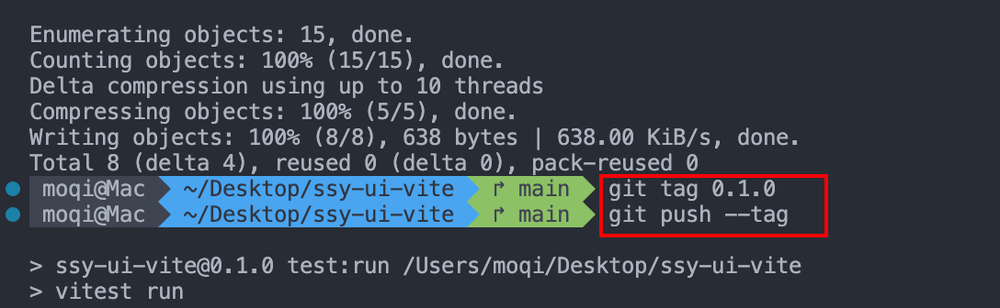

推送版本到 Github ，就可以在 Git 上面看到一个版本标记，而且可以提供此版本的 zip 打包下载。实际上这个也可以作为一种软件分发方式，只不过相对于使用 npm 包管理器，没有提供自动依赖安装。

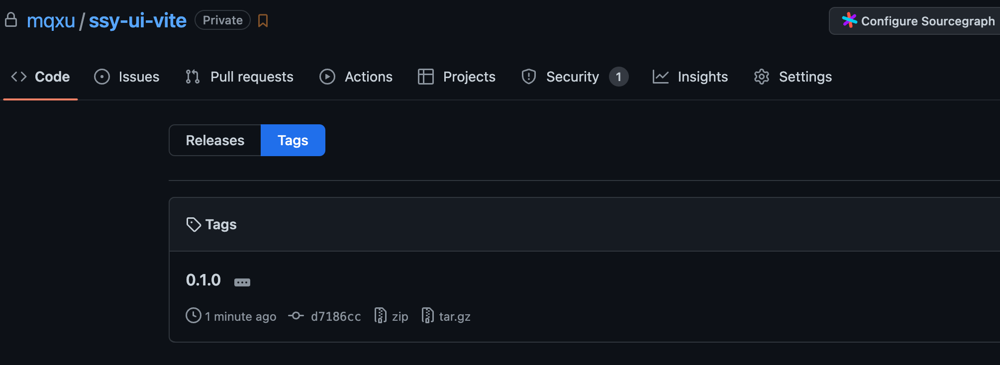

### 利用 Action 实现自动发布

下面就是发布的重头戏，推送软件包到 npm 仓库了。

传统的做法是使用命令实现。在项目的根目录下，运行` npm publish` 就可以实现。

还有一种方法就是利用 CI 工具实现，实际上这个过程叫做 CD 持续交付，对于组件库来讲，最终的交付就是推送到版本仓库中。

推送仓库的触发条件，肯定不是每次 push， 而是在有新的版本发布时，发布新版的动作可以通过判断 publish 提交的方法判定。具体做法为，首先单独划分一个 publish 分支，当发布版本时，就建立一个 pull request 到 publish 分支，当在 github 上 merge 分支时就触发发布流程。

首先，先划分 publish 分支。

```bash
git checkout -b publish-ssy-ui-vite
git push -u origin publish-ssy-ui-vite
```

发起 PR 并合并

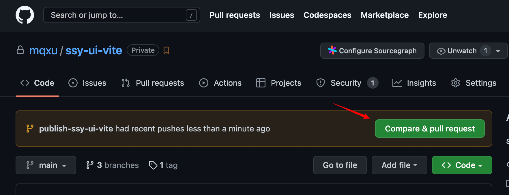

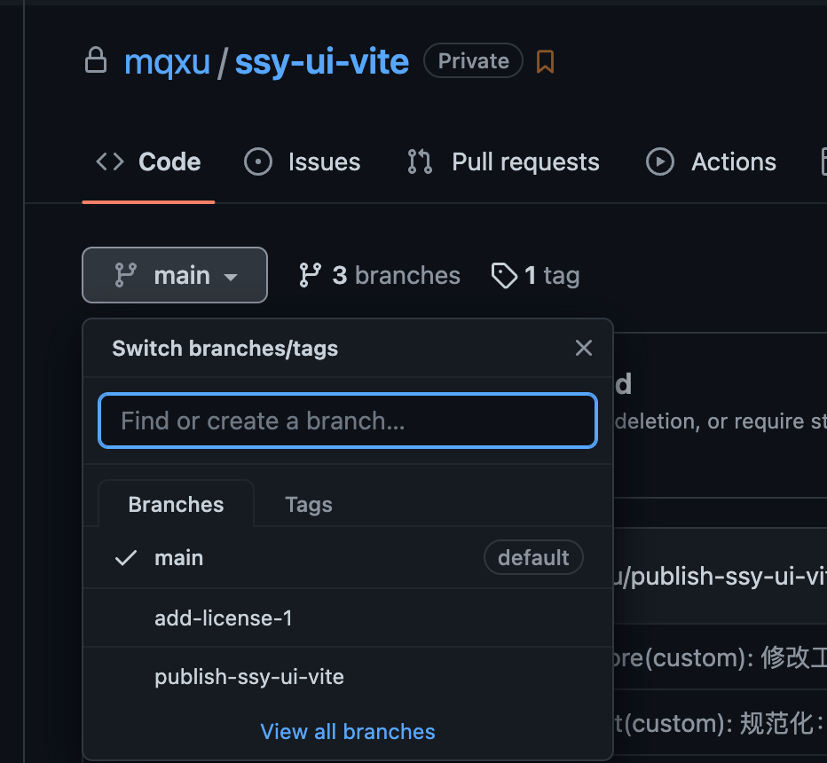

根据目前的 npm 规则，首次发布比较严格，需要识别验证码。在项目根目录下建立一个 `publish.sh` 文件。 这个 Shell 脚本的功能包括：

- 切换镜像仓库 （主要是由于国内默认是 taobao 这种第三方仓库、需要切换到原始库）
- 认证
- 发布
- 还原 Taobao 镜像仓库

先登陆 [npmjs.com](https://www.npmjs.com/)

添加以下内容到 `package.json`，设置公开发布（否则要收费）

> 发布前检查下你的包名（name）是否未被使用（去 npmjs.com 搜索）

```json
{
  // ...
  // 添加以下
  "publishConfig": {
    "access": "public",
    "registry": "https://registry.npmjs.org/"
  }
  // ...
}
```

然后编写 publish.sh 脚本：

```bash
#!/usr/bin/env bash
npm config get registry # 检查仓库镜像库
npm config set registry=https://registry.npmjs.org
echo '请进行 npm 登录操作：'
npm login # 登陆
echo "-------publishing-------"
npm publish # 发布
npm config set registry=https://registry.npmmirror.com # 设置为淘宝镜像
echo "发布完成"
exit
```

使用命令行工具执行

```bash
# 修改执行权限
chmod +x publish.sh
# 执行
./publish.sh
```

执行到登录的时候，跟着链接输入验证密码登录

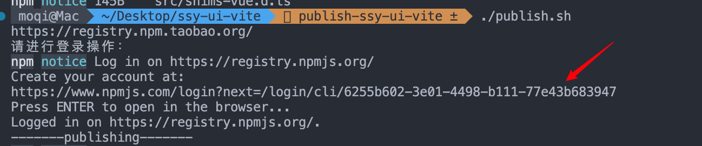

然后就可以成功发布：

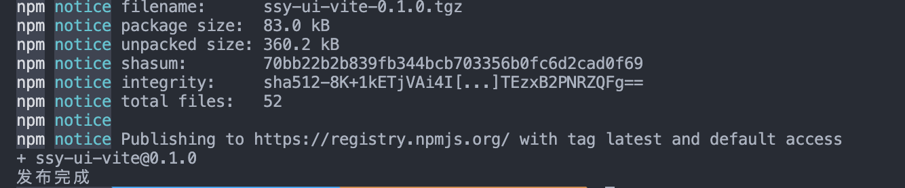

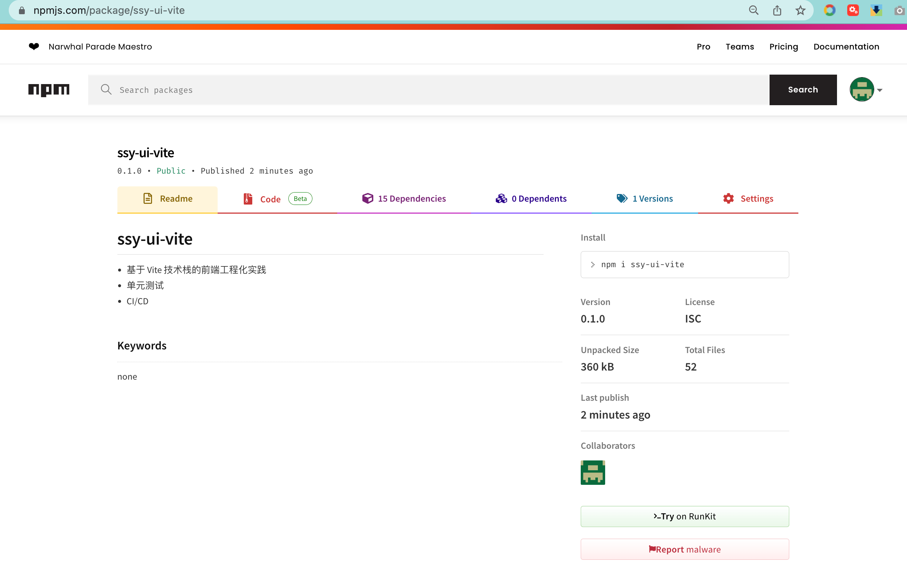

首次发布后，后面的更新就可以使用 CI 工具自动完成了。

编写一个 Action 脚本用于自动打包，并推送新的软件包到 npm。

Action 的方法和前面讲的持续集成类似，只是发布动作，可以使用一个现成的 publish 插件完成。

[npm-publish](https://jstools.dev/npm-publish/)

在需要提交 npm 库时需要认证，我们通过向 npm 申请 token 完成。

首先，在 npm 中的账户信息中生成一个新的 Token。

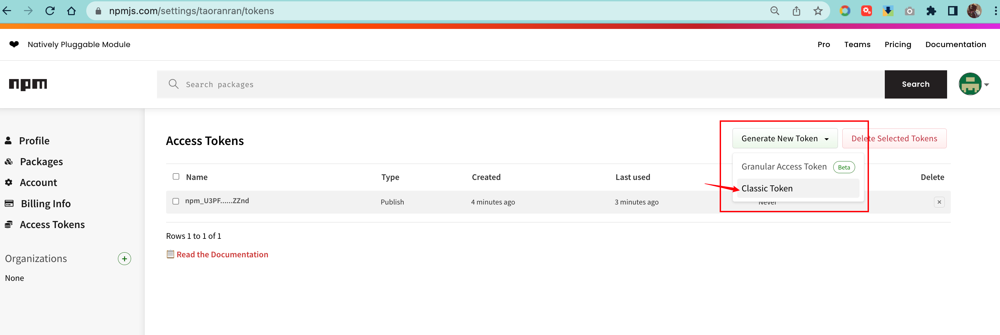

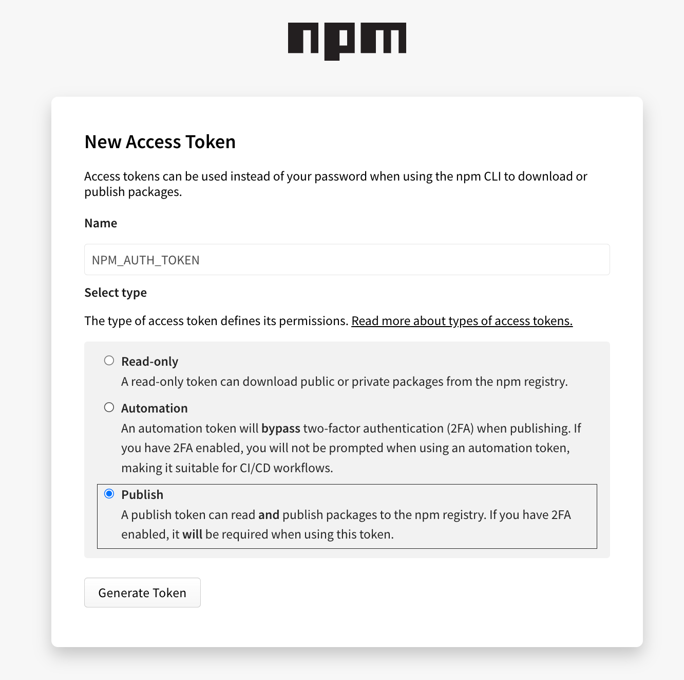

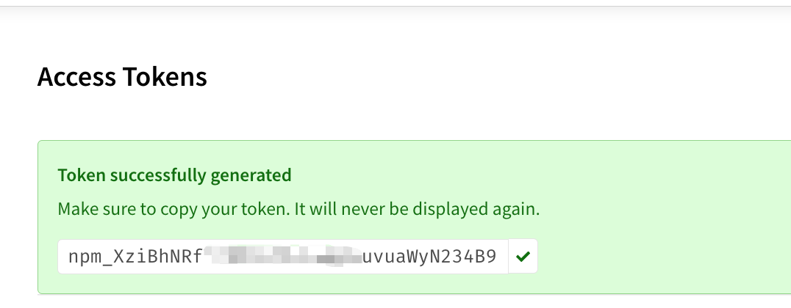

复制下来，备用。

这个 Token 相当于随意操作你自己 npm 库的授权，提交的时候需要用到。但是又不能放在 Action 代码中，因为代码是公开的，一旦公开了 Token，相当于任何人都可以操作你的 npm 库，解决的办法就是使用 Github Action Secret 功能。

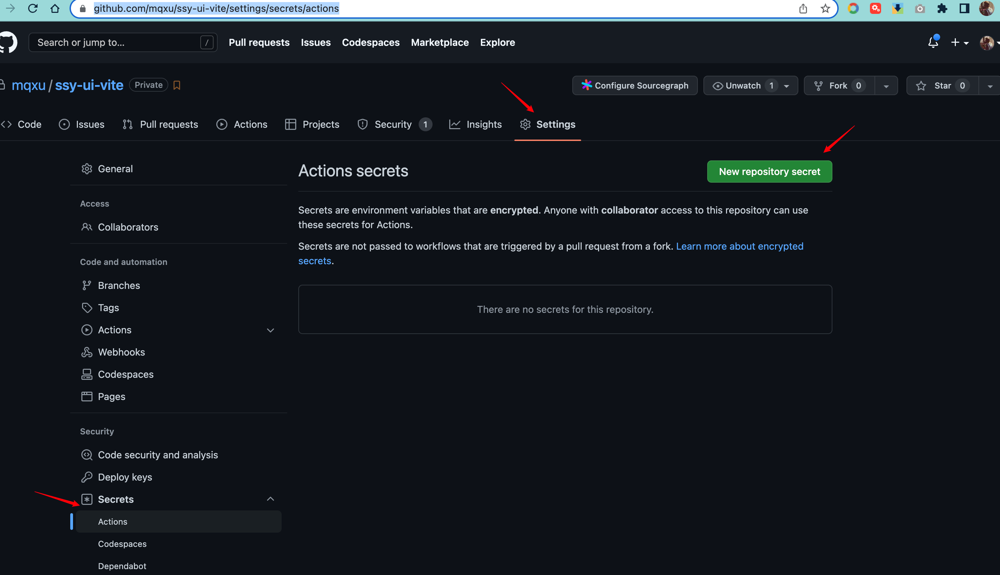

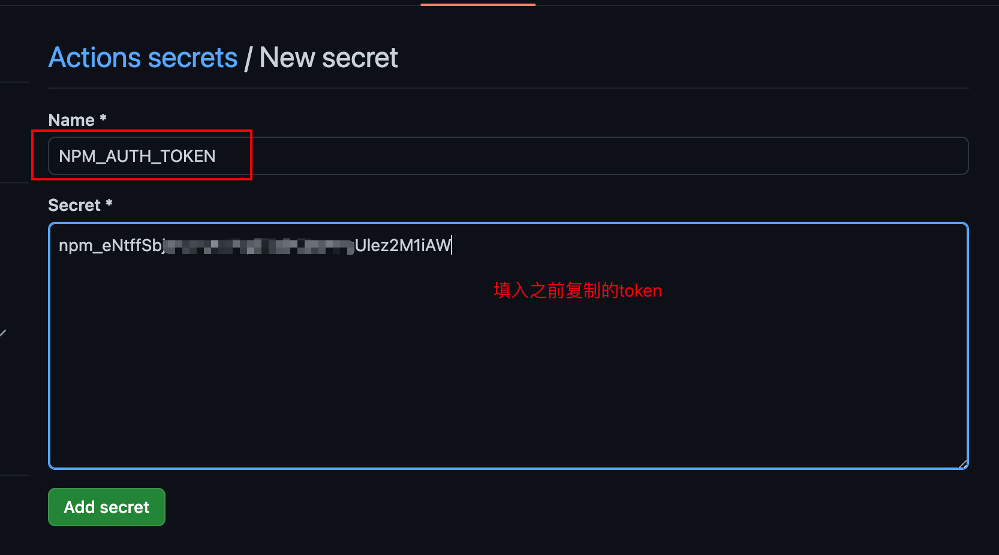

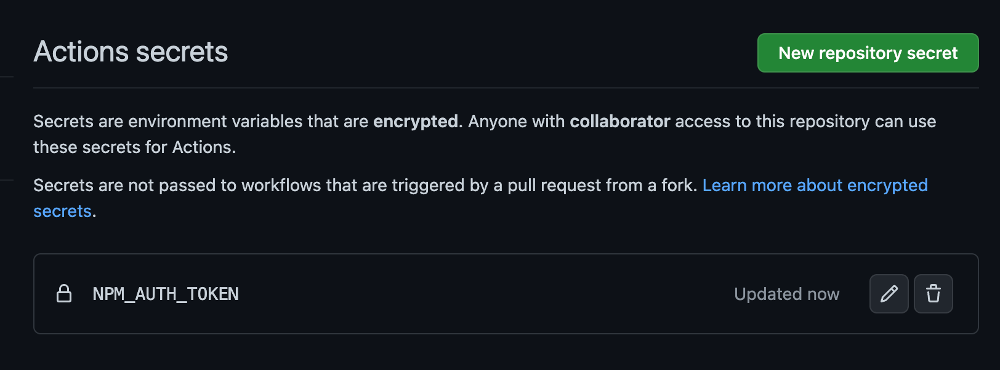

新建 publish-ssy-ui-vite.yml 文件

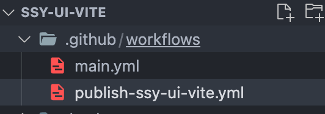

```yaml
name: PublishToNpm

on:
  push:
    branches: [publish-ssy-ui-vite]

jobs:
  publish:
    runs-on: ubuntu-latest
    steps:
      - uses: actions/checkout@v4
      - uses: pnpm/action-setup@v3
        with:
          version: 9.8.0
      - run: pnpm install
      - run: pnpm run build
      - uses: JS-DevTools/npm-publish@v1
        with:
          token: ${{ secrets.NPM_AUTH_TOKEN }}
```

更改 `package.json` 中版本号，提交并推送代码到 Github，创建一个 PR

::: tip
因为上面的配置文件里的 `on.push.branches`声明了这个 action 触发的分支，你也可以在本地直接推送到该分支来触发，或者直接声明 main 分支（因为新版的 npm-publish 会自己判断，仅当版本号 package.json 与 npm 上的最新版本不同时才发布）。
:::

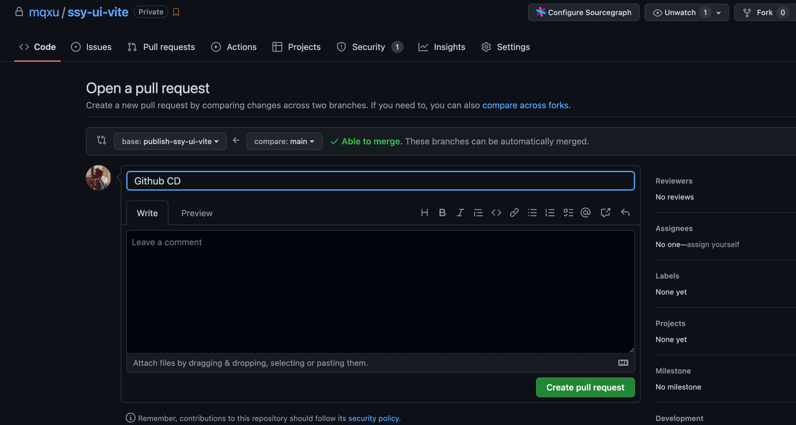

合并后会自动触发发布到 Npm

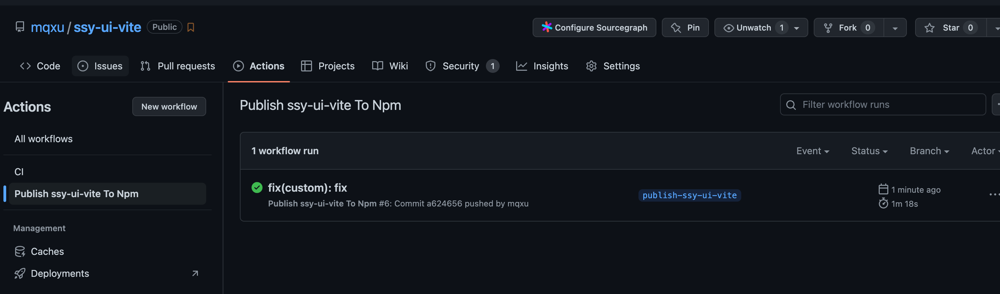

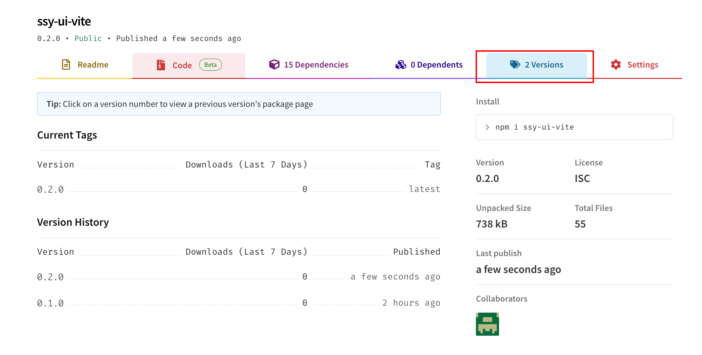

::: tip
发包后可以尝试其他 vue 项目里安装使用，应该会出现不少缺少 TS 类型的警告，目前忽略就行了，不影响使用，类型提示的部分后续章节会添加。

刚发包可能下载不下来，大概等半小时后再试试。
:::

## 复盘

本节的主要内容是对组件库进行版本发布，其中包括了语义化标签的定义、Git 版本 Tag 标签、Publish 分支、持续交付脚本的设置。

最后留一些思考题：

- 语义化标签的优点是什么 ？
- Git 的 Tag 标签的作用 ？
- 如何利用 Github Action 实现持续交付 ？
