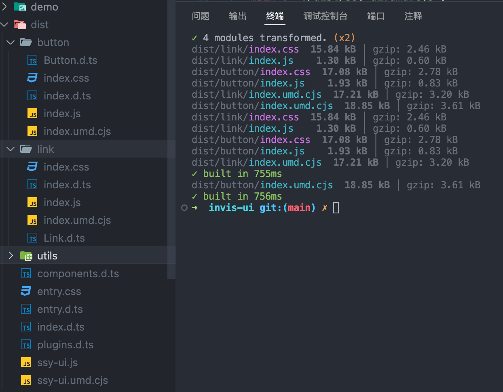
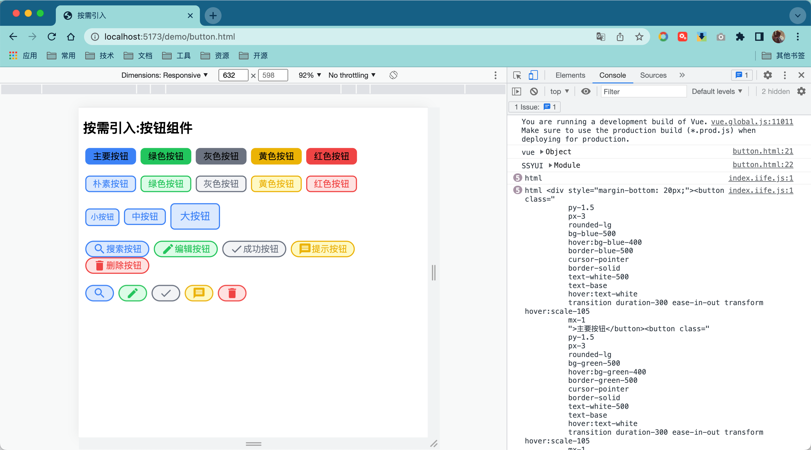
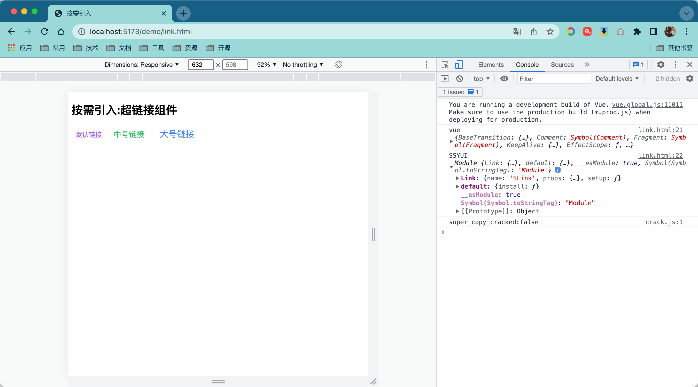

组件库会包含几十甚至上百个组件，但是应用的时候往往只使用其中的一部分。这个时候如果全部引入到项目中，就会使输出产物体积变大。按需加载的支持是组件库中必须考虑的问题。

目前组件的按需引入会分成两个方法：

- 经典方法：组件单独分包 + 按需导入 + babel-plugin-component ( 自动化按需引入)；
- 次时代方法：ESModule + Treeshaking + 自动按需 import（unplugin-vue-components 自动化配置）。

### 分包与树摇（Treeshaking）

传统的解决方案就是将组件库分包导出，比如将组件库分为 List、Button、Card，用到哪个加载哪个，简单粗暴。这样写有两个弊端：

- 需要了解软件包内部构造 例： import "ui/xxx" or import "ui/package/xxx"；
- 需要不断手工调整组件加载预注册。

```javascript
// 全部导入
const SSYUI = require("ssy-ui-vite");

// 单独导入
const Button = require("ssy-ui-vite/button");
```

好在后面有 babel-plugin-component，解决了需要了解软件包构造的问题。当然你需要按照约定规则导出软件包。

```javascript
// 转换前
const { Button } = require("ssy-ui-vite");

// 转换后
const Button = require("ssy-ui-vite/button");
```

随着时代的发展，esmodule 已经成为了前端开发的主流。esmodule 带来好处是静态编译，也就是说，在编译阶段就可以判断需要导入哪些包。

```javascript
// 动态引入的不可确定性
const m = Math.random() > 0.5 ? require("a") : require("b");
```

这样就给 Treeshaking 提供了可能。Treeshaking 是一种通过语法分析去除无用代码的方法。目前，Treeshaking 逐渐成为了构建工具的标配，Rollup、Vite、新版本的 Webpack 都支持了这个功能。

比如：组件库只使用了 Button。

```javascript
import { Button } from "ssy-ui-vite";
```

使用 ES 模块并且只引用了 Button，编译器会自动将其他组件的代码去掉。

### 自动导入黑科技

[unplugin-vue-components](https://github.com/unplugin/unplugin-vue-components) 的 [unplugin-auto-import](https://github.com/unplugin/unplugin-auto-import) 支持。

## 用户故事 (UserStory)

为组件库添加按组件分包导出功能，适配按需加载需要。

## 任务分解(Task)

- 实现分包导出脚本；
- 测试按需加载。

::: tip
本章节先实现组件的分包，类似 ElementPlus 的分包效果，至于自动导入，可以自己课后尝试实现。
:::


### 实现分包导出

分包导出相当于将组件库形成无数各子软件包，软件包必须满足以下要求：

- 每个组件有单独的文件夹；
- 有独立的 es 和 umd 等文件；
- 每个组件必须以 Vue 插件形式进行加载；
- 每个软件包还需要有单独的 css 导出；

#### package.json

改动较多，包括版本问题、支持 TS 脚本等，注意高亮处

这里用 `exports`更精细的声明了导出的文件路径

```json{10-21,24-26,30-32}:collapsed-lines=10
{
  "name": "ssy-ui-vite",
  "type": "module",
  "version": "0.1.1",
  "description": "",
  "author": "",
  "license": "ISC",
  "keywords": [],
  "sideEffects": false,
  "exports": {
    ".": {
      "types": "./dist/entry.d.ts",
      "import": "./dist/ssy-ui.js",
      "require": "./dist/ssy-ui.umd.cjs"
    },
    "./*": "./*"
  },
  "main": "./dist/ssy-ui.umd.cjs",
  "module": "./dist/ssy-ui.js",
  "types": "./dist/entry.d.ts",
  "files": ["dist"],
  "scripts": {
    // ...
    "build:all": "vite build",
    "build:components": "tsx ./scripts/build.ts",
    "build": "pnpm build:components && tsc -b tsconfig.types.json"
  },
  "devDependencies": {
    "@types/node": "^22.7.4",
    "fs-extra": "^11.2.0",
    "@types/fs-extra": "^11.0.4",
    "tsx": "^4.19.1",
    "typescript": "5.5.4"
    // ...
  }
  // ...
}
```

- `pnpm i` 安装

::: warning
注意 scripts.build 命令里的 `tsconfig.types.json`文件，根目录下创建这个文件，在打包时需根据这个文件里的配置来生成组件库的类型文件。
:::

#### tsconfig.type.json

```json
{
  "extends": "./tsconfig.json",
  "compilerOptions": {
    "rootDir": "./src" /* 指定输出文件目录（用于输出），用于控制输出目录结构 */,
    "declaration": true /* 生成相关的 '.d.ts' 文件。 */,
    "declarationDir": "./dist" /* '.d.ts' 文件输出目录 */,
    "emitDeclarationOnly": true /* 只生成声明文件，不生成 js 文件 */
  },
  "include": ["src/**/*"],
  "exclude": ["**/test/**/*"] // 排除不需要的文件
}
```

#### vite.config.ts

```typescript{15,31-45}:collapsed-lines=10
/// <reference types="vitest/config" />
import type { BuildOptions } from "vite";
import { resolve } from "node:path";
import vue from "@vitejs/plugin-vue";
import vueJsx from "@vitejs/plugin-vue-jsx";
import UnoCSS from "unocss/vite";
import { defineConfig } from "vite";

const rollupOptions: BuildOptions["rollupOptions"] = {
  external: ["vue"], // 将这些模块保留在 bundle 之外
  output: {
    globals: {
      vue: "Vue",
    },
    exports: "named",
  },
};
// https://vitejs.dev/config/
export default defineConfig({
  plugins: [vue(), vueJsx(), UnoCSS()],
  resolve: {
    alias: {
      vue: "vue/dist/vue.esm-bundler",
    },
  },
  test: {
    globals: true,
    environment: "happy-dom",
  },

  build: {
    rollupOptions,
    minify: "terser", // boolean | 'terser' | 'esbuild'
    sourcemap: false, // 输出单独 source文件
    reportCompressedSize: true, // 生成压缩大小报告
    cssCodeSplit: true,
    // 添加库模式配置
    lib: {
      entry: resolve(__dirname, "src/entry.ts"),
      name: "SSYUI",
      fileName: "ssy-ui",
      // 导出模块格式
      formats: ["es", "umd"],
    },
  },
});
```

修改`vite.config.ts`的 `rollupOptions`的 exports 的值，允许具名导出和默认导出同时存在。

```ts{9}
import type { BuildOptions } from "vite";

const rollupOptions: BuildOptions["rollupOptions"] = {
  external: ["vue"], // 将这些模块保留在 bundle 之外
  output: {
    globals: {
      vue: "Vue",
    },
    exports: "named",
    // 自定义构建结果中的静态资源名称
    // assetFileNames(chunkInfo) {
    //   const assetNames = chunkInfo.names || []
    //   if (assetNames.includes('index.css')) {
    //     return 'style.css' // 自定义的 CSS 文件名
    //   }
    //   return '[name].[ext]' // 其他资源文件的命名规则
    // },
  },
};
```

#### 重构代码结构

在原有代码上进行重构，`src`文件夹结构如下：

::: file-tree

- src
  - button
    - test
      - Button.test.ts
    - **Button.tsx**
    - index.ts
  - link
    - **Link.tsx**
    - index.ts
  - utils
    - with-install.ts
  - entry.ts
  - plugins.ts
  - index.ts

:::

- 组件入口 `index.ts` 默认作为插件导出。

:::code-tabs

@tab button/index.ts

```ts :no-line-numbers
import { withInstall } from "../utils/with-install";
import _Button from "./Button";

export { buttonProps } from "./Button";
export type { ButtonColor, ButtonProps, ButtonSize } from "./Button";

// 给组件添加注册方法
export const Button = withInstall(_Button);
export default Button;

// 组件类型声明
declare module "vue" {
  export interface GlobalComponents {
    SButton: typeof Button;
  }
}
```

@tab button/Button.jsx

```tsx
import type { ExtractPropTypes, PropType } from "vue";
import { defineComponent } from "vue";
import "virtual:uno.css";

export type ButtonSize = "small" | "medium" | "large";
export type ButtonColor =
  | "black"
  | "gray"
  | "red"
  | "yellow"
  | "green"
  | "blue"
  | "indigo"
  | "purple"
  | "pink";

export const buttonProps = {
  // 颜色
  color: {
    type: String as PropType<ButtonColor>,
    default: "blue",
  },

  /**
   * 尺寸
   * @example 'small' | 'medium' | 'large'
   */
  size: {
    type: String as PropType<ButtonSize>,
    default: "medium",
  },

  // 是否圆角
  round: {
    type: Boolean,
    default: false,
  },

  // 是否扁平
  plain: {
    type: Boolean,
    default: false,
  },
  // 图标
  icon: {
    type: String,
    default: "",
  },
} as const;

export type ButtonProps = ExtractPropTypes<typeof buttonProps>;

export default defineComponent({
  name: "Button",
  props: buttonProps,
  setup(props, { slots }) {
    const size = {
      small: {
        x: "2",
        y: "1",
        text: "sm",
      },
      medium: {
        x: "3",
        y: "1.5",
        text: "base",
      },
      large: {
        x: "4",
        y: "2",
        text: "lg",
      },
    };

    return () => (
      <button
        class={`
          mx-1
          hover:scale-105
          hover:text-white
          transition duration-300 ease-in-out transform
          py-${size[props.size].y}
          px-${size[props.size].x}
          ${props.round ? "rounded-full" : "rounded-lg"}
          bg-${props.color}-${props.plain ? "100" : "500"}
          hover:bg-${props.color}-400
          border-${props.color}-${props.plain ? "500" : "500"}
          cursor-pointer
          border-solid
          text-${props.plain ? `${props.color}-500` : "white"}
          text-${size[props.size].text}
          `}
      >
        {props.icon !== "" ? (
          <i class={`i-ic-baseline-${props.icon} p-3`}></i>
        ) : (
          ""
        )}
        {slots.default ? slots.default() : ""}
      </button>
    );
  },
});
```

@tab utils/with-install.ts

```ts
import type { App, Component } from "vue";

export type WithInstall<T> = T & {
  install: (app: App) => void;
};

// 组件前缀
const componentPrefix = "S";

export function withInstall<T extends Component>(options: T) {
  (options as Record<string, unknown>).install = (app: App) => {
    const { name } = options;
    if (name) {
      app.component(componentPrefix + name, options);
    }
  };

  return options as WithInstall<T>;
}
```

:::

类似的，我们再新建 `Link 链接组件`，编写 `Link.tsx`,对链接组件定义颜色、大小等属性，并导出。

:::code-tabs

@tab link/Link.tsx

```tsx
import type { ExtractPropTypes, PropType } from "vue";
import { defineComponent } from "vue";
import "virtual:uno.css";

export type LinkSize = "small" | "medium" | "large";
export type LinkColor =
  | "black"
  | "gray"
  | "red"
  | "yellow"
  | "green"
  | "blue"
  | "indigo"
  | "purple"
  | "pink";

export const linkProps = {
  size: {
    type: String as PropType<LinkSize>,
    default: "medium",
  },
  color: {
    type: String as PropType<LinkColor>,
    default: "purple",
  },
};
export type LinkProps = ExtractPropTypes<typeof linkProps>;

export default defineComponent({
  name: "Link",
  props: linkProps,
  setup(props, { slots }) {
    const size = {
      small: {
        x: "2",
        y: "1",
        text: "sm",
      },
      medium: {
        x: "3",
        y: "1.5",
        text: "base",
      },
      large: {
        x: "4",
        y: "2",
        text: "lg",
      },
    };

    return () => (
      <a
        class={` 
              hover:text-white
              cursor-pointer
              py-${size[props.size].y}
              px-${size[props.size].x}
              text-${`${props.color}-500`}
              text-${size[props.size].text}
              hover:bg-${props.color}-400
              `}
      >
        <span> {slots.default ? slots.default() : "默认链接"} </span>
      </a>
    );
  },
});
```

@tab link/index.ts

```ts
import { withInstall } from "../utils/with-install";
import _Link from "./Link";

export { linkProps } from "./Link";
export type { LinkColor, LinkProps, LinkSize } from "./Link";
export const Link = withInstall(_Link);
export default Link;

declare module "vue" {
  export interface GlobalComponents {
    SLink: typeof _Link;
  }
}
```

:::

::: tip
可以删除或者注释掉之前写的 `JSXButton.tsx` 和 `SFCButton.vue` 文件，目前不需要。
:::

#### 编写分包导出脚本

默认导出方式是通过配置 vite.config.ts 的 build 属性完成。但是在分包导出的时候需要每个组件都分别配置自己的配置文件，而且需要由程序自动读取组件文件夹，根据文件夹的名字遍历打包。

项目根目录新建 `scripts/build.ts` 文件，该文件主要做如下事情：

1. 读取组件文件夹，遍历组件库文件夹
2. 为每个模块定制不同的编译规则。编译规则如下：

- 导出文件夹为 dist/ <组件名>/ 例： `dist/button`
- 导出模块名为： `index.js`、`index.umd.js`

`build.ts` 内容如下：

```typescript :collapsed-lines=10
import type { InlineConfig } from "vite";
import path from "node:path";
import { fileURLToPath } from "node:url";
import fs from "fs-extra";
import { build } from "vite";

// const __dirname = new URL('.', import.meta.url).pathname // 在windows上无法获得正确路径
const __dirname = path.dirname(fileURLToPath(import.meta.url)); // 更强的跨平台兼容性

// 全量打包
const buildAll = async () => {
  await build();
  const srcDir = path.resolve(__dirname, "../src/");
  fs.readdirSync(srcDir)
    .filter((name) => {
      // 只要目录不要文件，且里面包含index.ts
      const componentDir = path.resolve(srcDir, name);
      const isDir = fs.lstatSync(componentDir).isDirectory();
      return isDir && fs.readdirSync(componentDir).includes("index.ts");
    })
    .forEach(async (name) => {
      const outDir = path.resolve("./dist", name);
      const custom = {
        lib: {
          entry: path.resolve(srcDir, name),
          name, // 导出模块名
          fileName: `index`,
          formats: [`es`, `umd`],
        },
        outDir,
      };

      await build({
        build: custom,
      } as InlineConfig);
    });
};

buildAll();
```

#### 修改入口文件

修改 entry.ts ，导出单独组件、类型和插件

::: code-tabs
@tab plugins.ts

```ts
import type { Plugin } from "vue";
import { Button } from "./button";
import { Link } from "./link";

const plugins: Plugin[] = [Link, Button];

export default plugins;
```

@tab entry.ts

```ts
import { version } from "../package.json";
import plugins from "./plugins";
import "virtual:uno.css";

// 导出组件
export * from "./button";
export * from "./link";

// 导出插件
export default {
  install(app) {
    plugins.forEach((c) => app.use(c));
  },
  version,
};
```

:::

#### 在 package.json 中添加打包脚本

```json
{
  "scripts": {
    "build:all": "vite build",
    "build:components": "tsx ./scripts/build.ts",
    "build": "pnpm build:components && tsc -b tsconfig.types.json"
  }
}
```

#### 执行打包操作

```bash
pnpm build
```

效果


### 测试按需加载

在 demo 文件夹下写两个示例

1.  测试 Button 按钮，只调用 Button 子包中的 js、css 就可以了

button.html

```html :collapsed-lines=10
<!DOCTYPE html>
<html lang="en">
  <head>
    <meta charset="UTF-8" />
    <meta http-equiv="X-UA-Compatible" content="IE=edge" />
    <meta name="viewport" content="width=device-width, initial-scale=1.0" />
    <title>按需引入</title>
  </head>

  <body>
    <h2>按需引入:按钮组件</h2>
    <div id="app"></div>
    <link rel="stylesheet" href="../dist/button/index.css" />
    <script src="../node_modules/vue/dist/vue.global.js"></script>
    <script src="../dist/button/index.umd.cjs"></script>
    <script>
      const { createApp } = Vue;
      const { Button } = button;
      console.log("SSYUI:Button", Button);
      createApp({
        template: `
        <div style="margin-bottom:20px;">
            <SButton color="blue">主要按钮</SButton>
            <SButton color="green">绿色按钮</SButton>
            <SButton color="gray">灰色按钮</SButton>
            <SButton color="yellow">黄色按钮</SButton>
            <SButton color="red">红色按钮</SButton>
        </div>
        <div style="margin-bottom:20px;">
            <SButton color="blue" plain>朴素按钮</SButton>
            <SButton color="green" plain>绿色按钮</SButton>
            <SButton color="gray" plain>灰色按钮</SButton>
            <SButton color="yellow" plain>黄色按钮</SButton>
            <SButton color="red" plain>红色按钮</SButton>
        </div>
        <div style="margin-bottom:20px;">
            <SButton size="small" plain>小按钮</SButton>
            <SButton size="medium" plain>中按钮</SButton>
            <SButton size="large" plain>大按钮</SButton>
        </div>
        <div style="margin-bottom:20px;">
            <SButton color="blue" round plain icon="search">搜索按钮</SButton>
            <SButton color="green" round plain icon="edit">编辑按钮</SButton>
            <SButton color="gray" round plain icon="check">成功按钮</SButton>
            <SButton color="yellow" round plain icon="message">提示按钮</SButton>
            <SButton color="red" round plain icon="delete">删除按钮</SButton>
        </div>
        <div style="margin-bottom:20px;">
            <SButton color="blue" round plain icon="search"></SButton>
            <SButton color="green" round plain icon="edit"></SButton>
            <SButton color="gray" round plain icon="check"></SButton>
            <SButton color="yellow" round plain icon="message"></SButton>
            <s-button color="red" round plain icon="delete"></s-button>
        </div>
    `,
      })
        .use(Button)
        .mount("#app");
    </script>
  </body>
</html>
```

link.html

```html :collapsed-lines=10
<!DOCTYPE html>
<html lang="en">
  <head>
    <meta charset="UTF-8" />
    <meta http-equiv="X-UA-Compatible" content="IE=edge" />
    <meta name="viewport" content="width=device-width, initial-scale=1.0" />
    <title>按需引入</title>
  </head>

  <body>
    <h2>按需引入:超链接组件</h2>
    <div id="app"></div>
    <link rel="stylesheet" href="../dist/entry.css" />
    <script src="../node_modules/vue/dist/vue.global.js"></script>
    <script src="../dist/Link/index.umd.cjs"></script>
    <script>
      const { createApp } = Vue;
      const { Link } = link;
      // console.log('vue', Vue)
      console.log("SSYUI:Link", Link);
      createApp({
        template: `
        <div style="margin-bottom:20px;">
            <s-link size="small"></s-link>
            <SLink size="medium" color="green">中号链接</SLink>
            <SLink size="large" color="blue">大号链接</SLink>
        </div>
     `,
      })
        .use(Link)
        .mount("#app");
    </script>
  </body>
</html>
```

启动，访问

http://localhost:5173/demo/button.html





### 添加 vue-tsc

tsc 无法给 .vue 文件生成类型，若是使用 SFC 编写组件，则可以使用 [vue-tsc](https://www.npmjs.com/package/vue-tsc)。

```bash
pnpm i vue-tsc -D
```

修改文件

::: code-tabs
@tab tsconfig.types.json

```json{8}
{
  "extends": "./tsconfig.json",
  "compilerOptions": {
    "rootDir": "./src" /* 指定输出文件目录（用于输出），用于控制输出目录结构 */,
    "declaration": true /* 生成相关的 '.d.ts' 文件。 */,
    "declarationDir": "./dist" /* '.d.ts' 文件输出目录 */,
    "emitDeclarationOnly": true /* 只生成声明文件，不生成 js 文件 */,
    "outDir": "./dist"
  },
  "include": ["src/**/*"],
  "exclude": ["**/test/**/*"] // 排除不需要的文件
}
```

@tab package.json

```json{5-8}
  "scripts": {
    // ...
    "build:all": "vite build",
    "build:components": "tsx ./scripts/build.ts",
    "build": "pnpm build:components && pnpm type:build",
    "typecheck": "vue-tsc --noEmit",
    "type:build": "vue-tsc -b --declaration --emitDeclarationOnly tsconfig.types.json",
    "clean:dist": "rimraf dist"
  },
```

@tab eslint.config.mjs

```js{16-18}
import antfu from "@antfu/eslint-config";

export default antfu({
  unocss: true,
  vue: true,
  typescript: true,
  // 在Flat配置中不再支持' .eslintignore '，请使用' ignore '代替
  ignores: ["**/test"],
  // 取消 Anthony 喜好的一些固执己见的规则。
  lessOpinionated: true,

  formatters: {
    css: true,
    html: true,
  },
  rules: {
    "ts/no-empty-object-type": "off",
  },
});
```

:::

添加一个 SFC 组件

例如，在 src 下新建 avatar 文件夹，在里面添加如下文件
::: code-tabs

@tab avatar.ts

```ts
export interface AvatarProps {
  url: string;
  round: boolean;
  size: string;
}
```

@tab Avatar.vue

```vue
<script lang="ts" setup>
import type { AvatarProps } from "./avatar";

defineOptions({
  name: "Avatar",
});

const { round = false, size = "24px" } = defineProps<AvatarProps>();
</script>

<template>
  
</template>
```

@tab index.ts

```ts
import { withInstall } from "../utils/with-install";
import _Avatar from "./Avatar.vue";

export const Avatar = withInstall(_Avatar);
export default Avatar;

declare module "vue" {
  export interface GlobalComponents {
    SAvatar: typeof Avatar;
  }
}
```

:::

接着在 `plugins.ts`和`entry.ts`文件里添加组件的导出。运行 `pnpm build`打包后写一个 demo 测试下这个 Avatar 组件。

## 复盘

本节的主要内容是为组件库添加分包导出功能，使组件库提供按需加载。组件库具备良好的按需加载能力，可以使提高页面性能。虽然目前 ESM Treeshaking 已经非常流行，但是还是有很多场合需要分包按需引入的支持。

另外，分包引入需要每个子组件包都分别使用不同的配置调用 vite 导出。这需要编写相对较为复杂的脚本完成。工程化中很重要的一部分就是要根据实际需求编写自动化的脚本。

最后留一些思考题：

- 组件如何才能实现按需引入？
- 如何实现组件分包导出？
