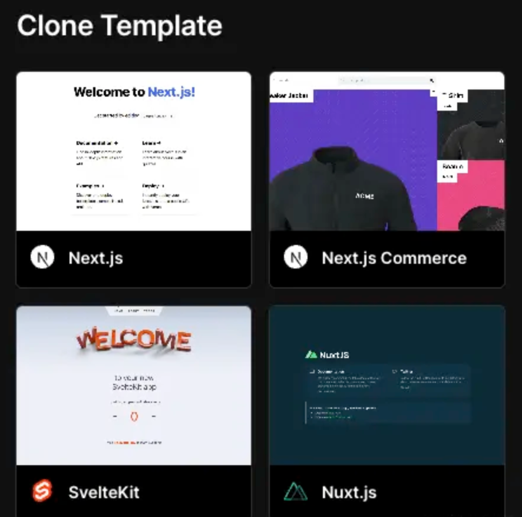
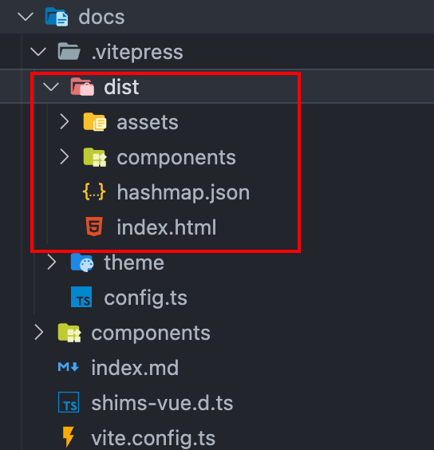
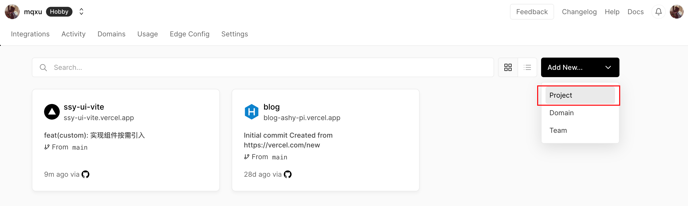
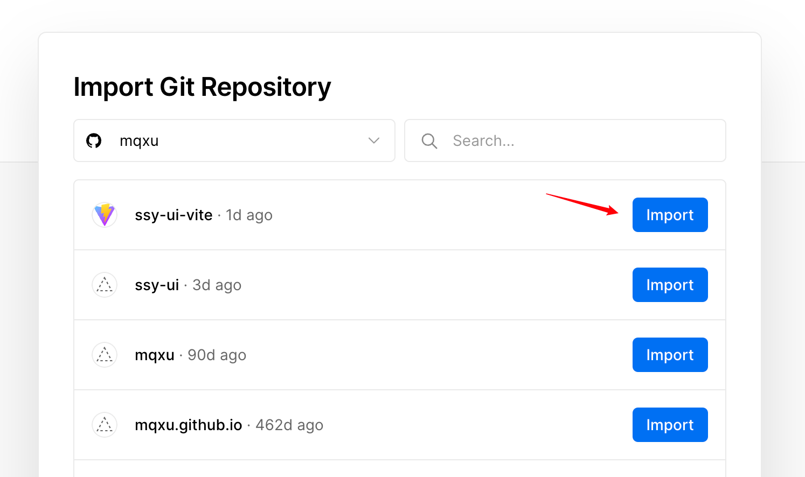
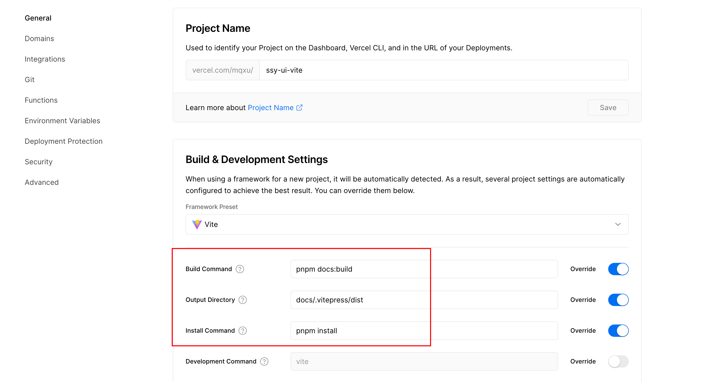
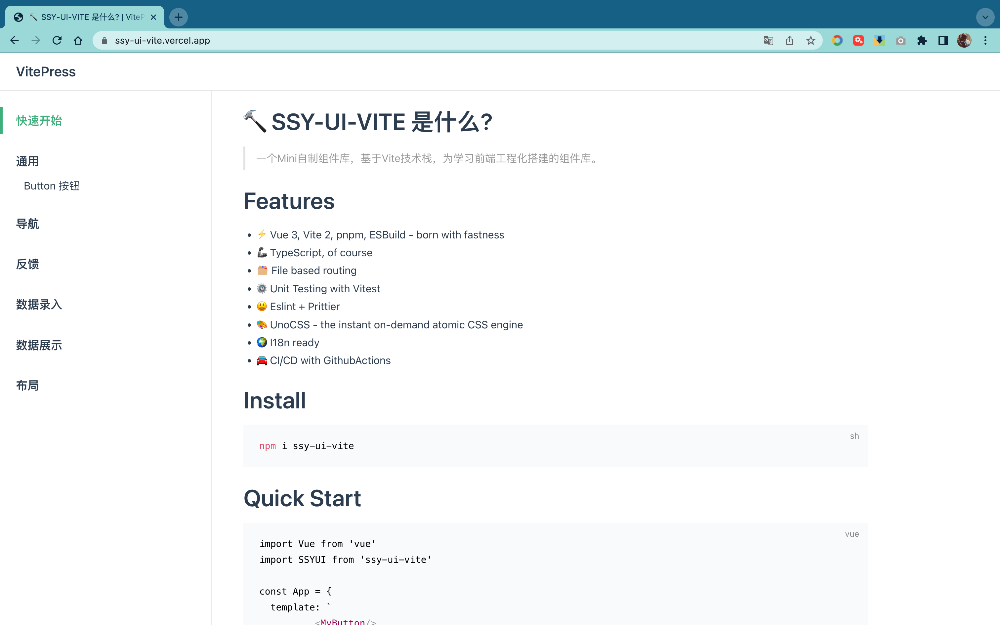
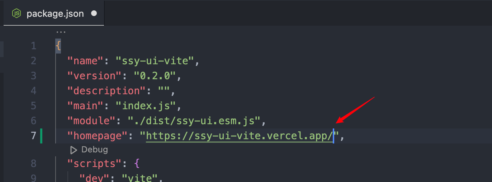
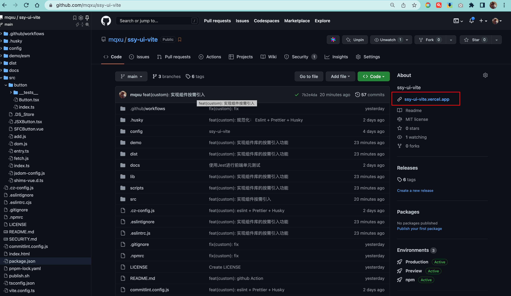

文档网站需要发布到互联网上才能让更多的人知道，传统的发布方法需要做以下准备：

- Linux 服务器；
- 网页服务软件 Nginx；
- 购买域名 + 实名认证；
- HTTPS 证书；
- Sftp 上传工具；
- Github Action CI 自动发布最新文档；

这里面租用服务器和域名需要一笔花费。安装 Linux、Nginx，配置域名与 HTTPS 证书需要相应的服务器端知识。注册 HTTPS 证书和实名认证都需要准备和寄送材料，传统的部署方式可以说是费时费力。假设你只想简单的发布一个静态网页，完全没有必要采用这个方案。

目前，最佳的解决方案是使用 Serverless 页面托管云服务。这些云服务只需简单配置就可以自动发布 Github 上面的页面；图形化界面操作省去了学习服务器端知识；分配二级 HTTPS 域名无需购买域名和实名认证，可以说是省时省力。

目前比较推荐的有 Github Pages、Vercel、Netlify。

## 方案选型

备选三款分别是 Github Pages、Vercel、Netlify，这三个托管服务其实大同小异。

1. **Github Pages**

Github Pages 使用最为方便，因为是 Github 内置的。

1. **Netlify**

Netlify 总部位于旧金山， 在 2021.11.17 日完成了 D 轮 1.05 亿美元的融资，估值达到 20 亿美金。

Netlify 为了解决 Github Page 的一些问题，可以认为它是一个体验更好速度更快的 Github Pages，Netlify 付费后可以承担企业级的 Web 访问业务。

1. **Vercel**

Vercel 总部也位于旧金山，在 2021.11.23 完成了 D 轮 1.5 亿美金的融资，估值达到 25 亿美金，由 GGV Capital 领投。Vercel 的创始人 Guillermo Rauch 也是 Next.js、 [socket.io](http://socket.io)等开源项目的发起人。

Next.js 和 [socket.io](http://socket.io) 都是明星级别的开源项目， 这个非常重要。首先证明 Vercel 财大气粗，免费额度很够用。再者就是由于创始人和前端的亲缘关系，促使 Vercel 对前端工程师非常友好。比如： Vercel 可以自动识别项目的构建工具和框架并进行自动配置。



除此之外， Guillermo 根据自己过往丰富的 Web 应用开发经验。 它提供的 Vercel 云服务可以帮助前端开发者屏蔽掉那些烦人的非业务问题。比如域名、DNS、SSL 证书。Vercel 还支持了 Node 运行时环境。自带 CI/CD 功能，并且自带 CDN ，网页速度能够得到非常好的保证。

## 用户故事 (UserStory)

发布组件库文档网站，使用持续集成，随时同步最新版文档网站。

## 任务分解 (Task)

- 添加 `vercel.json`
- 部署文档网站；
- 实现 CD 自动更新；
- 添加 Github Home Page；

### 添加 vercel.json

首先先回忆一遍开发本组件库的过程，然后根据这个过程填写相应的参数。

生成文档网站需要执行：

```bash
pnpm i
pnpm docs:build
```

页面会生成在 ssy-ui-vite/docs/.vitepress/dist 中。



对号入座，就可以很容易地把下面的参数填出来了

在项目根目录下新建该文件，添加一些配置和打包脚本

参考如下：

```json{3,5-7}
{
  "version": 2,
  "name": "invis-ui",
  "framework": "vite",
  "installCommand": "pnpm install",
  "buildCommand": "pnpm docs:build",
  "outputDirectory": "docs/.vitepress/dist",
  "git": {
    "deploymentEnabled": {
      "main": true
    }
  }
}
```

更多配置项参考官方文档：[vercel.json](https://vercel.com/docs/projects/project-configuration)

推送到 github 主分支后继续下一步

### 部署文档网站

首先需要登录 [vercel.com/](https://vercel.com/) 网站，使用 Github 账号第三方登录。这个时候 Vercel 会要求你提供 Github 数据读取授权。你可以认为 Vercel 这个时候充当的是一个 CI 服务器，它需要随时调用 Github API 随时监听项目的变化，并且获取最新的代码。

选择 New Project 添加一个项目。



从 Github 列表中选择 ssy-ui-vite



查看 Build 配置，这个步骤相当于以前的 CI 过程的图形化。相当于在 Vercel 的 CI 服务器上执行一遍文档编译过程。这个步骤和我们学过的 Github Action 类似。只是那个时候是使用 Yaml 文件进行配置，而现在换成了图形界面。

可以看到这里的配置是之前在 `vercel.json`里的信息，你也可以在这里手动修改；



- BUILD COMMAND ： pnpm docs:build (vitepress 导出指令)；
- OUTPUT DIRECTORY : docs/.vitepress/dist (vitepress 静态页面位置)；
- INSTALL COMMAND： pnpm install 软件包安装；

点击 Deploy 开始构建，这相当于启动了 CI 服务。这个时候， Vercel 的 CI 服务会提取 Github 代码执行安装和导出流程，并且会将页面发布上线。

在几分钟的等待后，网站就发布好了，会给出可访问地址。



:::danger Deploy 失败
我在部署这个文档的时候出现了执行 pnpm install 失败的情况，发现是 node 版本的问题，
在该项目的顶部导航里找到 `Settings`,找到 Node.js Version 设置，选择 `18.x`，save 保存后，切换到`Deployments`里，找到最新的一次部署，点击`Redepoly`重新部署试试。

:::

### 实现 CI 自动更新

下面要考虑的就是，如果有文档更新如何自动实现推送。当然这个 Vercel 已经默认提供这个功能。但是作为工程化，这个是需要大家考虑的一个问题。我们可以在 Deployments 中看到每次 Vercel 更新的记录，这表明 CI 工作正常。


### 添加 HomePage 配置

将发布后的地址填写到项目的 package.json 中去，这一步的属性可以让 Github 页面中显示相应的主页链接，后续发布到 Npm 上也会有主页链接。





## 复盘

本节的主要内容是为组件库部署文档网站，我们选用了 Serverless 网站托管服务完成。相比于传统部署形式，前端程序员无需了解过多的服务端知识和繁琐的搭建过程就可以部署上线。

另外，类似 Vercel 这种托管服务还内置了 CI/CD 工具可以实现自动更新功能。 文档网站部署属于一个 CD 持续交付，也正好趁这次机会体验了 Github Action 以外的另外一个 CI/CD 服务。 本次部署选择了 Vercel ，其实其他两个服务也各有特点，尤其是 Github Pages，可以自己去尝试一下。

最后留一些思考题：

- 如何使用 Vercel 部署前端项目？
- Github Page 与 Vercel 的区别 ？
