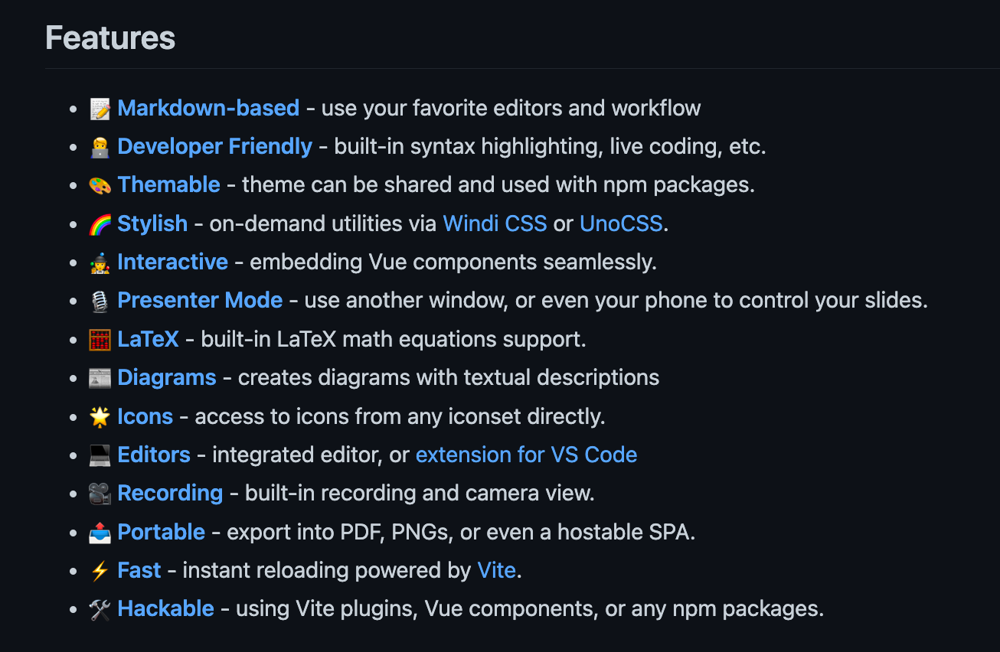
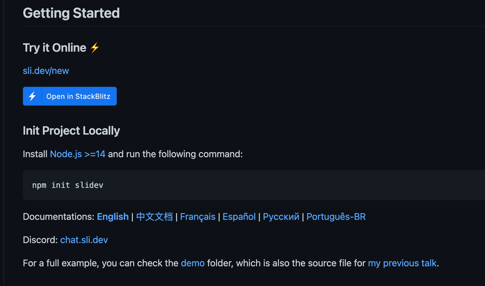
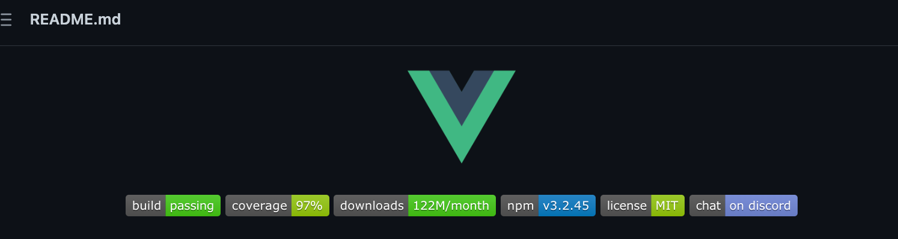
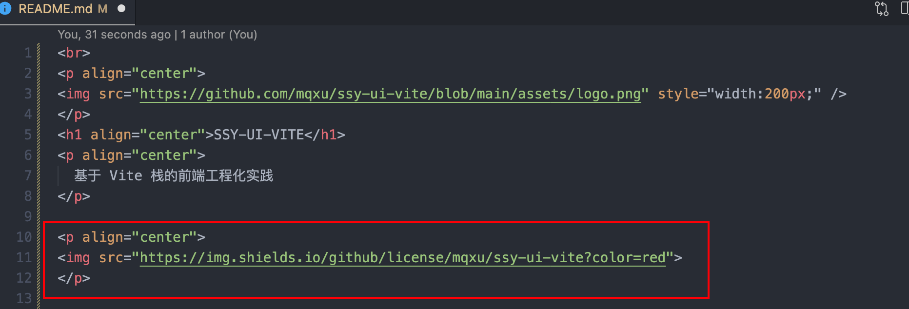
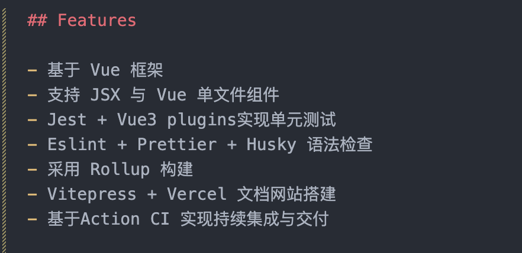
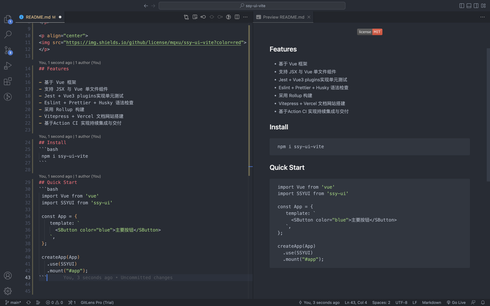
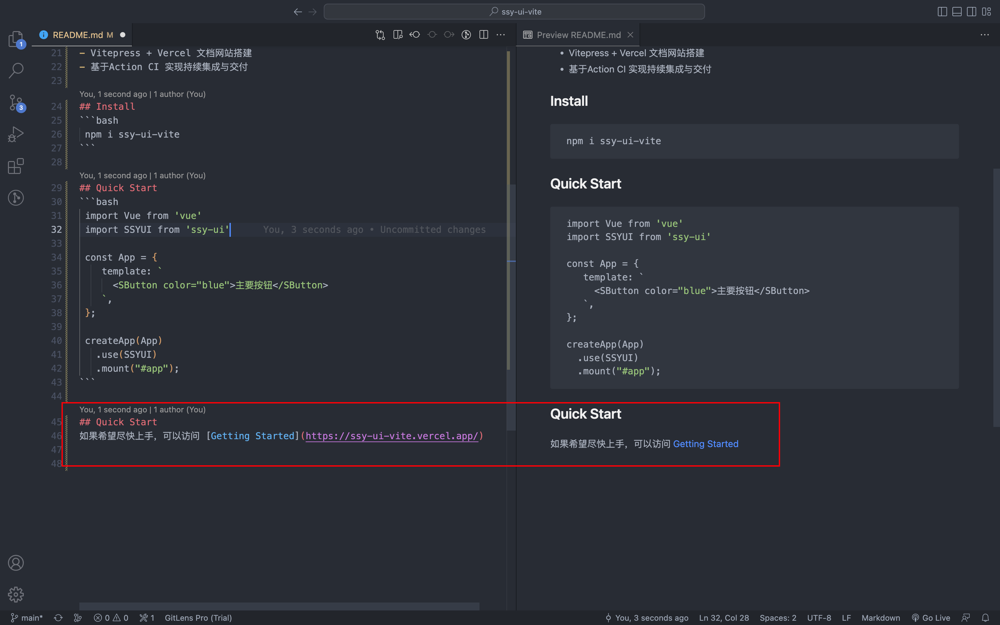
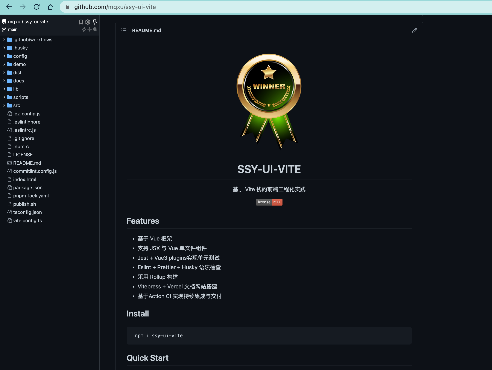

本节来介绍如何编写 README 文档。README 文档对于开源项目的重要性甚至会超过代码本身。试想一下，你打开一个 Github 项目，第一时间就会看到 README 文档，而这时候同一类的项目可能有很多选择，如果这个 README 不正规，无法快速上手，你可能直接就弃用这个项目。

在编写自己的组件库案例之前，先欣赏一下大神的作品。

[优秀的案例：slidevjs](https://github.com/slidevjs/slidev)


先看开头部分：

- Banner + Title 居中；
- 徽章的颜色重新定制和 Logo 呼应，并且细心地使用了渐变效果。



- 特性描述精炼准确；
- 字体图标开头提升了页面视觉效果；
- 引用链接完整清晰。



- 快速开始提供了在线编辑器可以一键试用；
- 文档提供多语言链接。

## 用户故事 (UserStory)

为组件库编写标准 README 文档，使开发者更容易上手使用。

## 任务分解(Task)

- Title 标题；
- Banner 头图；
- 徽章 Badges；
- 特性 Features；
- 开源许可证 License ；

对于如何编写标准 README ，有一个[经典的 Github 项目](https://github.com/RichardLitt/standard-readme)。

这个项目系统地讲述了 README 的编写方法。文中提到标准的 README，最基本的部分包括以下几大内容：

- Background 背景；
- Install 安装 ；
- Usage 用途；
- Badge 徽章 - 项目的标准，例： npm 下载量、测试覆盖率、通过 CI 工具持续验证 ；
- Contributing 贡献者名单；
- License 代码许可证。

这个应该是一个最低配的 README。

通过这个结构可以让使用者最短时间了解并上手。

如果扩展一下，让项目介绍更加的丰满，还可以采用以下结构：

- Title；
- Banner；
- Badges；
- Short Description；
- Long Description ；
- Table of Contents；
- Security；
- Background；
- Install；
- Usage；
- Extra Sections；
- API；
- Maintainers；
- Thanks；
- Contributing；
- License 。

以上都是提供的一个思维框架，在实际运用中可以根据实际情况灵活掌握。

下面开始 SSY-UI-VITE 的具体编写。

### 标题 Title

首先是标题。

内容就是项目的名字，没什么好说的，关键部分是副标题和表现形式。

副标题可以很好地解释主题，表现形式上可以考虑一下居中效果。由于 Markdown 中可以使用 HTML， 所以可以直接使用 HTML 实现。

```markdown
<p align="center">
<div style="width:150px;margin:auto;">
<svg xmlns="http://www.w3.org/2000/svg" viewBox="0 0 261 226"><path d="M161.096.001l-30.225 52.351L100.647.001H-.005l130.877 226.688L261.749.001z" fill="#41b883"/><path d="M161.096.001l-30.225 52.351L100.647.001H52.346l78.526 136.01L209.398.001z" fill="#34495e"/></svg>
</div>
</p>
<h1 align="center">SSY-UI-VITE</h1>
<p align="center">
  基于 Vite 栈的前端工程化实践 
</p>
```

在项目根目录新建 assets 子目录，放入 logo 图。

### Banner 头图

一个醒目的横幅可以有效提高 README 的颜值，所以可以选一个合适的图片作为横幅。（上一步已完成）

### Badges 徽章

徽章是一个开源库的品质保证。比如 npm 下载量、测试覆盖率、CI 运行状况。这些不是普通的字符，每一个徽章都是相应的系统动态生成的，比如 npm 下载量就是由 npm 生成并颁发的。



徽章在 [shields.io/](https://shields.io/) 中生成，我们先来生成一个开源协议徽章

[shields.io/badges/git-hub-license](https://shields.io/badges/git-hub-license)


可以看到 GitHub 的 License 格式要求，我们按要求填写仓库用户和公开的仓库名就行了


可以修改颜色，或者其他属性，然后点击下方的蓝色按钮，拷贝徽章链接，比如添加 Logo，需要先去[simpleicons.org](https://simpleicons.org/?q=github)里查找

在 README 中加入徽章



<center>


</center>

### Features 特性

这部分可以认为是一个 Description ，也就是具体说明这个库的功能。这里主要写了技术栈。



### Install & Quick Start 安装 & 快速指南

为了让用户快速上手，这部分一般都会在第一屏出现。普遍有两种方法：

第一种是直接写到 README 里面。比如：



Install 安装指南要尽量简洁，目的是为了让用户尽快上手。尽量选择通过 Npm 包和 CDN 直接安装。这样使用者可以尽快感受到项目的效果，有利于推广。

Quick Start 快速开始也是同样的要求，尽量用最精华的代码让用户感受到项目的强大。

如果项目具备文档网站，更好的方法是将用户引导到网站中去。因为网站有更好的阅读体验，可以呈现更为系统的内容。

第二种是当有文档网站的时候，显示文档网站链接就可以了。



### License 代码许可证

这部分会引用开源证书链接并且填写上 Copyright 信息。

完成后 push，效果



## 复盘

本节的主要内容是编写一个标准的 README 文档。

最后留一些思考题：

- 如何使用 Vercel 部署前端项目？
- Github Page 与 Vercel 的区别 ？
