代码覆盖率才是评价一个项目品质的标准。在挑选一个项目的时候，有经验的使用者都会根据代码覆盖率来确定代码的可靠性。

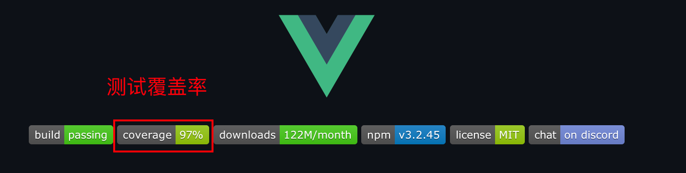

虽然自动化测试工具可以自动验证代码的正确性，但是如果只有部分代码经过了测试，或者只是简单地跑通了代码，也不能说是一个合格的代码。比如组件库只测试一部分的组件，或者每个组件只测试了默认设置。譬如，按钮中某个属性或者某几个属性间的排列组合并没有得到测试，这样的测试还不能保证组件库的功能完全正确。

那么如何来客观评价这个测试的完备程度呢？**答案就是代码覆盖率。**

### 覆盖率概念

代码覆盖率（Code coverage）是软件测试中的一种度量指标，描述测试过程中（运行时）被执行的源代码占全部源代码的比例。

### 覆盖率指标种类

只是简单地做到行级覆盖还远远不够，可以看看下面的例子。

```javascript
function getName(a, b) {
  if (a && b) {
    return "Jane";
  } else {
    return "Tony";
  }
}
```

以上代码只需要两个 Case，就可以将所有语句都跑一遍：

- Case01: a = true ; b = true; 期待：Jane
- Case02: a =false ; b= true; 期待：Tony

但是，显然这样测试甚至不能确定代码中 b 是否参与条件判断。比如下面代码可能也会出现相同的结果。

```javascript
function getName(a, b) {
  if (a) {
    return "Jane";
  } else {
    return "Tony";
  }
}
```

所以假设覆盖率只有简单的代码行覆盖还远远不够。

在软件工程理论中会把覆盖率分为：

- 语句覆盖（statement coverage）
- 判定覆盖（decision coverage）
- 条件覆盖（condition coverage）
- 条件判定组合覆盖（condition decision coverage）
- 路径覆盖（path coverage）
- 多条件覆盖（multi-condition coverage）
- 修正条件判定覆盖（modified condition / decision coverage）

覆盖深度的提高显然会让代码功能验证更加全面，但是相应的实施成本也会明显提高。

理论的覆盖虽然全面但是实际生产很多指标的指导价值并不是很大。在实际生产中会将它进行简化。

在 Javascript 中，代码覆盖率通常会分为**四级覆盖**。

- Function coverage 函数覆盖 - 每个函数是否被执行；
- Line coverage 行覆盖 -- 每行是否被执行；
- Statement coverage 语句覆盖 - 每个语句是否被执行；
- Branch coverage 分支覆盖 - 每个 if 节点是否都被执行。

这是结合了函数式语言的特点和指标的实用程度的经验之谈，也是 JavaScript 世界比较受认可的标准。

## 用户故事 (UserStory)

为组件库发布覆盖率报告，使测试覆盖率可视化。

## 任务分解 (Task)

- 生成覆盖率报告；
- 将覆盖率报告任务加入到 CI；
- 上传覆盖率展示平台 Codecov；
- 获取覆盖率徽章。

### Istanbul 代码覆盖率工具

代码覆盖率需要专用的工具生成。在 JavaScript 程序中的代码覆盖率通常都是通过 Istanbul 生成的。Istanbul 的来历是伊斯坦布尔的地毯，覆盖率报告其实就是用颜色来表示代码的运行情况，好像给代码铺上了地毯。

我们熟悉的 Jest 和组件库使用的 Vitest 测试框架，都是使用的 Istanbul。Istanbul 的实现原理是通过编译期代码插桩方式实现的。

http://www.alloyteam.com/2019/07/13481/

### [生成覆盖率报告](https://cn.vitest.dev/guide/coverage.html)

在 Vitest 只需要在命令行中添加参数 --coverage 就可以生成覆盖率报告了。

需安装 v8 或 istanbul

```bash
# For v8
pnpm i -D @vitest/coverage-v8

# For istanbul
pnpm i -D @vitest/coverage-istanbul
```

要对其进行配置，需要在配置文件中设置 `test.coverage `选项：

```ts{6-11}
// vitest.config.ts
import { defineConfig } from "vitest/config";

export default defineConfig({
  test: {
    coverage: {
      provider: "istanbul", // or 'v8',
      reporter: ["text", "json", "html"],
      // include: ['src/**/*.ts', 'src/**/*.tsx'], // 指定你要测试的文件路径
      // exclude: ['src/*.ts', 'src/utils/**'],// 指定你要忽略的文件路径
    },
  },
});
```

添加脚本

```json
"scripts": {
    "test:coverage": "vitest run --coverage"
},
```

运行结果
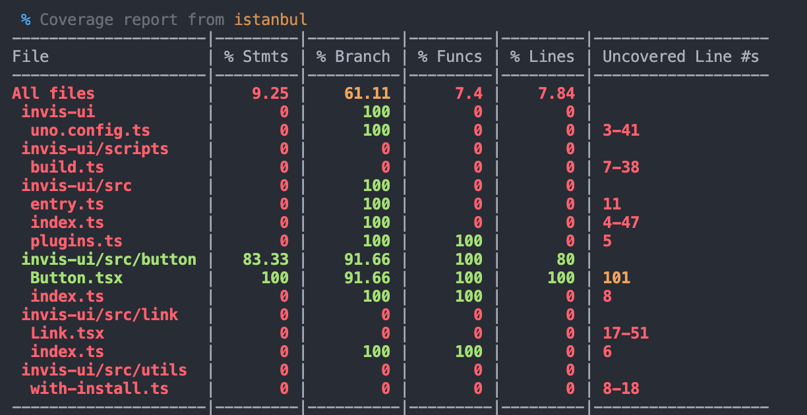

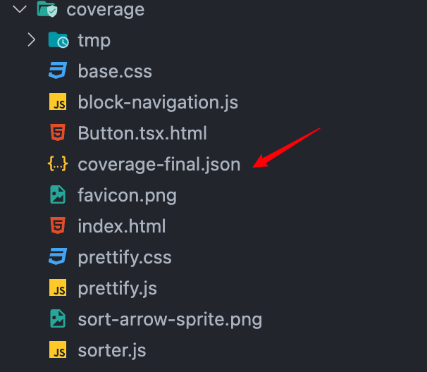

查看上面的 index.html

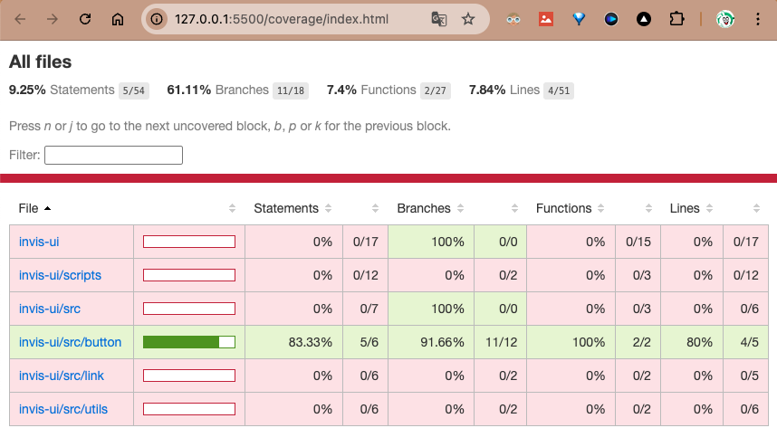

默认报告形式是一个静态网站。

### 公布覆盖率报告

覆盖率报告放在本地只能给自己的单元测试提供依据，更大的用途在于将覆盖率报告公布展示出来，让使用者可以看到。通常会选用覆盖率展示平台，常用的有 Codecov 和 Coveralls。

Codecov 是一个开源的测试结果展示平台，将测试结果可视化。Github 上许多开源项目都使用了 Codecov 来展示单测结果。Codecov 跟 Travis CI 一样都支持 Github 账号登录，同样会同步 Github 中的项目。


还会自动的生成徽章。这个徽章是会根据报告结果动态变化的，属于客观的第三方数据，具有公信力。

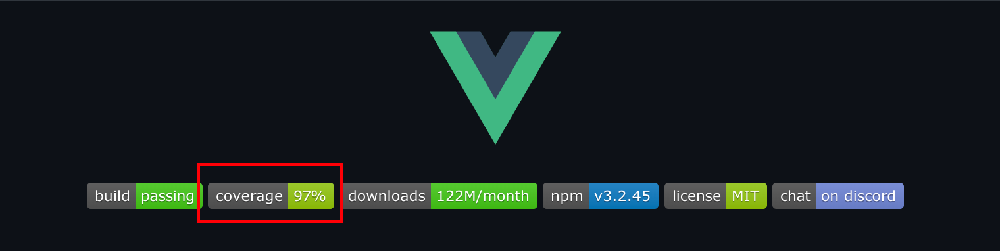

首先需要登录 [Codecov 网站](https://codecov.io/)，**一定要使用 Github 账号进行登录**，这样它可以直接读取你的 Github 中的项目。

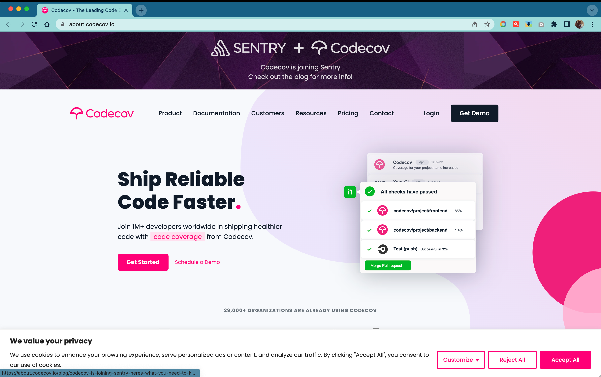

然后是添加访问授权，如果你的项目在你名下的组织下，也需要访问授权。

这时候你就可以在网站上找到所有 Github 中的项目。选择 【Not yet setup 】，选择需要展示覆盖率报告的网站后的【 setup repo】链接，就可以看到安装指南。

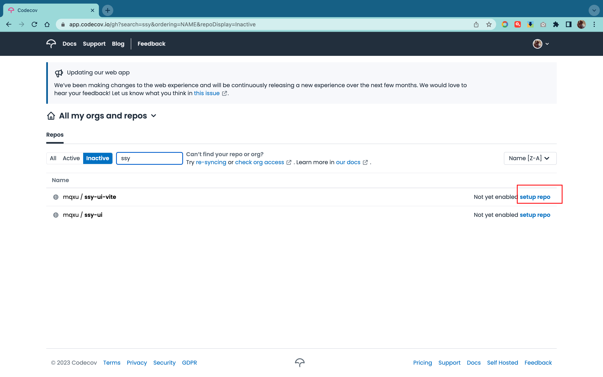

这里面我们只需要得到它的上传 Token 就好了。
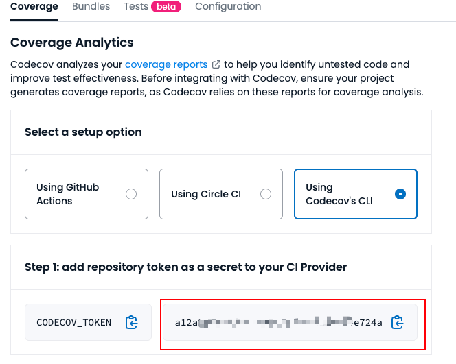

上传报告环节同样使用现成的 Action 。这里面需要添加 Token，把上面 codecov 安装指南中得到的 Token 放入 Secrets 中。

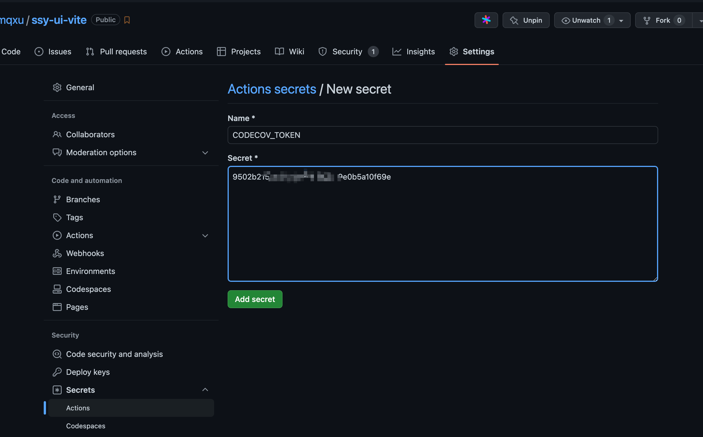

### 持续集成自动更新覆盖率报告

覆盖率报告最好能够自动按照最新版本持续更新，而不是自己手动上传。所以这个时候就需要使用 CI 工具来帮忙了。首先需要编写一个 Action。

.github/wokflows/codecov.yml

```yml
name: Run tests and upload coverage

on:
  push:
    branches: [main]
  pull_request:
    branches: [main]

jobs:
  test:
    name: Run tests and collect coverage
    runs-on: ubuntu-latest
    steps:
      - name: Checkout
        uses: actions/checkout@v4
        with:
          fetch-depth: 0
      - uses: pnpm/action-setup@v3
        with:
          version: 9.8.0
      - name: Install modules
        run: pnpm install

      - name: Run tests
        run: npx vitest run --coverage

      - name: Upload results to Codecov
        uses: codecov/codecov-action@v4
        with:
          token: ${{ secrets.CODECOV_TOKEN }}
```

提交代码就可以自动生成覆盖率报告了。

::: tip
`git add .` 前先把 `coverage/`添加到 `.gitignore` 文件，这个没必要上传
:::

Codecov Action 会自动识别语言与测试框架的覆盖率报告种类，然后上传相应的数据。这里面要特别说明，对于 Vitest ，是上传的 JSON 格式的报告，所以需要确定你确实生成了 JSON 报告。

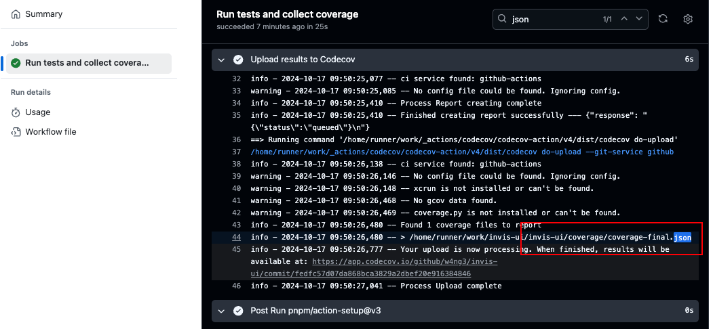
图中底部还有对应的链接，点击去查看测试覆盖率，也可以登录 Codecov 查看更详细的说明。

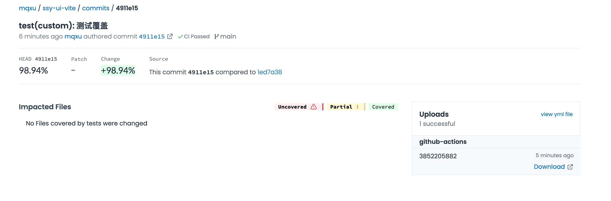

### 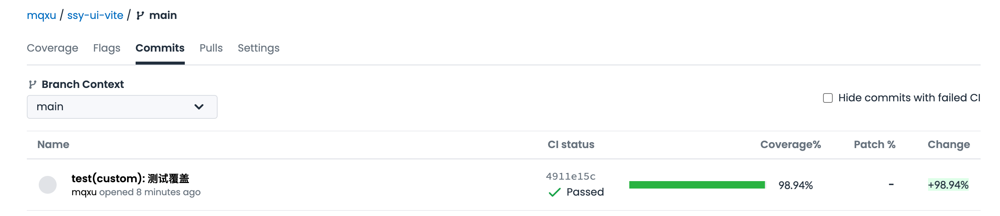

### 添加覆盖率徽章

最后就是富有仪式感的一步。Codecov 网站可以将测试结果生成为徽章。你可以把徽章直接放到 Github 中展示出来。

在项目的【 Configuration 】中找到对应的徽章。
::: tip
更新：codecov 上现在已经把 `Settings`更名为 `Configuration`
:::
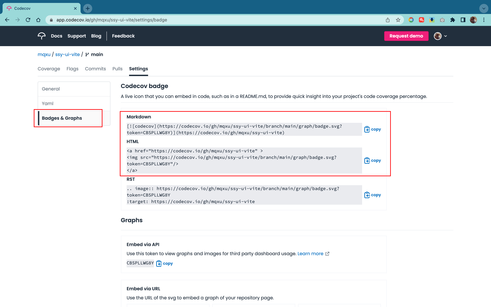

添加到 README 中后推送到 Github 即可看到效果。


