一个好的项目很少会由一个人来独立完成。即使你完成了所有功能实现，也需要有人给你 Review 和提建议、找 Bug。

本节介绍一下如何参与开源社区的代码贡献。对于任何一个开源项目，我们都是以陌生人的身份参与的。你并不是项目组成员，不具备直接提交代码的权限。如果想参与其中，最好的方式就是提交 PullRequest，等你有一定贡献的话再请求成为项目成员。

## 什么是 PullRequest？

PullRequst 直译过来就是拉取请求，那么拉取请求和提交代码有什么关系呢。

我们可以把代码比作一个团队，对于一个陌生人来讲，你很难获取信任，让你直接插手团队的管理。这个时候上帝给了你一次证明的机会，就是复制一个一模一样的团队给你。

你经过一段时间的优化管理后，可以把你的复制团队和原有团队的对比记录发送给原团队的管理者证明你优化的效果，请求将你的改进合并到原团队之中，这种行为就是代码世界的 PullRequest。显然这个世界上并没有上帝，但是代码本身是有可复制性的，可以很轻松地复制一份，这个叫做 fork。你改进后提交的合并请求就叫做 PullRequest，是你的复制分支和原分支的对比记录 + 你对改进的描述。

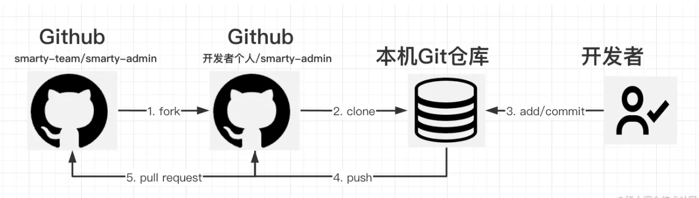

假设你要给张三的组件库提交代码，在 GitHub 中的 PullRequest 步骤如下：

1. 从张三组件库 fork 代码仓库到你的仓库；
2. 从自己仓库 clone 到本地；
3. 修改代码或添加新代码，或提交 commit 你的更改；
4. Push 到你的的代码仓库；
5. 给张三的组件库提交一个 PullRequest (拉取请求)，说明你的修改内容，请求张三提交。张三认为属于有价值提交的话，就会点击接受。则 Github 会将这次修改拉取到然叔的项目，这样的话就相当于给张三组件库提交了一次代码贡献。

简单地说，整个代码贡献过程可以认为是复制 -> 修改 -> 提交拉取请求 -> 接受请求。

一般我们用这里面的关键一步 PullRequest 当做整个代码贡献行为的简称。现在你就比较清楚为什么说参与开源项目叫提 PR 了。

## 用户故事(UserStory)

使用 Github 的 PullRequest 功能，管理陌生人提交的代码。

## 任务分解(Task)

- 模拟陌生人提交一个 PR；
- 查看 PR 和 Review Code；
- 合并代码；

### 创建一个 PullRequest

首先，我们创建一个 PullRequest。

这里用我另一个账号登录 Github，找到之前的项目

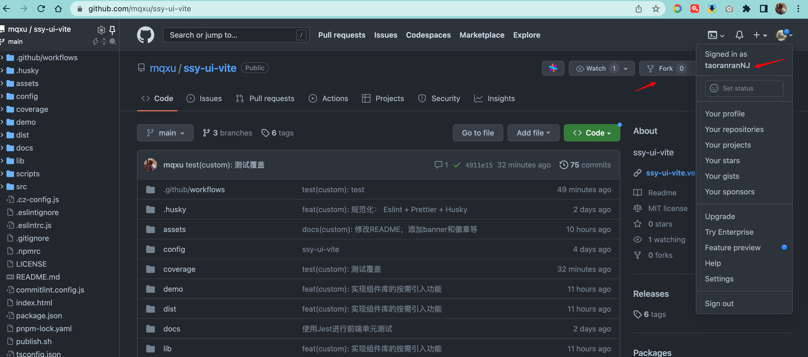

**Fork 代码**

Fork 实际上就是复制的意思。在 Github 中相当于将别人 账号中的项目复制了一份到自己账号中。

新创建的代码和自己常见的几乎没有差别，只是在界面上多了一点内容：

- 来源： 表示项目复制得哪个地址；
- 提交贡献： 这个按钮是 PullRequest 用的；
- 同步： Sync fork，这是一个新功能，用于将源地址的最新提交拉取回本地址。

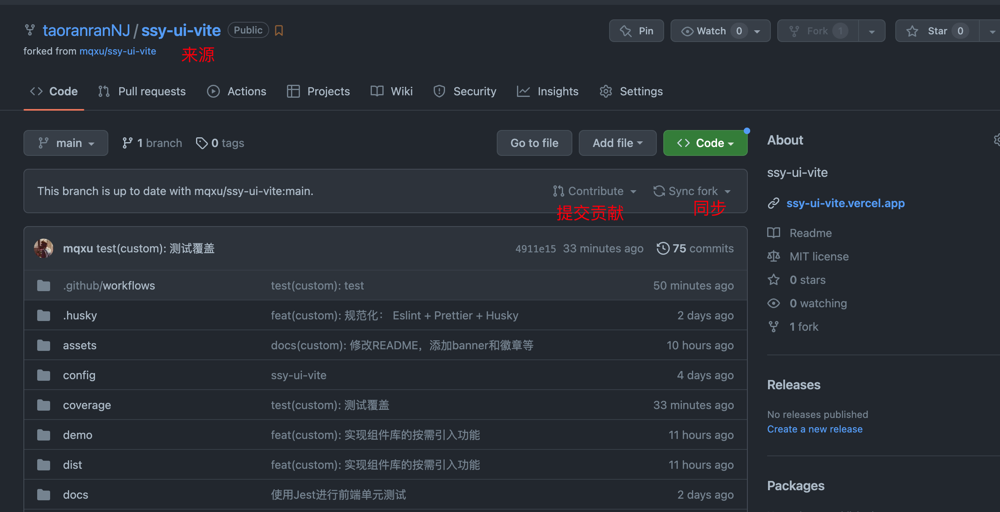

**Clone 代码到本地**

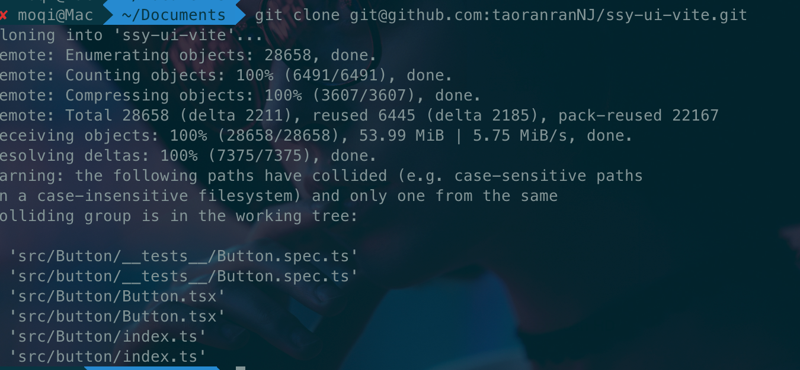

稍作修改后提交、push

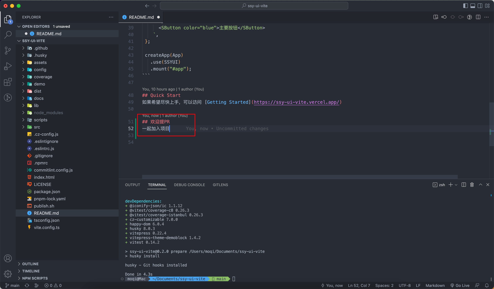

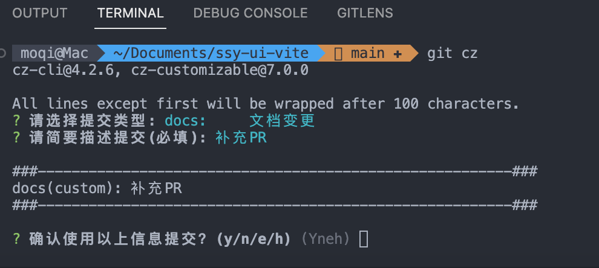

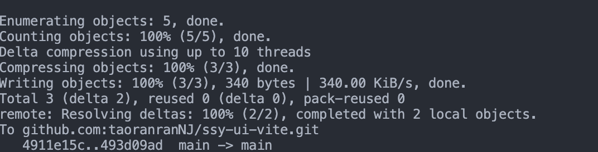

推送成功后，在当前用户的 github 页面，发起 PR

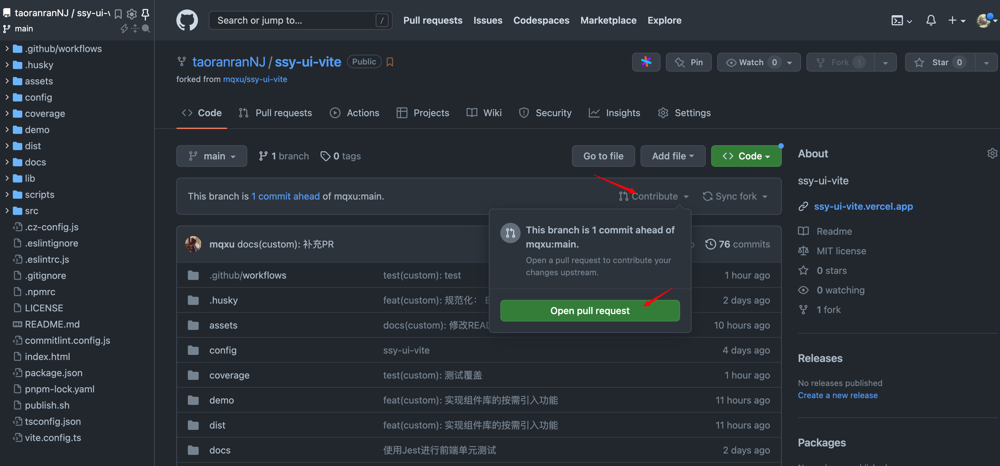

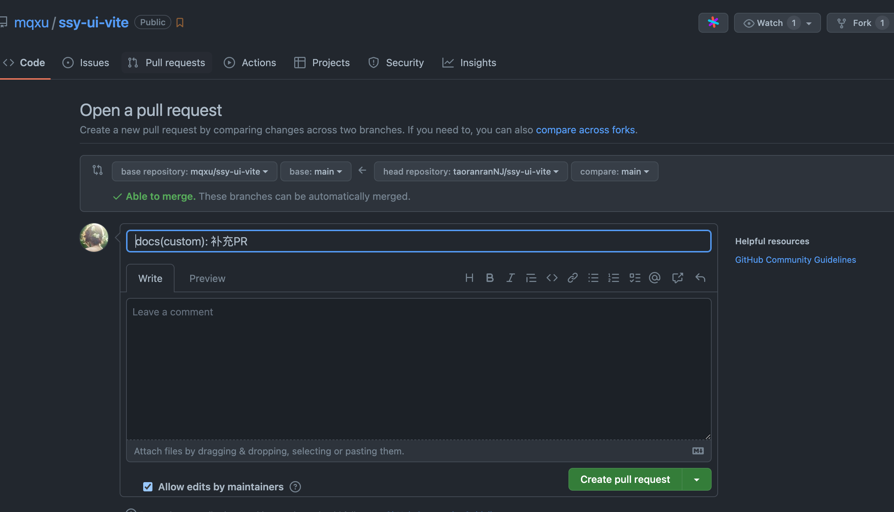

然后在项目所有者的 github 页面即可看到这条 PR

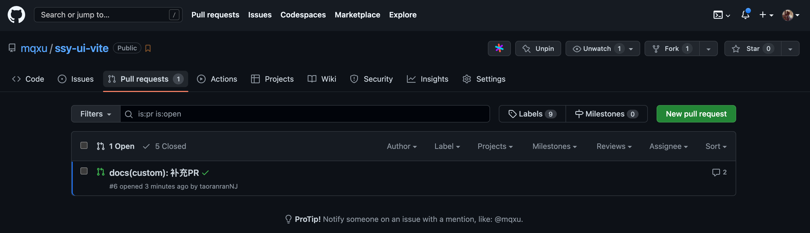

点进去，在让工作流 run

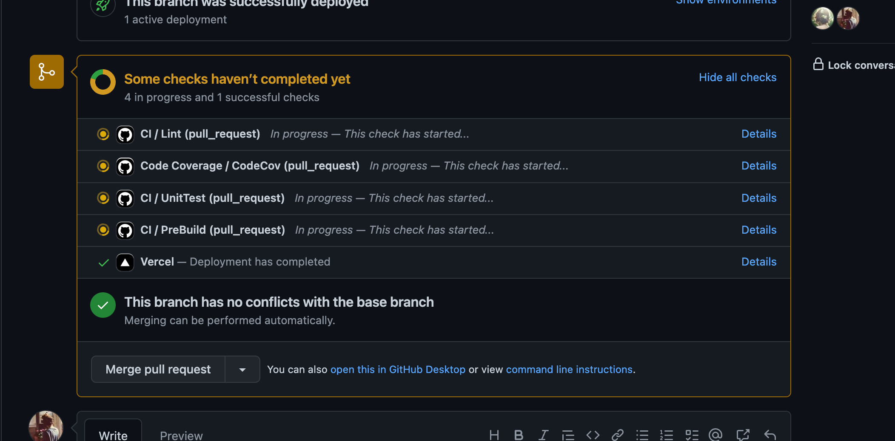

跑完后合并

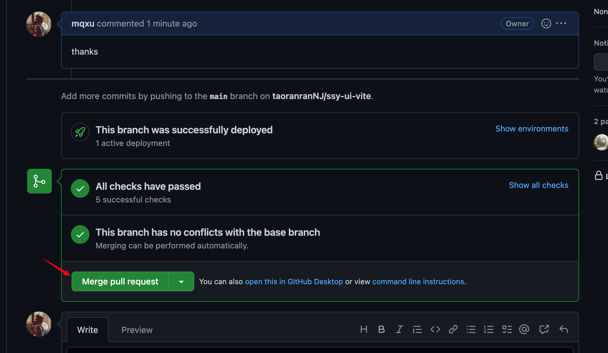

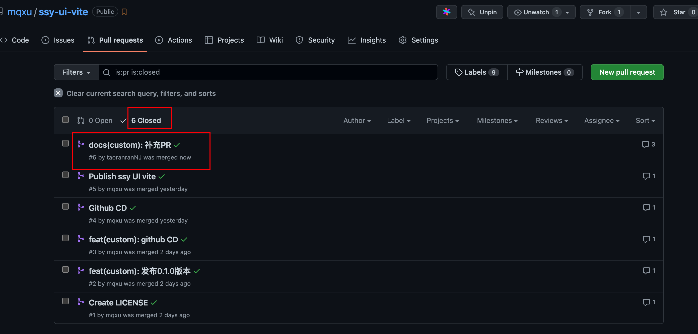

提起 PR 的人同步仓库即可

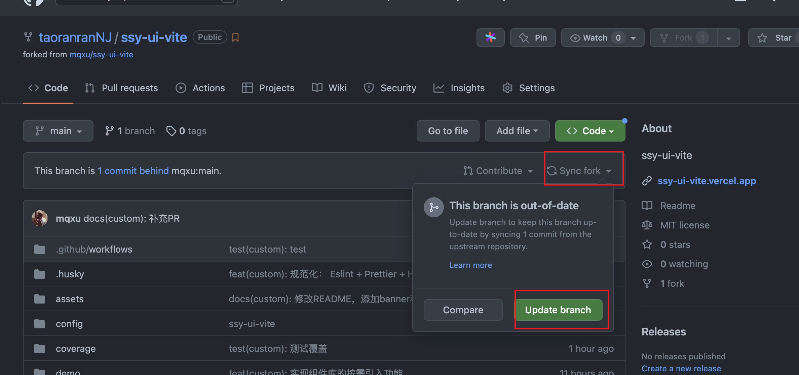

## 复盘

本节的主要内容是介绍如何参与代码贡献。

在开源世界中，每个人都是互不相识的。开源世界中的合作也是从陌生人到熟人的过程。有趣的 Github 给我们提供了一种陌生人参与代码贡献的可能，可以通过代码来证明自己、实现自己的价值。

然叔的组件库项目是为了大家学习而存在的，希望大家可以参与其中。大家也可以把然叔的项目当做进入开源世界的大门，从给然叔的项目提交第一个代码贡献开始你的开源之路。

下一个问题是有哪些可以提交的内容。一开始可以从简单的注释、文档开始。更进一步的内容，就需要通过关注 Issue 和 Projects 看板来关注项目动态了，下一节讲。

最后留一些思考题：

- 什么叫 PullRequest？
- 如何合并 PullRequest ？
