本节主要讲讲开源项目中的项目管理，以及 Github 中项目管理工具的运用。

在 Github 上的项目往往都采用敏捷方式管理。一个项目可能由几个处于不同时区国家的程序员合作完成。项目中的大量沟通任务都可以在 Github 上进行。他们有条不紊地向着同一个目标前进，这是一种非常神奇的体验，也正是 Github 的强大之处。本节我们就来学习这种方法，并尝试融入其中。

## 用户故事 (UserStory)

使用 Issue 与 Project 看板在 Github 上管理项目。

## 任务分解 (Task)

- 使用 Issue 进行问题管理；
- 使用 Project 进行项目管理。

Github 中的项目管理主要由 Issue 和 Project 组成；

### 问题管理 - Issue

https://zhuanlan.zhihu.com/p/28870840

无论你的项目管理方式是不是敏捷的。问题管理系统是一定需要的。问题管理是四大管理模式之一，你可以将项目开发过程当做一个挖掘问题、表达问题、归结问题、处理问题的过程。

一个项目就是将一个大问题分拆，并各个击破的过程。

在项目中的问题大概可以归纳为以下几类：

- 任务 - 待完成任务；
- Bug 缺陷；
- Feather 新特性；
- 问题：

- 功能建议；
- 项目中不能计划或不期望发生的问题和困难。

基于问题的管理，需要一个强大的工单系统进行支撑。就好比一个大企业面向无数客户需要一个 Call Center 不断处理工单。

这个工单系统需要能够管理提供以下功能：

- 项目管理

- 优先级
- 关联项目、基线、里程碑
- 分配人员
- 制定日程
- 监控进度提供统计

- 项目合作 - TeamWork

- 讨论
- 邮件通知

- 代码管理

- 将 Issue 关联代码
- 将 Issue 关联代码提交与合并

Issue 就是在 Github 中内置的工单系统或者叫问题管理系统。

下面我们来实践一下。

在 Github 中打开一个项目的 【Issue】选项卡，看一下一个 Issue 包含的内容。

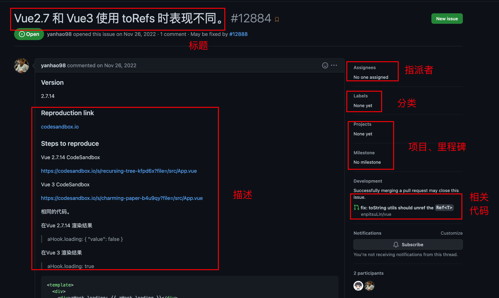

- 标题： 这个不用说了；
- 描述： 这个是聊天室模式所有人都可以评论；
- 指派者： 其实意思就是目前的负责人。如果有一个 Bug 的话，发现的人可以指派给项目负责人。负责人也可以根据分工指派给具体开发，大家也可以自己认领；
- 分类： 这个是一个标签体系。具体重要程度、优先级、分类；
- 项目和里程碑： 简单地说，就是表示这个问题和哪个项目相关。一般所有属于这个项目的问题都解决或被移出这个项目，才能算是项目完结；
- 相关代码： 这个功能可以链接某一个代码的提交。

我们可以在 ISSUE 中不断讨论问题、链接代码、指派给相关人，直到最终将问题解决，然后 Close 问题 。 这就是问题管理系统。

按照上述说明，给 ssy-ui-vite 仓库提交一些不同类型的 issue。

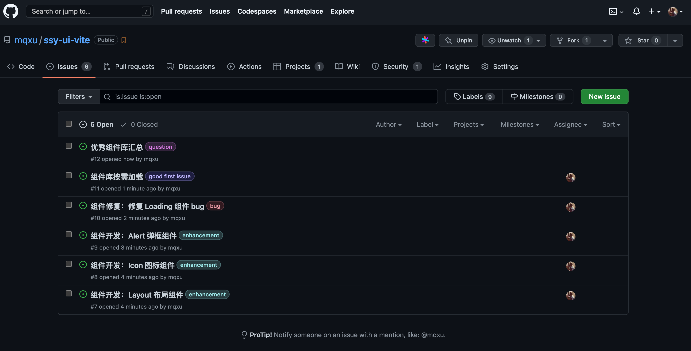

### 项目 - Project

项目是在一定约束的条件下（时间、资源（人力、设备）），完成一个明确的一次性任务。很多人都会把代码称之为项目，这个大错而特错。

具体来讲，比如 Vue 代码不是一个项目，在八月底完成 Vue1.0 版本的发布才是一个项目。为了完成项目，你需要确定项目的目标，拆分(Break Down)成 Task ISSUE 。在完成的过程中不断测量，不断平衡质量、进度、成本，促使项目在约定时间用合理的成本达成目标，这就是项目管理。

在 Github 中会使用敏捷的方式管理项目。在问题管理的基础上，一次项目，譬如说完成某一个版本，可以看做是是解决一部分特定的 Issue。

在 Github 中使用 Project 功能来实现这个功能。这个功能主要的理论根源来自于**敏捷开发的看板模式**。

看板模式，源于丰田的精益生产，是一种可视化的流程管理系统。

使用看板管理项目需要三步：

- 创建项目: 确定目标；
- 将相关 ISSUE 纳入项目中： 拆分任务、划分任务边界；
- 分配任务到个人；
- 看板跟踪项目进度。

1. 创建项目

Github 项目的面板可以点击项目首页的“Projects”进入

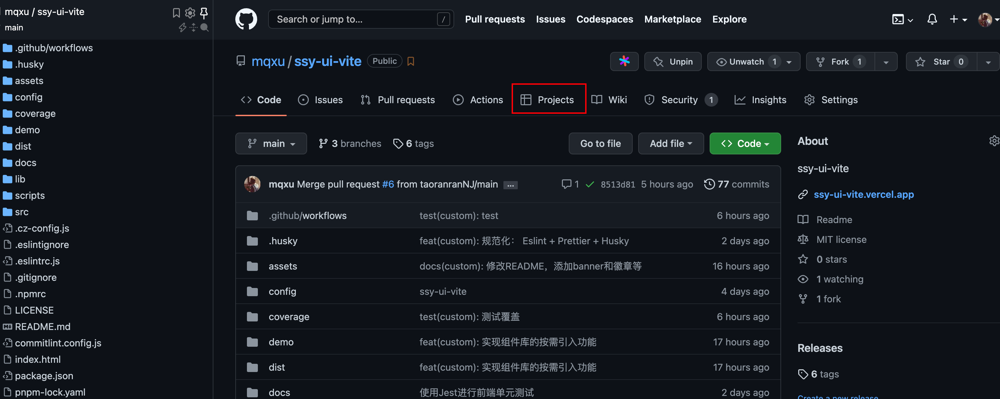

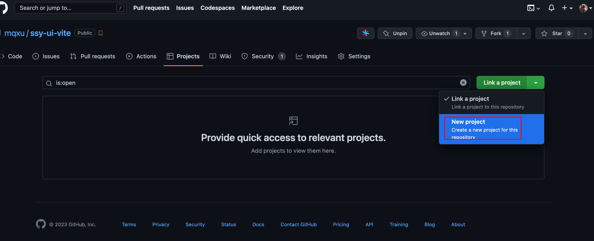

首先，开启一个项目 【ssy-ui-vite Alpha.1】 开发。

接下来可以选择一下项目的种类。

视图方式可以选择 Table 和 Board，Board 就是看板模式。这个模式其实就和大多数敏捷团队中使用的实体看板是一样的。

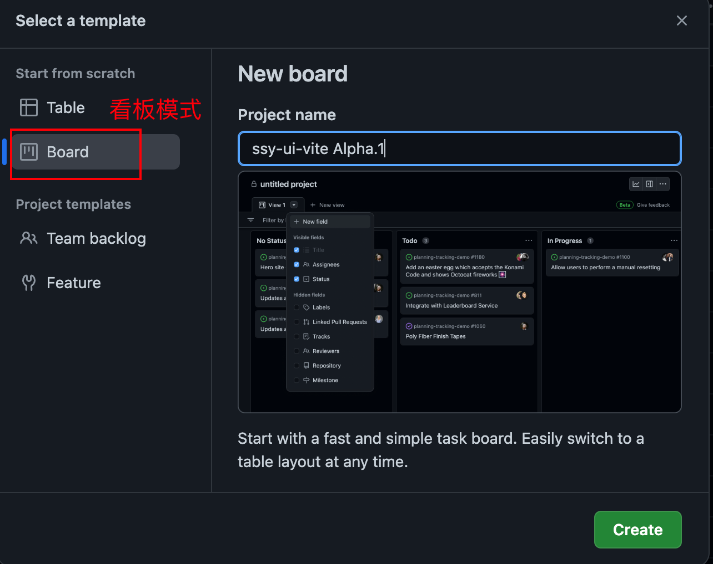

然后回到 ssy-ui-vite 仓库，将 Project 挂载到此仓库。

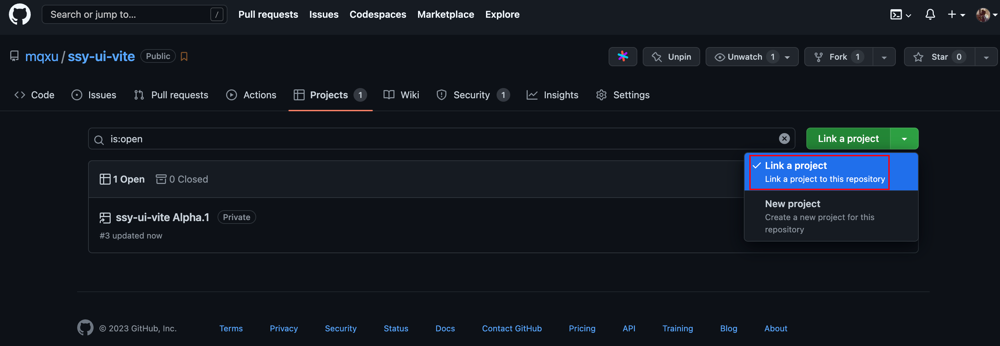

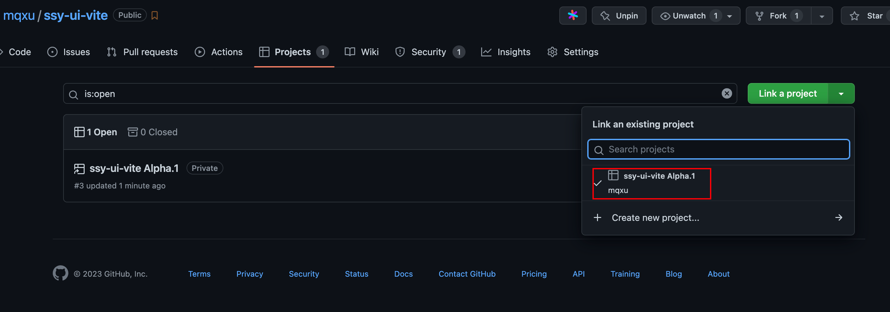

1. **将 ISSUE 纳入项目**

接着根据项目目标划定具体的功能。实际上这一步相当于把目标分解和确定开发边界。

比如本次开发的是 Alpha.1 版本。目标就是完善工程化闭环 + 添加典型组件。那么就需要将相关的功能 ISSUE 和 Bug ISSUE 添加到项目之中。如果还缺少一些功能，可以添加 ISSUE。

之前关联了仓库，issue 会直接显示在看板中。

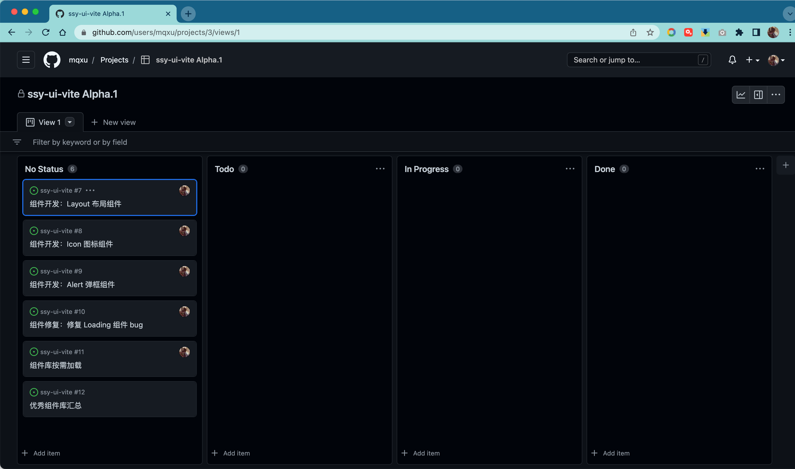

1. **分配任务**

接着可以分配相关的任务了

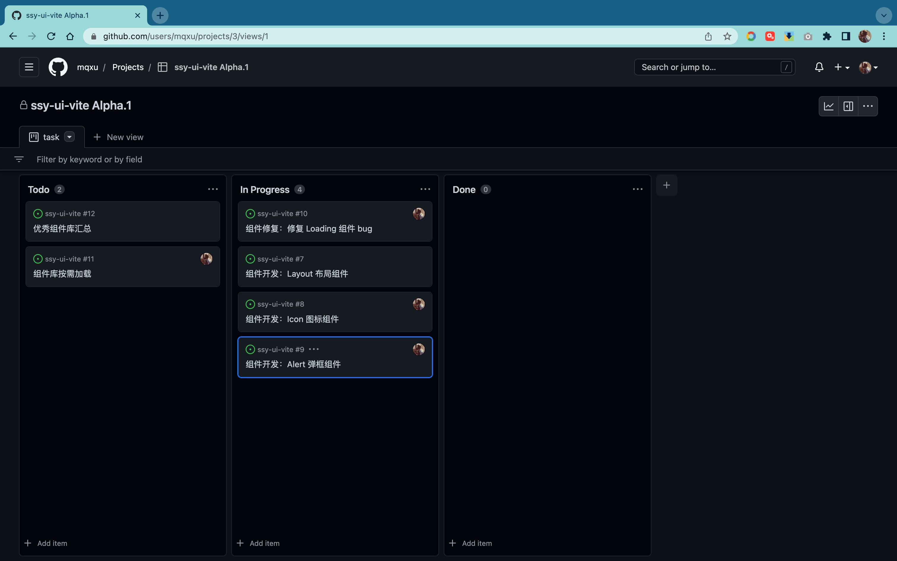

也可以点击 Add item 来添加

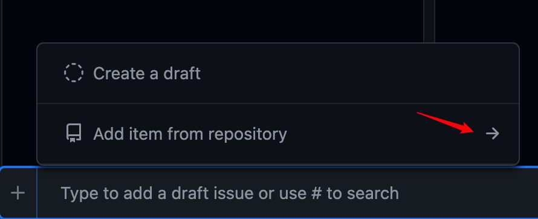

选择相应 PR 中的 issue

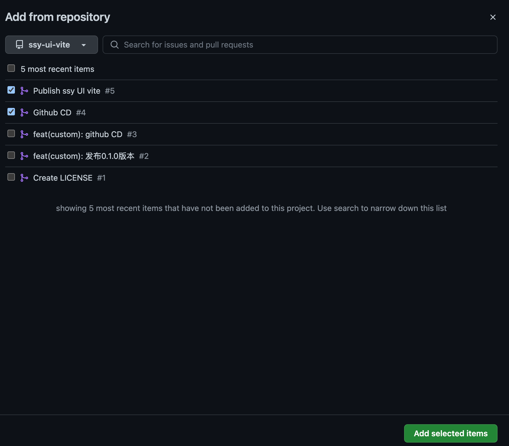

来自 PR 的 issue 会被添加到进行中

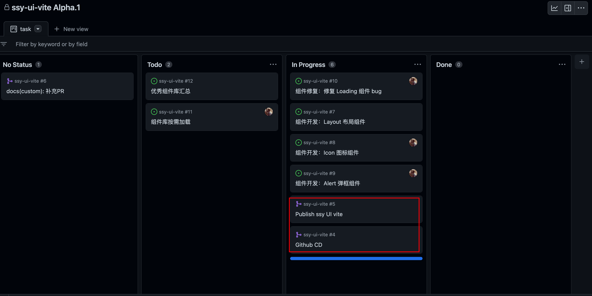

或者输入 # 来搜索相应的仓库，然后找 PR

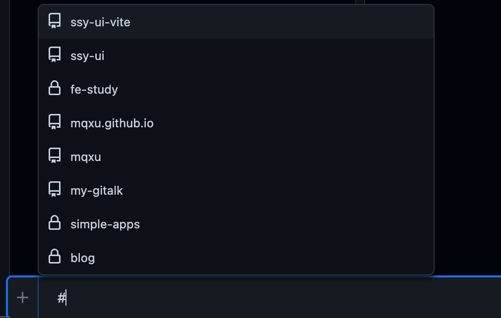

1. **分配开发者**

如果之前写 issue 的时候，没有分配开发者，那么此时可以分配任务到开发者，或者由开发者自觉认领，开源团队这个过程一般都是认领的比较多。

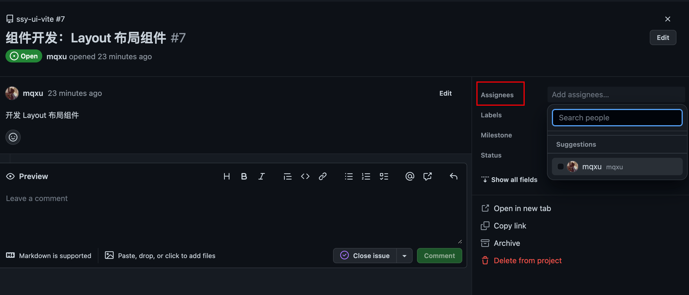

接下来就是使用，看板功能跟踪项目过程。这个过程比较直观，就不赘述了。

要强调的是，开发完成不是完成任务。代码的 review 和关闭项目需要第三者确认才有意义。就比如说你开发的新组件，一定是需要项目负责人检查了你的代码、跑了你写的测试用例、确认才算完成这个 ISSUE。

正常来讲，当项目的所有 ISSUE 都完成了，就可以宣布项目成功完结了。当然很多时候还会临时加一些任务或者把一些不太好完成的东西放到下一期。

## 复盘

本节的主要内容是使用 Github 中的 ISSUE 和 Project 实现对开源项目的管理。

显然，开源团队对管理比线下团队提出了更大的挑战。因为大家彼此不熟悉，而且也许在地球的两侧，需要分时交流。所以需要更为强大的管理工具的支持。

Github 中的项目管理功能吸取了大量敏捷团队的思想，是一个非常不错的敏捷管理模型的实践。这也是大家参与开源项目的很重要的一步。可以花一定时间详细阅读某一开源项目的 ISSUE 。

最后留一些实践任务：

- 给彼此项目提一个 ISSUE 并解决完成整个闭环；
- 多思考如何使用这些工具用于平时的学习、团队管理等。
