搭建工程的过程会觉得非常辛苦，一直在踩坑。即使文档描述再精确，由于版本和各种不可预知的原因，都会造成各种各样的问题。一个项目中搭建框架的人就好比项目的开路先锋，ta 的踩坑是为了不让别人继续踩坑。

那么怎样让搭建的工程框架复用起来，让大部队享受开路先锋创造的工程成果呢？ 答案就是**脚手架工具。** 比如 Vue 有 vue-cli 和 vue-create，React 有 create-react-app 等。

本节我们就来学习如何创建脚手架程序。

对于一个组件库来讲，脚手架一般分为两种：

- create-ssy-cli : 创建使用 SSY-UI 组件库的程序的脚手架；
- create-xxx-ui ： 创建和 SSY-UI 类似的组件库的脚手架，也就是复用我们上面的架构。

实际上这两种脚手架原理和功能都非常相似，我们就以第一种为例子来介绍如何编写脚手架程序。

## 用户故事 (UserStory)

编写一个 create-ssy-cli 脚手架程序， 让用户可以轻松搭建使用 SSY-UI 的应用程序。

## 任务分解 (Task)

- 创建模版项目；
- 初始化 CLI 项目；
- 创建命令行界面；
- 克隆项目模版；
- 模版生成代码；
- 上传 Npm 仓库。

### CLI 与 脚手架的概念

用惯了 vue-cli 或者 create-react-app 的前端人可能都会认为，cli 与脚手架是一个概念。

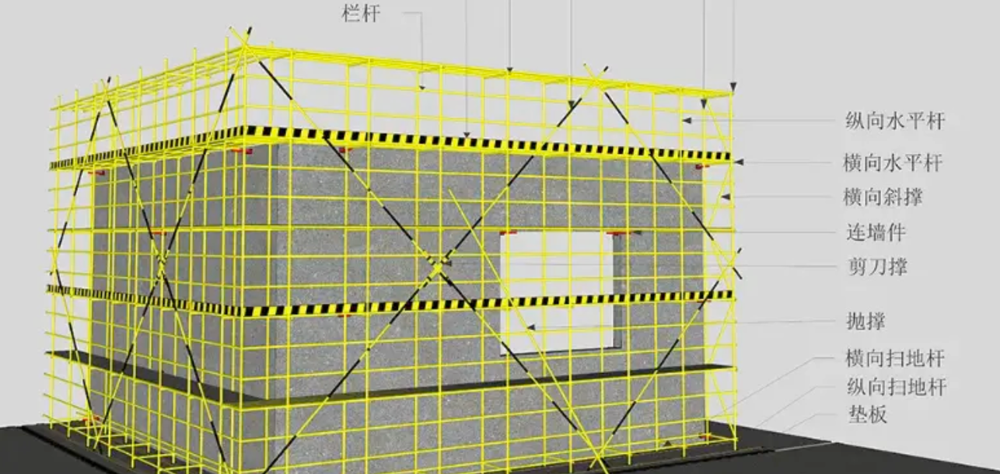

先讲讲脚手架，脚手架的概念来自于工程。脚手架就是为了工程顺利进行而搭建的工程平台。用在软件开发中，就是帮助开发过程的工具和环境配置的集合。简单来说，目前组件库的状态就是一个脚手架。虽然只有一个组件，但是为组件库的环境配置和工具已经整合完成了。

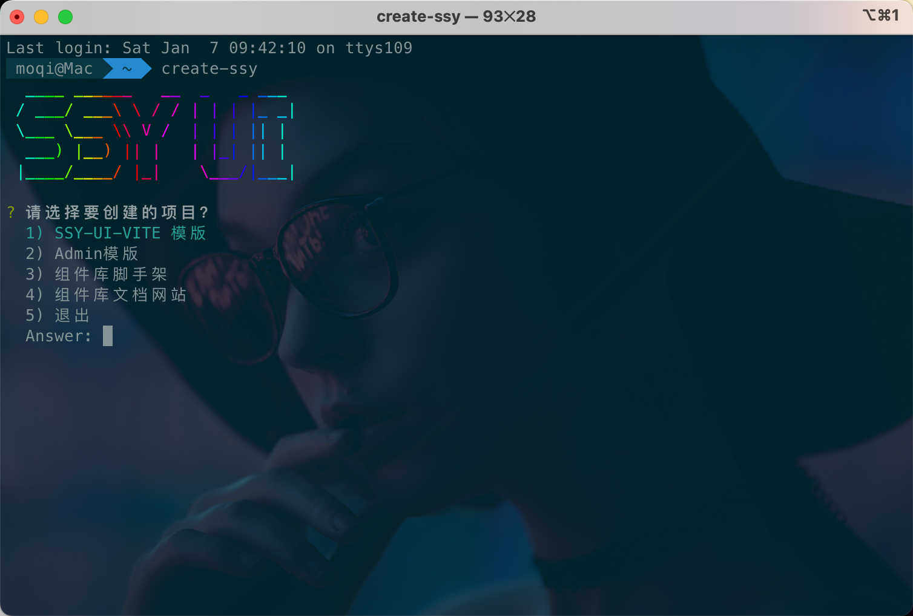

其次说一下 CLI 工具是什么。 CLI 是英文 `command-line interface` 的简写，翻译为命令行界面。也就是只在用户提示符下键入可执行命令的界面。通常脚手架程序会通过 CLI 的形式封装，这样做更加符合程序员的习惯，相比开发完整的 UI 开发效率更高。所以目前看到的大多数脚手架都是以 CLI 工具的形式封装的。久而久之，大家也就比较习惯将 CLI 与脚手架混为在一起了。

明白了概念后我们正式开始。

这次我们要开发的脚手架 create-ssy-cli ，功能是可以快速创建一个使用 SSY-UI 开发的项目模版。也就是说，假设你想用 ssy-ui 开发项目，可以直接使用脚手架创建一个空的项目，里面包含的 vite + vue3 + ssy-ui 组件，直接开发逻辑就好了。

当然这个功能还比较初级，后续还可以不断迭代。但是麻雀虽小五脏俱全，基本上这里面会将脚手架工具所使用的工具都会演示一遍。

**一般一个脚手架项目会有两部分组成：**

- Template 项目： 项目的模版；
- CLI 工具项目： 提供命令行界面用于克隆项目，生成代码、自动配置、运行调试、发布等功能。

### 创建模版项目

这一步主要就是创建一个程序的模版。其实就是从零搭建一个 Vue3 + Vite 环境并且引入 SSY-UI。

首先，选择使用 vite-cli 工具直接搭建项目。

- Vite 启动；
- 使用 TypeScript 语言；
- 全局引入 SSY-UI。

这个过程其实就是使用 Vite 脚手架工具搭建一个 vue3 项目，然后引入 ssy-ui 组件。

```bash
 pnpm create vue@latest
```

输入项目名：ssy-ui-template ，按照提示添加一些你想要的插件，例如：

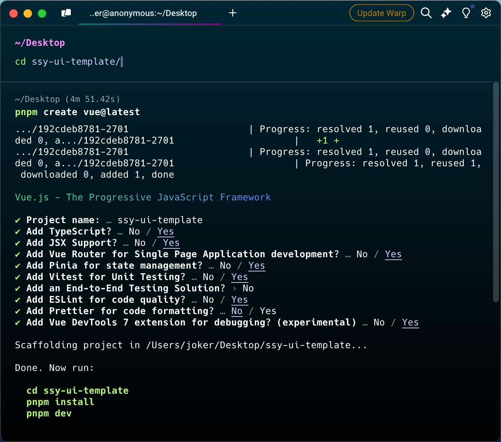

`package.json` 需要引入之前发布成功的 `ssy-ui-vite` 包，这里引入你自己发布的包，可以修改一些描述信息。

```json
{
  "name": "ssy-ui-template",
  "version": "1.0.0",
  "description": "ssy-ui-template模版项目",
  "keywords": [],
  "author": "xxx",
  // ...
  "dependencies": {
    "ssy-ui-vite": "^1.7.0"
    // ...
  }
}
```

main.ts ，全局引入了 SSYUI 及其样式，当然，也可以在某个页面局部引入。

```typescript{6,7,12}
import "./assets/main.css";
import { createApp } from "vue";
import { createPinia } from "pinia";
import App from "./App.vue";
import router from "./router";
import SSYUI from "ssy-ui-vite";
import "ssy-ui-vite/style.css";

const app = createApp(App);
app.use(createPinia());
app.use(router);
app.use(SSYUI);
app.mount("#app");
```

接着修改一下代码，例如添加一些组件库的组件和描述、添加一个自己的图标，如图：

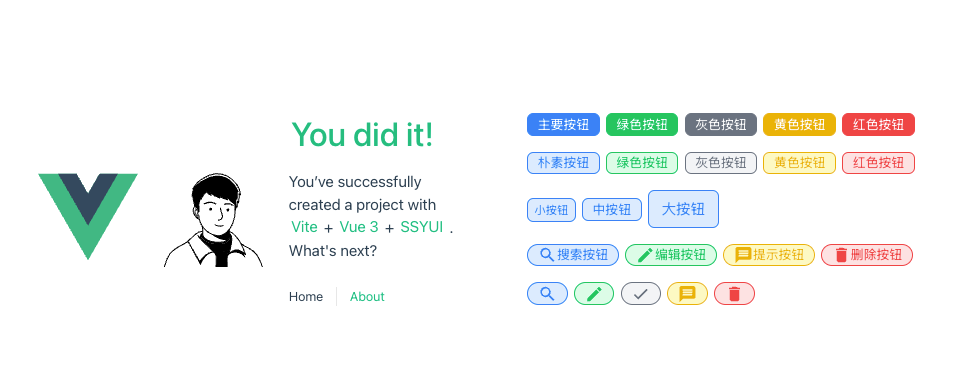

`src` 同级目录，新建 `template` 目录，然后新建 `package.hbs.json` 模版配置，主要就是将项目名称替换成用户输入的变量，其他和根目录的 `package.json` 一致。

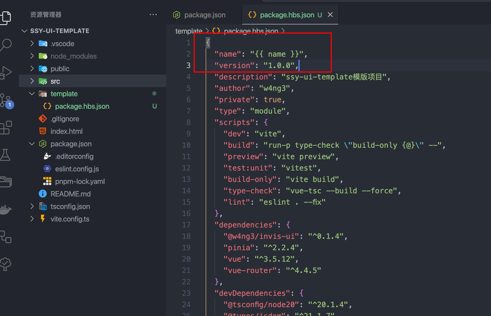

完成后发布到 Github

<!-- 这里放上我的作为参考。 -->
<!-- https://github.com/mqxu/ssy-ui-template -->

### 初始化 CLI 项目

脚手架主要的运行过程如下：

- 提供命令行界面：

- 选择代码模版 ；
- 填写项目名称。

- 克隆模版项目；
- 根据项目名称及其他配置生成代码。

这一步的目的主要是搭建一个基础的 CLI 环境。也就是可以用一个全局命令调用到 CLI 工具的 JS 程序。 CLI 工具是可以在全局执行的程序。也就是说，将 npm 软件包中的一个 JS 文件注册到全局。

首先创建 `create-ssy-cli` 项目

```bash
mkdir create-ssy-cli
cd create-ssy-cli
pnpm init
```

根目录新建 `bin/index.js` 作为文件的入口。

```javascript
#!/usr/bin/env node
console.log("create-ssy ....");
```

这里面第一行 `#!/usr/bin/env node` ，讲一下它的功能。首先这个 index.js 程序不是常规的使用 `node xxx` 命令执行。而是需要通过 `source xxx` 或 `./xxx` 来执行，也就是像一个 shell 脚本一样执行。这时候就出现了一个问题， JS 代码是不能够直接以这种形式执行的，那么就需要上述语句来声明解释器类型。也就是说，执行该代码需要使用 node 当做解释器辅助。

在 `package.json` 中添加一个 `bin` 属性，声明注册一个叫 `create-ssy` 的可执行文件。并且将 `type` 设置为 `module` 。这么做的目的是在 Node 环境中使用 esm 模块规范。这样就可以使用 import 和 export 导入导出模块了。

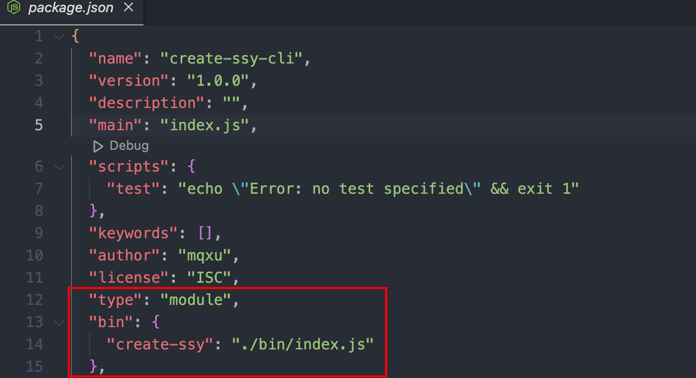

编写完成后运行 `npm link`， 模拟全局安装的效果。

```bash
npm link
```

这个时候就可以在电脑的任何一个目录下执行命令:

```bash
create-ssy
```

日志正确输出，标志着 CLI 工具框架初始化完毕。

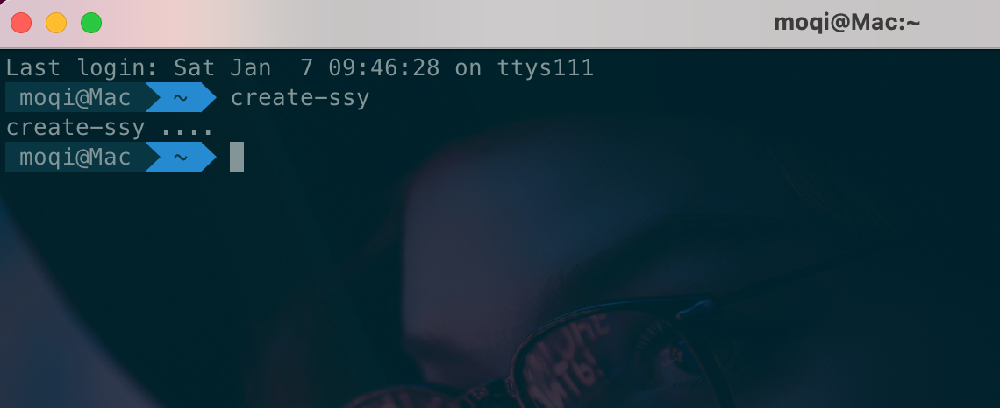

### 创建命令行界面

下一步，就是打造一个命令行界面。命令行界面的意义在于可以让用户定制自己需要的程序。

比如： vue-cli 可以选择需要的 ts/js 语言、是否需要 router 与 vuex 、是否需要 eslint 等。

具体到这个 CLI 的需求，需要实现选择多种模版功能。

Vue-cli 这样的通用脚手架提供多种可选项。但是它付出的代价，就是实现逻辑复杂且容易出错。而在企业内部的脚手架，更多的是需要更为简单高效的功能，并不需要花里胡哨。

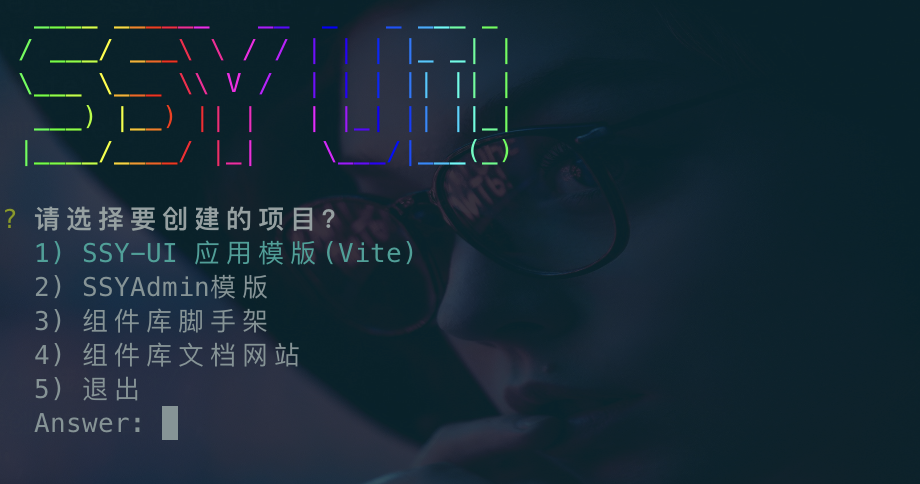

首先打印一个欢迎界面，这个功能是使用 `clear`、`chalk-animation` 与 `figlet` 合作完成。

- `Clear` 清除屏幕；
- `Figlet` 提供炫酷的文字效果；
- `Chalk-animation` 提供命令行动画与渐变颜色。

安装

```bash
pnpm i figlet clear chalk-animation
```

修改 index.js

```javascript
#!/usr/bin/env node
import figlet from "figlet";
import clear from "clear";
import chalkAnimation from "chalk-animation";

// 打印欢迎画面
clear();
const logo = figlet.textSync("SSY UI", {
  font: "Ghost",
  horizontalLayout: "default",
  verticalLayout: "default",
  width: 120,
  whitespaceBreak: true,
});

const rainbow = chalkAnimation.rainbow(logo);
setTimeout(() => {
  rainbow.stop(); // Animation stops
}, 500);
```

这里的 font 使用的`Ghost` 字体，使用或者注释掉的效果如下：

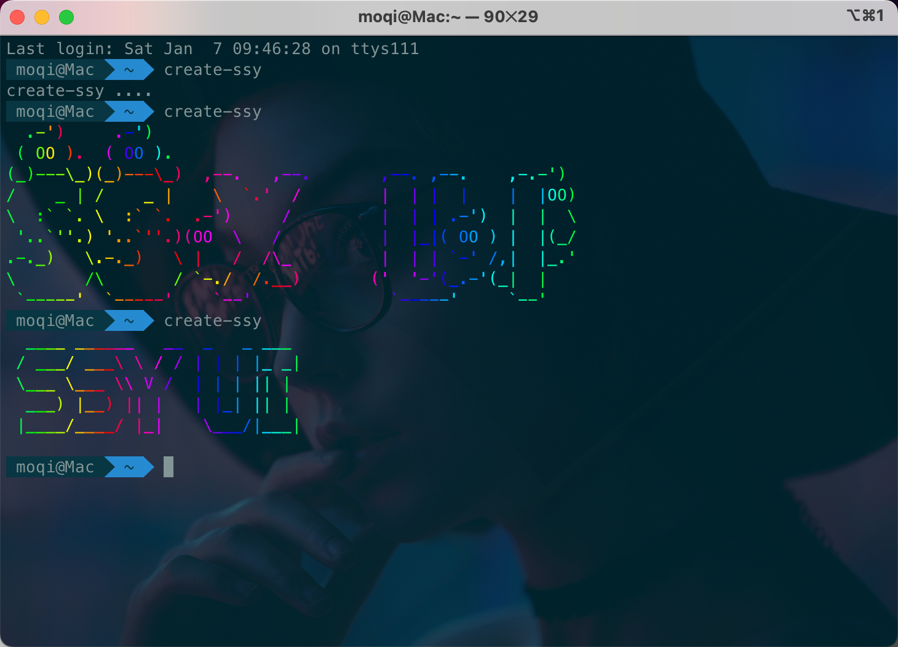

然后是命令行选项，这个使用 `inquirer` 这个库完成。它会根据配置显示界面并把结果返回为 `json`。

后面通过返回结果动态 import 导入需要的模块，这样就实现了根据选项运行不同的初始化模块。

安装

```bash
pnpm i chalk inquirer
```

继续修改 `index.js`

```javascript
#!/usr/bin/env node

import { promisify } from "util";
import figlet from "figlet";
import clear from "clear";
import inquirer from "inquirer";
import chalkAnimation from "chalk-animation";

const opt = {
  "SSY-UI-VITE应用模版": "ssy-ui-vite",
  // Admin模版: "admin",
  组件库脚手架: "uitemplate",
  组件库文档网站: "uitemplate",
  退出: "quit",
};

const question = [
  {
    type: "rawlist" /* 选择框 */,
    message: "请选择要创建的项目？",
    name: "operation",
    choices: Object.keys(opt),
  },
];

// 打印欢迎画面
clear();
const logo = figlet.textSync("SSY UI", {
  // font: "Ghost",
  horizontalLayout: "default",
  verticalLayout: "default",
  width: 120,
  whitespaceBreak: true,
});

const rainbow = chalkAnimation.rainbow(logo);
setTimeout(() => {
  rainbow.stop(); // Animation stops
  query();
}, 500);

async function query() {
  const answer = await inquirer.prompt(question);

  if (answer.operation === "退出") return;

  const { default: op } = await import(
    `../lib/operations/${opt[answer.operation]}.js`
  );
  await op();
}
```

### 克隆项目模版

项目的主体一般都是通过从 Github 直接拉取的形式。只有少部分需要修改的代码使用代码模版生成的方式实现，我们熟悉的 vue-cli、create-react-app 也都是一样的原理。

首先使用 `download-git-repo` 这个库完成克隆。 克隆是一个漫长的异步执行过程，可能会持续数秒到几分钟。这个时候为了优化用户体验，就需要一个进度条表示一直在加载。比如 `ora` 库。

```bash
pnpm i ora download-git-repo handlebars
```

首先编写一个进度条和 `git` 下载结合的 `clone` 函数，根目录新建 `lib/utils/clone.js`

```javascript
import { promisify } from "util";
import download from "download-git-repo";
import ora from "ora";
export default async (repo, desc) => {
  const process = ora(`开始下载模版...${repo}`);
  process.start();
  await promisify(download)(repo, desc);
  process.succeed();
};
```

然后编写克隆过程，这个里面还需要一点交互，问一下项目名称。另外为了让日志有颜色，使用了 chalk 包。

新建 `lib/operations/ssy-ui-vite.js`

会 `clone` 之前已经推送到远程的模版项目，而模版项目 又依赖正确发布的 `ssy-ui-vite` 包，所以牵一发动全身，此处参考很多内容，踩坑很久。

:::tip
第 22 行按照格式修改成你自己发布的仓库
:::

```javascript{22}
import clone from "../utils/clone.js";
import inquirer from "inquirer";
import fs from "fs";

import chalk from "chalk";
const log = (...args) => console.log(chalk.green(...args));

import handlebars from "handlebars";

export default async () => {
  const { name } = await inquirer.prompt([
    {
      type: "input" /* 选择框 */,
      message: "请输入项目的名称？",
      name: "name",
    },
  ]);

  log("🚌 创建项目:" + name);

  // 从github克隆项目到指定文件夹
  await clone("github:w4ng3/ssy-ui-template", name);

  // 生成路由定义
  compile(
    {
      name,
    },
    `./${name}/package.json`,
    `./${name}/template/package.hbs.json`
  );

  log(`
👌 安装完成：
get Started:
===========================
cd ${name}
pnpm i
pnpm run dev
===========================
    `);
};

/**
 * 编译模板文件
 * @param meta 数据定义
 * @param filePath 目标文件路径
 * @param templatePath 模板文件路径
 */
function compile(meta, filePath, templatePath) {
  if (fs.existsSync(templatePath)) {
    const content = fs.readFileSync(templatePath).toString();
    const result = handlebars.compile(content)(meta);
    fs.writeFileSync(filePath, result);
    log(`📚 ${filePath} 修改成功`);
  } else {
    log(`❌ ${filePath} 修改失败`);
  }
}
```

效果

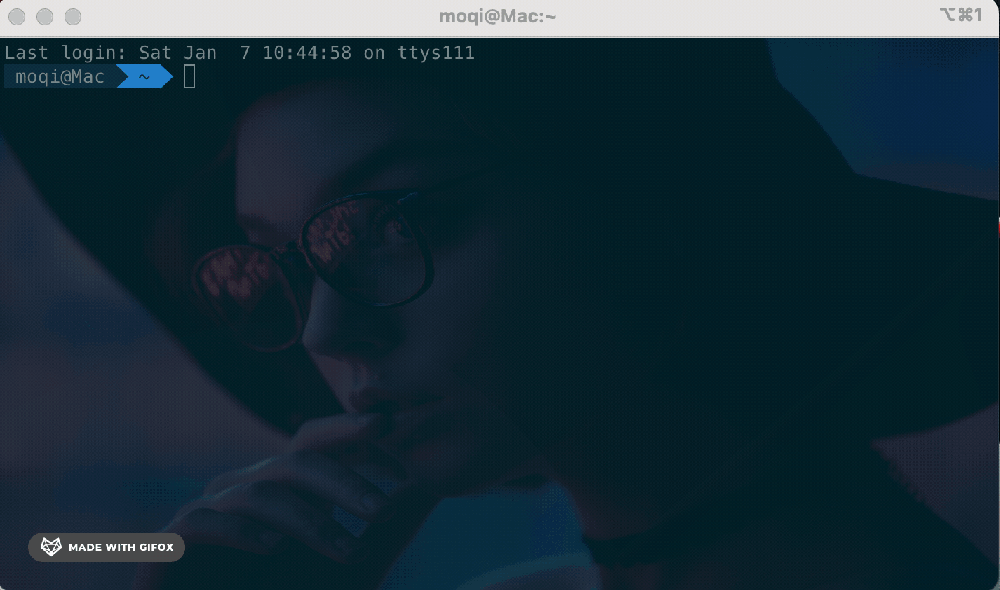

### 测试脚手架构建的项目

激动人心的时刻到了，我们用自己的脚手架构建的 demo 项目，能否正确运行，并正常显示组件库呢？

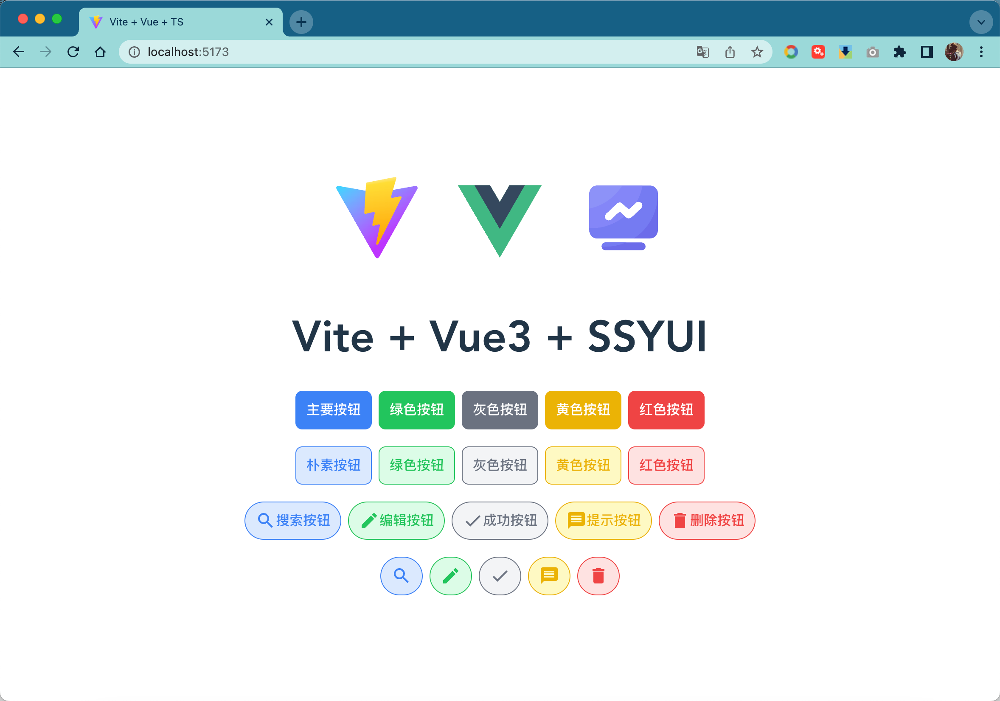

接下来修改一下代码，引入其他组件试试效果

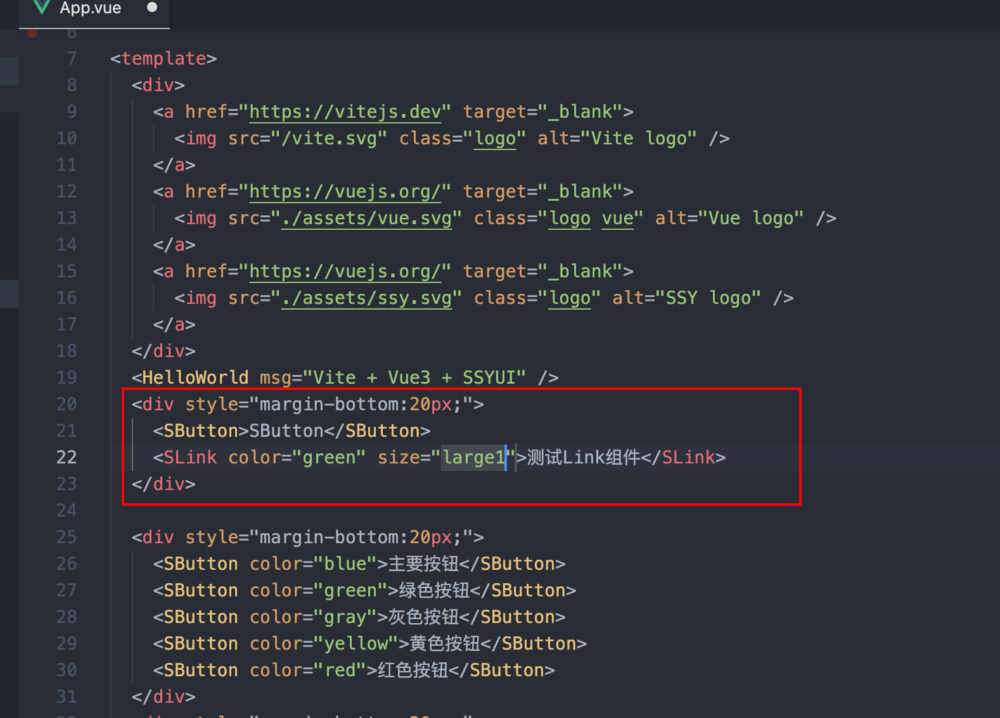

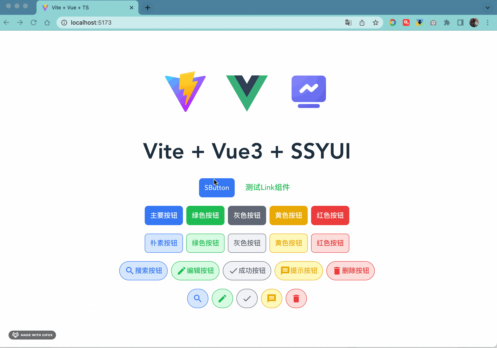

### 上传 Npm 仓库

最后一步是把脚手架项目打包上传到 npm 仓库，这个步骤还是需要使用 `Github Action` 完成。可以参考前面所学，自行完成。

建议先阅读完下一篇再发布到 npm 。

## 复盘

本节的主要内容是介绍如何编写一个 CLI 工具。

虽然只是介绍了一个很基本的功能，但是希望起到抛砖引玉的作用，探索工程化、自动化。

最后留一些扩展任务：

- 创造一个自己的 CLI 工具；
- 使用自动化生成代码功能解决一个项目的实际问题。
