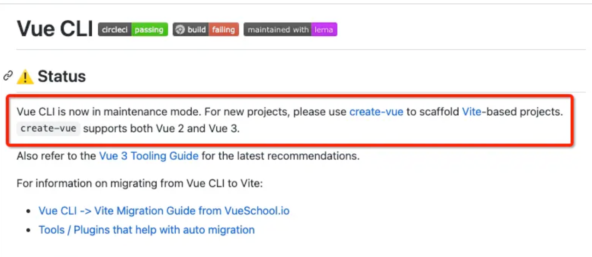
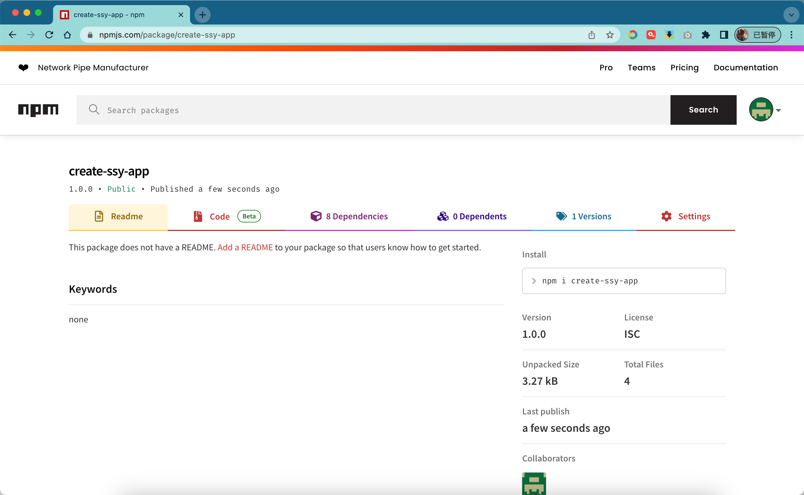
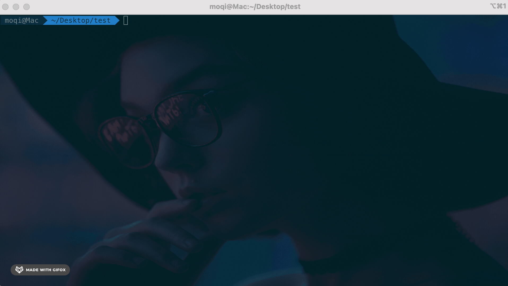
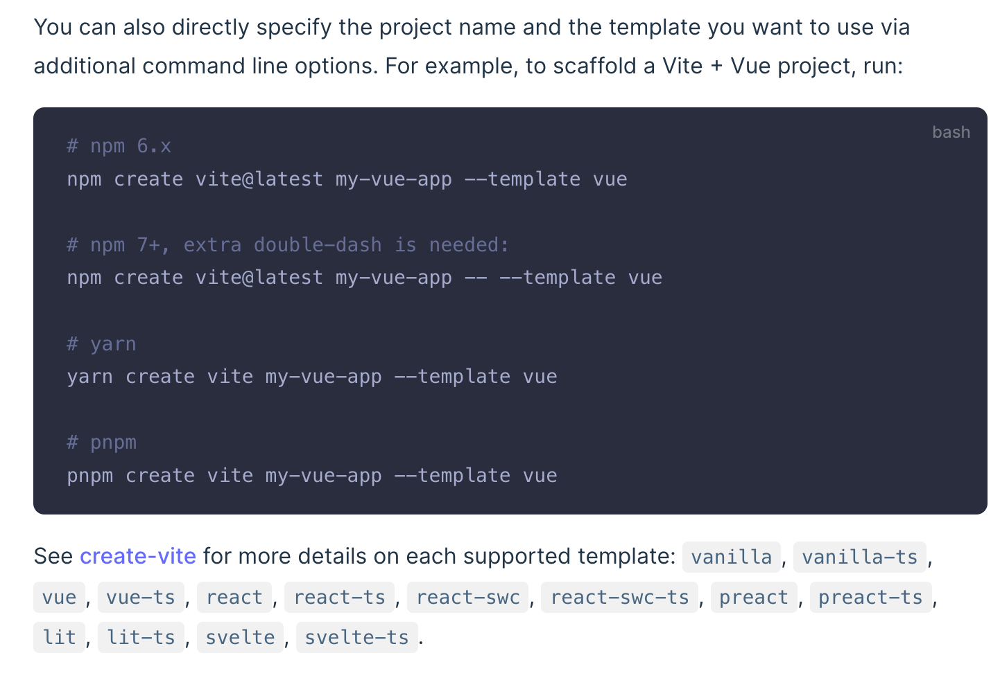
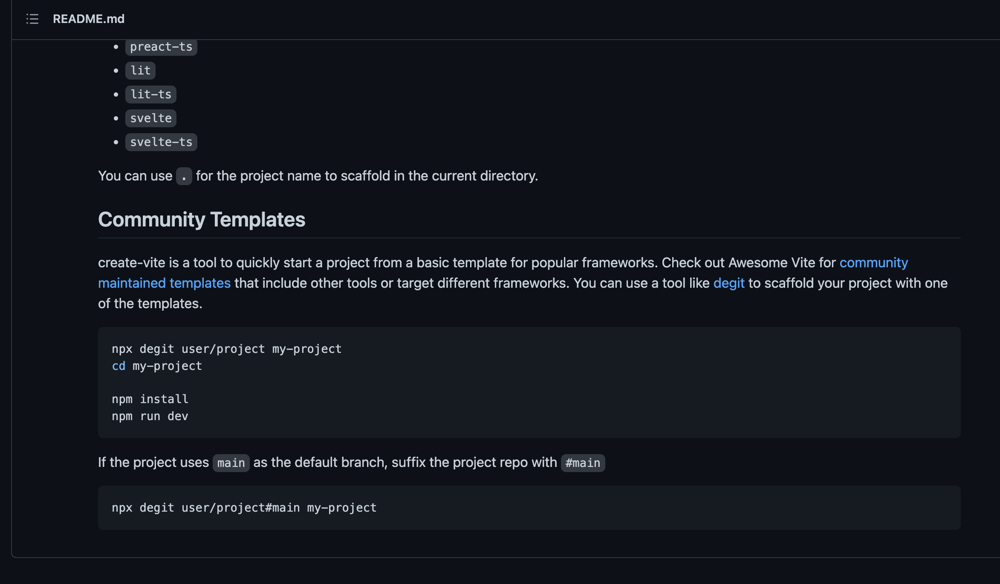
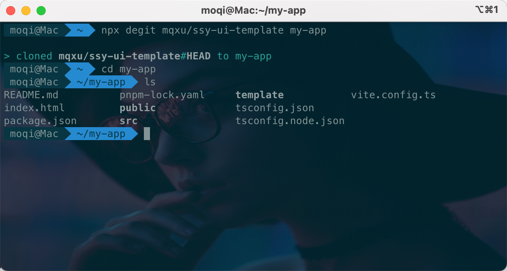

随着时代的发展，脚手架也不断地变革。更多的脚手架会使用 npm init 或者 npm create 来创建项目。其实这两个命令没什么区别。

以我们常用到 vue-cli 工具。



目前 vue 的脚手架已经进行版本分化。首先原来的 vue-cli 工具进入了维护状态。目前只支持使用 Webpack 项目的创建。新的脚手架工具全部转为 create-vue，使用 vite 构建。

- [@vue/cli](https://github.com/vuejs/vue-cli)
- [Create-vue](https://github.com/vuejs/create-vue)

哪种构建工具好，不是我们讨论的话题。我们来通过这个案例分析一下脚手架工具的流行趋势，

从 vue-cli 到 create-vue ，脚手架工具命令行界面的变革。

```bash
# 用 @vue/cli 创建项目
sudo npm i @vue/cli
vue create my-app

# 用 create-vue 创建项目
npm create vue my-app
```

很显然你会发现后者更加的简单，只需要一条语句而且无需提前安装。这个体验真的是太棒了。

## 用户故事 (UserStory)

让组件库脚手架可以通过 npm create 使用， 让用户使用更方便。

## 任务分解 (Task)

- 支持 npm init 功能；
- 测试 npm init 功能。

### 支持 npm init

其实这个功能实现起来比较简单，不需要修改代码。这个属于一种约定，了解一下就可以了。

[docs.npmjs.com/cli/v10/commands/npm-init/](https://docs.npmjs.com/cli/v10/commands/npm-init/)


我们可以查阅 npm 的官方文档。里面对 npm init 功能有以下描述。

`npm init <initializer>` 可以被用于安装一个新的或已经存在的 npm 软件包。

`Initializer` 是一个被命名为 `create-`的软件包。它会通过 `npm-exec` 运行。

以 ssy-ui 的 cli 为例，只需要将软件包名称命名为 `create-ssy-app`，然后发布到 npm，就可以通过。



:::tip
发布成功后虽然可以在 npm 上看到，但大概要半小时后才能正常使用。
:::

```bash
npm init ssy-app

# 两者功能是一致的。
npm create ssy-app
```

我们的库正好是按照这样的命名规约命名，所以不需要修改。

下面来测试一下：



果然这种方法是可以生效的。

### 参与 Vite 生态

根据 [Vite 官方文档](https://vitejs.dev/guide/#scaffolding-your-first-vite-project)，Vite 的脚手架目前分为官方脚手架和第三方脚手架。



第三方脚手架全部使用 degit 安装。

https://github.com/vitejs/vite/tree/main/packages/create-vite



degit 是一个简洁版的脚手架工具。它的特点是可以只需要创建项目模版而无需自己编写脚手架 CLI。 只需要使用 degit 就可以克隆模版项目创建自己的项目了。

https://github.com/Rich-Harris/degit

首先全局安装 degit

```bash
npm install -g degit
```

然后测试一下我们项目是否可以这样使用， 根据规则 degit 的后面参数应该是模版软件的 github 地址。我们按照描述运行。

```bash
npx degit mqxu/ssy-ui-template my-app
```



一样可用。

第三方脚手架全部汇总在 [awesome-vite](https://github.com/vitejs/awesome-vite#templates) 的网站上

## 复盘

本节的主要内容是介绍如何实现 npm init 功能。

本节内容很少，甚至不需要修改代码。只是阅读了一个简短的英文文档，遵循了某个约定就让`npm init` 支持了 组件库的安装。

开源社区和 Npm 软件生态像一部庞大的机器，它需要的是你不断添加新的零件。**这就需要不断地了解规则，遵循规则才能收到效果**。

最后留一些扩展任务：

- 思考如何更好的参与 Vite 生态。
