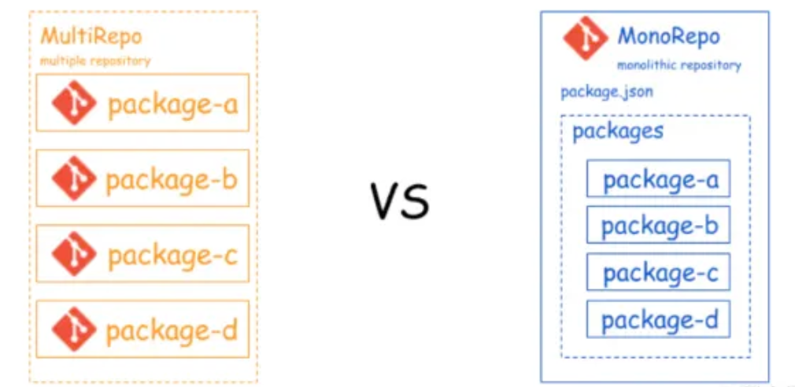
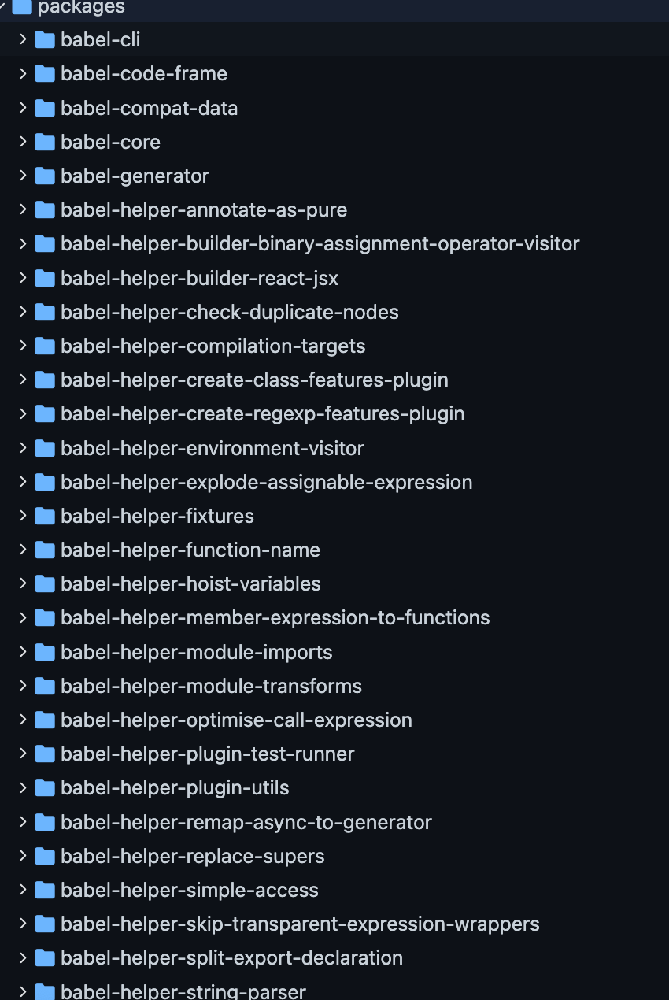
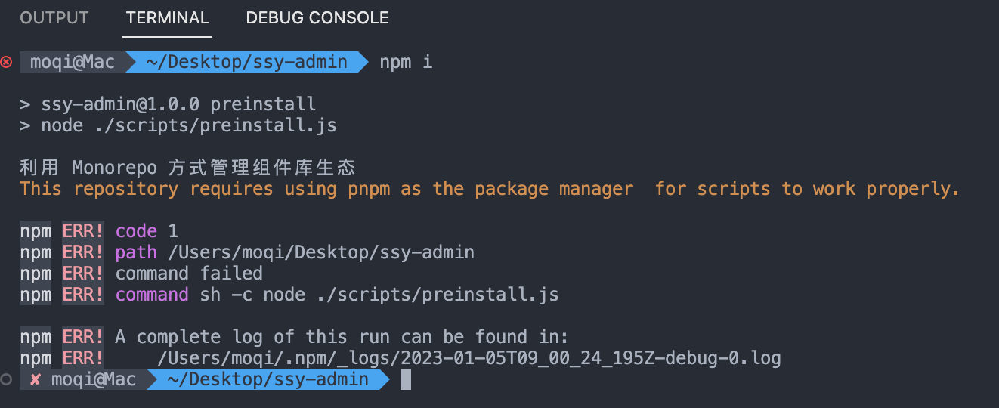
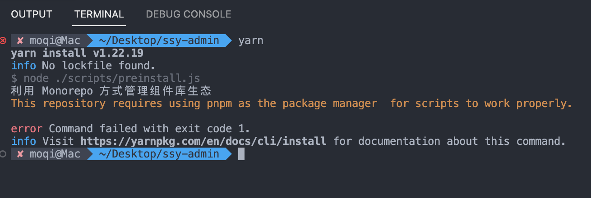
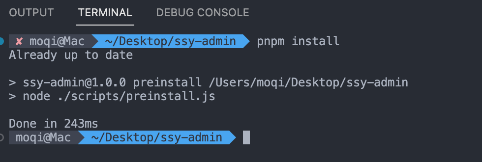

组件库一般都会配有周边产品，比如 Admin 、Template、CLI 工具等等。周边产品相当于有关联的多个项目，更准确的说法是多个软件包。这个时候就应该使用 Monorepo 方式组织代码，方便频繁在多个项目间同时交替开发，同时发布，保持版本间没有冲突。

## 传统 Mutirepo 方式的不足

所谓传统方式，我们称之为 Multirepo 方式，或者可以称之为 MutiPackage-MultiRepo 方式。就是遇到多个软件包的场景，使用多个 Repo 仓库的方式组织代码。

换句话说就是，一个软件包一个 Repo 仓库。其实我们常见的前端项目默认就是这样的模式。这种方式最大的问题就是在多个项目间切换开发会非常不方便。比如： 在开发 Admin 项目的时候，发现 UI 库需要增加了一个功能，那你需要做以下步骤：

- 从 Git 库克隆 UI 库代码；
- 修改 UI 库代码；
- 推送 UI 库到 Git 库；
- 推送 UI 库到 Npm 库；
- 在 Admin 中更新最新的 UI 库；

这个过程假设一次修改不满意频繁更新，那么整个过程还会不断重复。

优化的方案，是使用 npm link 方式把几个项目的本地目录链接起来。但是这种方法依然有弊端，比如在团队开发的时候，你必须随时同步所有的代码仓库。另外如果你的代码不希望公开到 Npm 上，你还需要建立私有的 Npm 仓库。

## Monorepo 的优势

Monorepo 其实就是将多个项目 （pacakage 软件包）放到同一个仓库 （Repo） 中进行管理。这种代码组织形式可以更好地管理多 Package 项目。主要的优点有：

- 可见性 （Visibility）: 每个开发者都可以方便地查看多个包的代码，方便修改跨 Package 的 Bug。比如开发 Admin 的时候发现 UI 有问题，随手就可以修改。
- 更简单的包管理方式（Simpler dependency management）： 由于共享依赖简单，因此所有模块都托管在同一个存储库中，因此都不需要私有包管理器。
- 唯一依赖源（Single source of truth）： 每个依赖只有一个版本，可以防止版本冲突，没有依赖地狱。
- 原子提交： 方便大规模重构，开发者可以一次提交多个包（package）。

同样是上面的那个同时开发 Admin 和 UI 的场景。当你开发 Admin 时，发现 UI 有要修改之处，只需要切换目录修改，这时候马上就可以验证修改后的效果了，无需提交软件包，无需担心软件冲突。

越复杂的场景，你会发现这种好处会更加明显。比如一个 UI 库对应两个 Admin 。这时候你希望重构一下某个组件的属性。这种重构需要同时调整三个包中的代码。使用 Monorepo ，可以不必有任何负担，调整后立刻验证两个 Admin 效果，同时发布就好。

## 用户故事 (UserStory)

将组件库重构为 Monorepo 风格管理(包含组件库、文档、CLI 工具三个子项目)，方便后续组件库生态建设。

## 任务分解 (Task)

- Monorepo 方案选型；
- 重构 Monorepo；
- 测试 Monorepo 效果；

### 方案选型

目前 JS 中常见的 Monorepo 大概有两种选择：Lerna、Pnpm workspace。

其实在 Pnpm 横空出世前，基本上就是 lerna 一统天下的局面。连 Vue3 早期都是使用 lerna 做的 Monorepo 方案。

lernaJS 是由 Babel 团队编写的多包管理工具。因为 Babel 体系的规模庞大后有很多子包需要管理，放在多个仓库管理起来比较困难。

[https://github.com/babel/babel/tree/main/packages](https://github.com/babel/babel/tree/main/packages#core-packages)

包多到一眼望不到边



长江后浪推前浪，2021 年底 `pnpm` 横空出世，闪电般的性能一下子征服了所有前端开发者。更重要的是它还附带 monorepo 方案。这个时候基本上没有任何开发者会抵挡这种诱惑，包括 Vue3.0。

毫无疑问，我们选择 pnpm 来搭建。

:::tip
接下来要将前面搭建的组件库项目改成 monorepo 结构，可以先 打个 `tag` 推送到 github 保存当前版本，也可以切分支来修改，或者建个新项目。
:::

### 修改软件包目录结构

```plain
├── packages
|   ├── create-cli  // CLI工具
|   |   ├── package.json
|   ├── ui  // UI组件库
|   |   ├── package.json
|   ├── docs // docs文档
|   |   ├── package.json
├── package.json
├── pnpm-workspace.yaml
```

然后需要在软件包中禁用 npm 和 yarn，这么做的目的是允许项目使用 pnpm 进行模块管理。不然的话会出现不兼容问题。

方法是添加 `preinstall npm hook` 钩子，这个钩子会在安装模块前触发，检查该代码是否是使用 pnpm 运行。如果不是的话会推出并提示错误。

在 package.json 中添加脚本：

```json
{
  "scripts": {
    "preinstall": "npx only-allow pnpm"
  }
}
```

当运行 `npm install` 或 `yarn`，就会发生错误并且不会继续安装。





只有 `pnpm install`才可以



### 初始化工作空间

在 monorepo 项目中，每个软件包都会存放在工作空间，方便管理。

首先在根目录创建 `pnpm-workspace.yaml`，这个文件用于声明所有软件包都要存放在 `packages` 目录之中。其实目前 `monorepo` 风格的项目也普遍使用 `packages` 作为默认软件包目录位置。

```yaml
packages:
  # all packages in subdirs of packages/ and components/
  - "packages/**"
```

## Example


::: tip
文档不想继续写了，参考[Project A or B](../share/1-monorepo.md)，自行修改成 monorepo 项目，可以参考我改造后的仓库结构和 package.json 等文件。 **(是 TMD 让你参考，不是抄答案连名字都一起抄！！！)**
:::

### 项目结构

```text :collapsed-lines=10
invis-ui
├─ .github
│  └─ workflows
│     ├─ codecov.yml
│     ├─ main.yml
│     └─ release.yml
├─ .gitignore
├─ .husky
├─ .vscode
├─ packages
│  ├─ create-cli
│  │  ├─ README.md
│  │  ├─ bin
│  │  │  └─ index.js
│  │  ├─ lib
│  │  │  ├─ operations
│  │  │  │  └─ invis-ui-vite.js
│  │  │  └─ utils
│  │  │     └─ clone.js
│  │  └─ package.json
│  ├─ docs
│  │  ├─ .vitepress
│  │  ├─ components
│  │  │  ├─ button
│  │  │  │  └─ index.md
│  │  │  └─ link
│  │  │     └─ index.md
│  │  ├─ index.md
│  │  ├─ package.json
│  │  └─ vite.config.ts
│  └─ ui
│     ├─ LICENSE
│     ├─ examples
│     │  ├─ App.vue
│     │  ├─ main.ts
│     │  ├─ index.html
│     │  ├─ button.html
│     │  ├─ link.html
│     ├─ scripts
│     │  ├─ build.ts
│     │  └─ publish.sh
│     ├─ src
│     │  ├─ avatar
│     │  ├─ button
│     │  ├─ link
│     │  ├─ components.ts
│     │  ├─ index.ts
│     │  ├─ plugins.ts
│     │  └─ utils
│     ├─ index.html
│     ├─ package.json
│     ├─ tsconfig.json
│     ├─ tsconfig.types.json
│     └─ vite.config.ts
├─ pnpm-lock.yaml
├─ pnpm-workspace.yaml
├─ uno.config.ts
├─ vercel.json
├─ .cz-config.cjs
├─ LICENSE
├─ README.md
├─ commitlint.config.js
├─ eslint.config.mjs
└─ package.json
```

:::code-tabs

@tab pnpm-workspace.yaml

```yaml
packages:
  - "packages/*"

catalog:
  vite: ^5.4.9
  typescript: ^5.6.2
  vue: ^3.5.12
  unocss: ^0.63.6
  "@vitejs/plugin-vue-jsx": ^4.0.1
```

@tab package.json

```json
{
  "name": "@w4ng3/invis-ui-monorepo",
  "type": "module",
  "private": true,
  "packageManager": "pnpm@9.11.0",
  "scripts": {
    "preinstall": "npx only-allow pnpm",
    "prepare": "husky",
    "lint": "eslint \"./packages/**/{src,test}/**/*.{vue,ts,tsx,js,mjs,cjs}\"",
    "lint:fix": "eslint \"./packages/**/{src,test}/**/*.{vue,ts,tsx,js,mjs,cjs}\" --fix",
    "test": "pnpm --dir ./packages/ui test",
    "test:coverage": "pnpm --dir ./packages/ui test:coverage",
    "dev": "pnpm --dir ./packages/ui dev",
    "build": "pnpm --dir ./packages/ui build",
    "docs:dev": "pnpm --dir ./packages/docs dev",
    "docs:build": "pnpm --dir ./packages/docs build",
    "docs:serve": "pnpm --dir ./packages/docs serve",
    "publish-all": "pnpm -r publish --access public"
  },
  "devDependencies": {
    "@antfu/eslint-config": "^3.7.3",
    "@commitlint/cli": "^19.5.0",
    "@commitlint/config-conventional": "^19.5.0",
    "@iconify-json/ic": "^1.2.0",
    "@types/node": "^22.7.4",
    "@unocss/eslint-plugin": "^0.62.4",
    "cz-customizable": "^7.2.1",
    "eslint": "^9.11.1",
    "eslint-plugin-format": "^0.1.2",
    "husky": "^9.1.6",
    "terser": "^5.34.1",
    "tsx": "^4.19.1",
    "unocss": "catalog:"
  },
  "config": {
    "commitizen": {
      "path": "node_modules/cz-customizable"
    },
    "cz-customizable": {
      "config": ".cz-config.cjs"
    }
  }
}
```

@tab create-cli/package.json

```json
{
  "name": "create-invis-app",
  "type": "module",
  "version": "1.0.1",
  "description": "Create Invis CLI App",
  "author": "w4ng3",
  "license": "ISC",
  "keywords": [],
  "main": "bin/index.js",
  "bin": {
    "create-invis": "./bin/index.js"
  },
  "scripts": {
    "dev": "tsc --watch"
  },
  "dependencies": {
    "chalk": "^5.3.0",
    "chalk-animation": "^2.0.3",
    "clear": "^0.1.0",
    "download-git-repo": "^3.0.2",
    "figlet": "^1.8.0",
    "handlebars": "^4.7.8",
    "inquirer": "^12.0.1",
    "ora": "^8.1.0"
  }
}
```

@tab docs/package.json

```json
{
  "name": "@w4ng3/invis-ui-docs",
  "type": "module",
  "version": "1.0.0",
  "private": true,
  "description": "组件库文档",
  "author": "w4ng3",
  "license": "ISC",
  "keywords": [],
  "main": "index.js",
  "scripts": {
    "dev": "vitepress dev",
    "build": "vitepress build",
    "serve": "vitepress serve"
  },
  "dependencies": {
    "@vitejs/plugin-vue-jsx": "catalog:",
    "@w4ng3/invis-ui": "workspace:^",
    "vite": "catalog:"
  },
  "devDependencies": {
    "vitepress": "^1.3.4",
    "vitepress-theme-demoblock": "3.0.7"
  }
}
```

@tab ui/package.json

```json
{
  "name": "@w4ng3/invis-ui",
  "type": "module",
  "version": "0.2.3",
  "description": "Le UI invisibili",
  "author": "w4ng3",
  "license": "MIT",
  "homepage": "https://github.com/w4ng3/invis-ui#readme",
  "keywords": [],
  "sideEffects": false,
  "exports": {
    ".": {
      "types": "./dist/index.d.ts",
      "import": "./dist/invis-ui.js",
      "require": "./dist/invis-ui.umd.cjs"
    },
    "./*": "./*"
  },
  "main": "./dist/invis-ui.umd.cjs",
  "module": "./dist/invis-ui.js",
  "types": "./dist/index.d.ts",
  "files": ["dist"],
  "scripts": {
    "dev": "vite",
    "test": "vitest",
    "test:coverage": "vitest run --coverage",
    "lint": "eslint .",
    "lint:fix": "eslint . --fix",
    "build:all": "vite build",
    "build:components": "tsx ./scripts/build.ts",
    "build": "pnpm build:components && pnpm type:build",
    "typecheck": "vue-tsc --noEmit",
    "type:build": "vue-tsc -b --declaration --emitDeclarationOnly tsconfig.types.json",
    "clean:dist": "rimraf dist"
  },
  "dependencies": {
    "vue": "catalog:"
  },
  "devDependencies": {
    "@types/fs-extra": "^11.0.4",
    "@vitejs/plugin-vue": "^5.1.4",
    "@vitejs/plugin-vue-jsx": "catalog:",
    "@vitest/coverage-istanbul": "^2.1.3",
    "@vue/test-utils": "^2.4.6",
    "fs-extra": "^11.2.0",
    "happy-dom": "^15.7.4",
    "typescript": "catalog:",
    "unocss": "catalog:",
    "vite": "catalog:",
    "vitest": "^2.1.3",
    "vue-tsc": "^2.1.6"
  },
  "publishConfig": {
    "access": "public",
    "registry": "https://registry.npmjs.org/"
  }
}
```

:::

### 修改发布工作流

这里用递归对子项目发包到 npm，只发布未设置 `"private": true` 的项目。

```yaml
name: PublishToNpm

on:
  push:
    # tags:
    #   - 'v*' # 推送 tag 为 v 开头时触发，比下面的推送到分支触发更正规些，自己选择
    branches: [main]

jobs:
  publish:
    permissions:
      id-token: write
      contents: write
    runs-on: ubuntu-latest
    steps:
      - uses: actions/checkout@v4
        with:
          fetch-depth: 0

      - name: Install pnpm
        uses: pnpm/action-setup@v4

      - name: Set node
        uses: actions/setup-node@v4
        with:
          node-version: lts/*
          cache: pnpm
          registry-url: "https://registry.npmjs.org"

      - name: Install Dependencies
        run: pnpm i

      - name: PNPM build
        run: pnpm run build

      - name: copy readme
        run: cp README.md ./packages/ui/

      - name: Publish to NPM
        run: pnpm -r publish --access public --no-git-checks
        env:
          NODE_AUTH_TOKEN: ${{secrets.NPM_AUTH_TOKEN}}
          NPM_CONFIG_PROVENANCE: false
```

之前的 `main.yml` 工作流也可以优化下，去掉一些重复的步骤。

```yaml
name: CI

on:
  push:
    branches: [main]
  pull_request:
    branches: [main]

# A workflow run is made up of one or more jobs that can run sequentially or in parallel
jobs:
  # This workflow contains a single job called "build"
  LINT_AND_BUILD:
    # The type of runner that the job will run on
    runs-on: ubuntu-latest
    # Steps represent a sequence of tasks that will be executed as part of the job
    steps:
      - uses: actions/checkout@v4

      - name: Install pnpm
        uses: pnpm/action-setup@v4

      - name: Set node
        uses: actions/setup-node@v4
        with:
          node-version: lts/*
          cache: pnpm
          registry-url: "https://registry.npmjs.org"

      - name: Install modules
        run: pnpm install

      - name: Run Lint
        run: pnpm lint

      - name: Run Build
        run: pnpm build
```
