本节将从零实现一个组件库。为了带来更加真实的开发体验，我们使用敏捷方式。每节课讲述一个主题，作为一个 Sprint 冲刺过程。从一个 MVP 开始，每个冲刺都会给组件添加一种特性，最终成为一个完整的组件库。

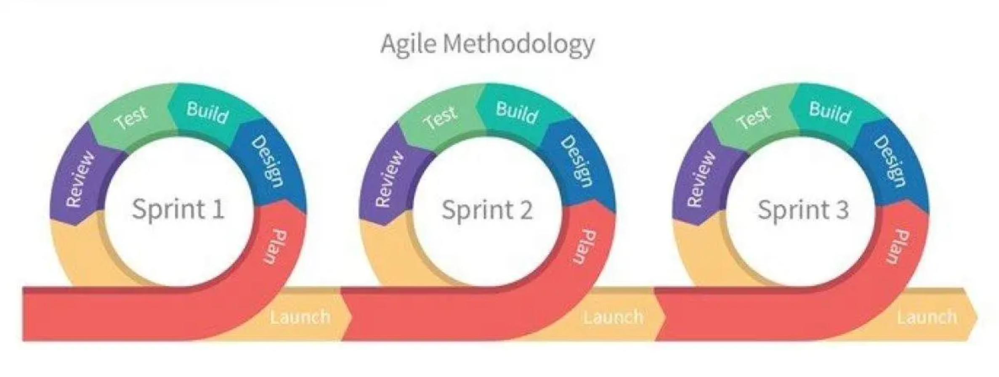

## 用户故事 (UserStory)

> 通过 Vite 将一个组件封装为组件库，组件库可以被其他 Vue 项目作为插件直接进行使用。

核心任务是完成一个组件库的 MVP。MVP (Minimum Viable Product) 是最简化可实行产品的意思。在组件库中，最小的 MVP，可以定义为： 将一个组件以组件库的形式封装起来。

组件库实际上就是一个 JS 的库文件，可以被 Vue 项目引用其封装的组件。

搭建这样一个环境，需要解决以下问题：

- 如何配置构建工具？
- 如何搭建一个调试环境？
- 组件以什么样的形式封装？
- 如何让组件库支持使用 JSX、SFC 单文件组件等语法？

## 功能实现

### node 版本

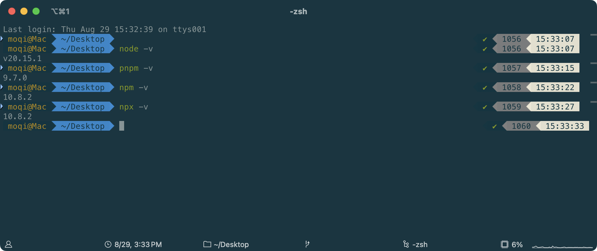

**pnpm 请自行安装**

[安装 | pnpm](https://pnpm.io/zh/installation)

### Vite 搭建开发环境

> 搭建一个项目，首先要创建一个开发目录并且初始化软件包信息(npm)

创建目录：

```shell
mkdir ssy-ui-vite
cd ssy-ui-vite
```

包管理选择目前比较流行的 **pnpm** 。选择 pnpm ，首先是由于 pnpm 优秀的管理机制，使得安装依赖非常迅速且节省空间。更重要的是，项目后期需要开发组件库的周边，比如 CLI 工具等。CLI 工具以单独软件包的形式发布在 npm 仓库之中，这样的话，一个 Repo 多个软件包的项目结构需要使用 monorepo 风格进行管理。pnpm 拥有的 workspace 功能可以很好地完成这样的工作。

使用 pnpm 初始化项目

```shell
pnpm init
```

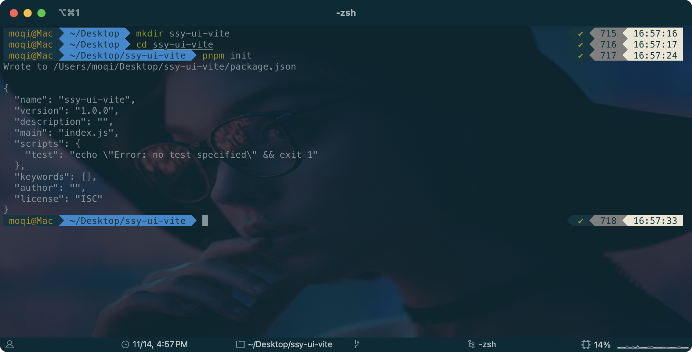

初始化完成后，下一步就是利用 Vite 搭建一个组件库的调试环境。

如果使用 Vite 搭建普通项目的话，推荐使用 Vite 脚手架工具搭建。这样可以免去大量的工程化配置工作。**但是作为一个需要长期维护的组件库，我们希望所有的工程化搭建细节都掌控在自己的手中。**

**所以这次，就从零开始自己搭建 Vite 项目。**

首先安装 Vite。

Vite 作为开发调试工具，只会在在开发环境中使用，所以需要在安装时加上 -D 。

VSCode 打开 ssy-ui-vite 文件夹，在根目录执行：

```shell
pnpm i vite -D
```

执行结果：

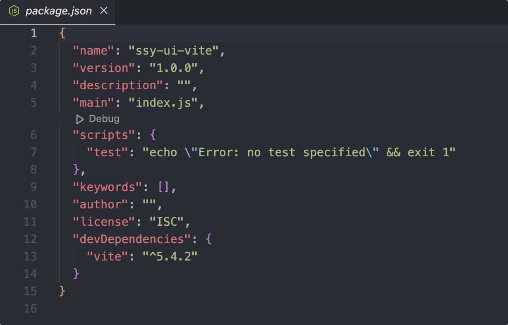

接着在这个`package.json`里添加属性 `"type": "module"`

然后在根目录创建一个测试页面 index.html，测试 Vite 是否安装正常。

```html
<!DOCTYPE html>
<html lang="en">
  <head>
    <meta charset="UTF-8" />
    <meta http-equiv="X-UA-Compatible" content="IE=edge" />
    <meta name="viewport" content="width=device-width, initial-scale=1.0" />
    <title>index</title>
  </head>
  <body>
    <h1>Hello SSY UI</h1>
  </body>
</html>
```

运行命令 `npx vite`启动 Vite。

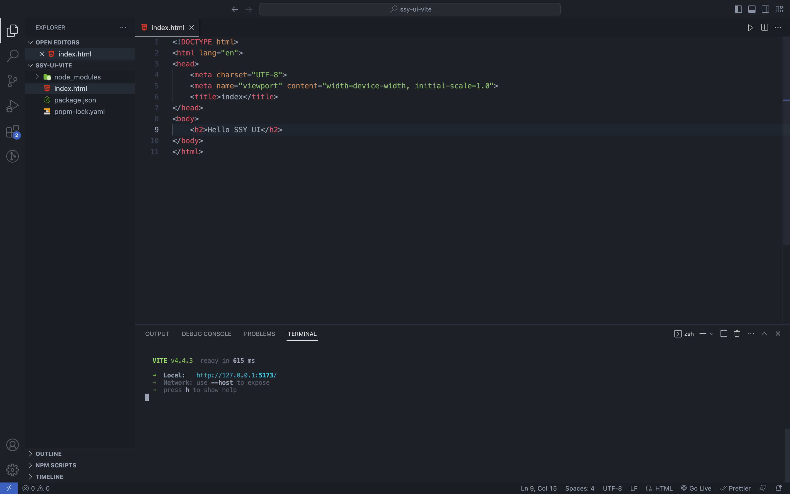`npx`是一个从 npm5.2 后新增加的命令，用于执行软件包中的可执行文件。 以往的可执行文件只能通过全局安装或者从 node_modules/.bin 中查找，要不然很难直接运行，这个升级体验非常赞 👍 。

打开 [http://localhost:5173/](http://localhost:5173/) 如看到页面可以正常显示，说明 Vite 安装正确。

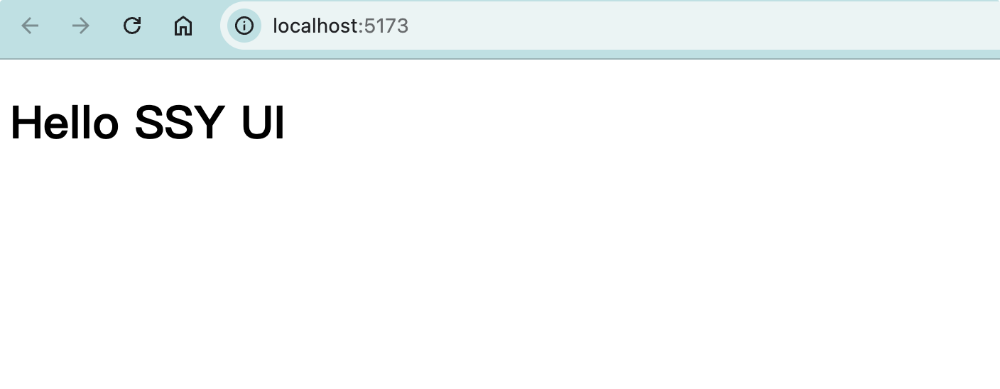

然后在根目录新建 src 目录，src 下新建 index.ts 文件，编写 Typescript 代码如下：

```typescript
const s: string = "hello TypeScript";
console.log(s);
```

在 index.html 中添加引用：

```html{10}
<!DOCTYPE html>
<html lang="en">
  <head>
    <meta charset="UTF-8" />
    <meta name="viewport" content="width=device-width, initial-scale=1.0" />
    <title>index</title>
  </head>
  <body>
    <h2>Hello SSY UI</h2>
    <script src="./src/index.ts" type="module"></script>
  </body>
</html>
```

此时，观察 http://localhost:5173/ 控制台：

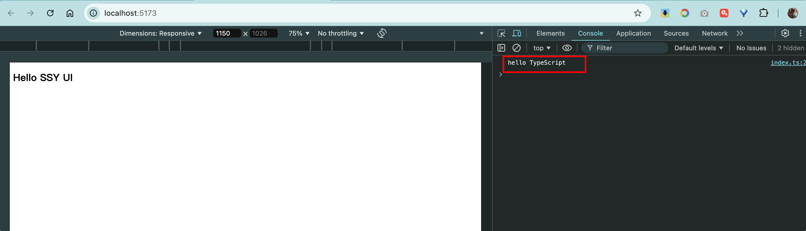

可以看到调试窗口中打印的【 Hello Typescript 】的日志，说明 Vite 已经可以正常调试 Typescript 代码了。

这就是 Vite 体验好的地方：**无需任何配置就可以提供一个 Typescript 的前端开发环境，支持自动热更新**。如果你是一个前端 Typescript 党，可以考虑把 Vite 安装到全局，这样就可以全局使用 Typescript 开发前端了。

最后在 package.json 中的 scripts 添加如下启动脚本，下次启动只要运行 `pnpm dev` ，就可以启动 Vite 开发代码了。

```json
"scripts": {
  "dev": "vite"
},
```

### 开发一个 Vue 组件

**基础组件**

下面尝试在 Vite 开发环境开发 Vue 组件。

首先安装 Vue3

```bash
pnpm i vue
```

接着尝试编写一个简单的 Button 组件。

新建 src/button/index.ts 文件：

```typescript
import { defineComponent, h } from "vue";
export default defineComponent({
  name: "SButton",
  render() {
    return h("button", null, "Sbutton");
  },
});
```

然后，在 src/index.ts 中启动 Vue 实例：

```typescript
import { createApp } from "vue";
import SButton from "./button";
createApp(SButton).mount("#app");
```

还需要在 index.html 中添加一个容器：

```html{10}
<!DOCTYPE html>
<html lang="en">
  <head>
    <meta charset="UTF-8" />
    <meta name="viewport" content="width=device-width, initial-scale=1.0" />
    <title>index</title>
  </head>
  <body>
    <h2>Hello SSY UI</h2>
    <div id="app"></div>
    <script src="./src/index.ts" type="module"></script>
  </body>
</html>
```

在浏览器中打开 [http://localhost:5173/](http://localhost:5173/)，就可以看到一个按钮已经显示到浏览器中了。

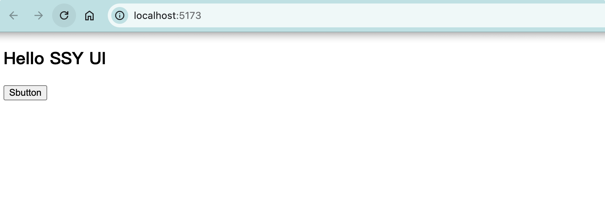

**单文件组件**

可能你会疑问：**为什么是使用 render 函数，而不是熟悉的 template 语法编写呢？**

这是因为 **Vue3.0 默认的包是不支持模板编译功能的**，也就是说， template 语法现在还不能用。在 Vue3.0 中，编译功能推荐在构建阶段完成，而不是放到浏览器中运行。如果希望在浏览器中的话，可以选择 ./node_modules/vue/dist/vue.global.js 这个包。

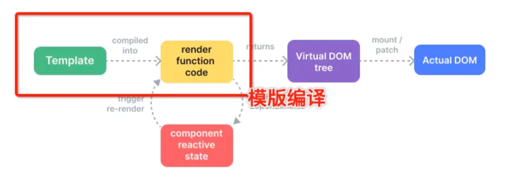 如果想让 Vite 可以编译 Vue 模版，可以通过安装 Vite 的 Vue 插件。

可以这样理解： Vite 默认只能支持 TS 代码，而 Vue 的模板需要在编译阶段转换为 Typescript 代码 (渲染函数)才可以运行。Vue 插件不但提供了模板的编译，同时还支持 Vue 单文件 (SFC) 组件的编译。

下面用一张图来说明一下。

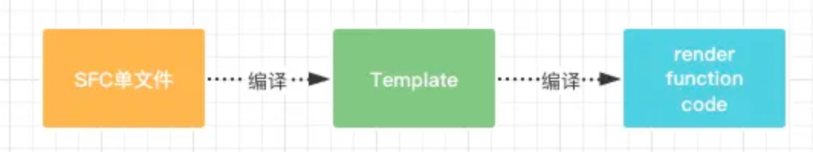

- 提供 Vue 3 单文件组件支持
- [https://cn.vitejs.dev/guide/using-plugins.html](https://cn.vitejs.dev/guide/using-plugins.html)

首先，安装 Vite 的 Vue 插件：

```bash
pnpm i @vitejs/plugin-vue -D
```

项目根目录新建 vite.config.ts

```typescript
import { defineConfig } from "vite";
import vue from "@vitejs/plugin-vue";

export default defineConfig({
  plugins: [vue()],
});
```

src 根目录新建一个 SFCButton.vue 单文件组件，使用 template 语法。

```vue
<template>
  <button>SFC Button</button>
</template>

<script lang="ts">
export default {
  name: "SFCButton",
};
</script>
```

在 index.ts 中引用测试

```typescript
import { createApp } from "vue";
// import SButton from './button'
import SButton from "./SFCButton.vue";
createApp(SButton).mount("#app");
```

**重新启动项目**，运行效果如下：

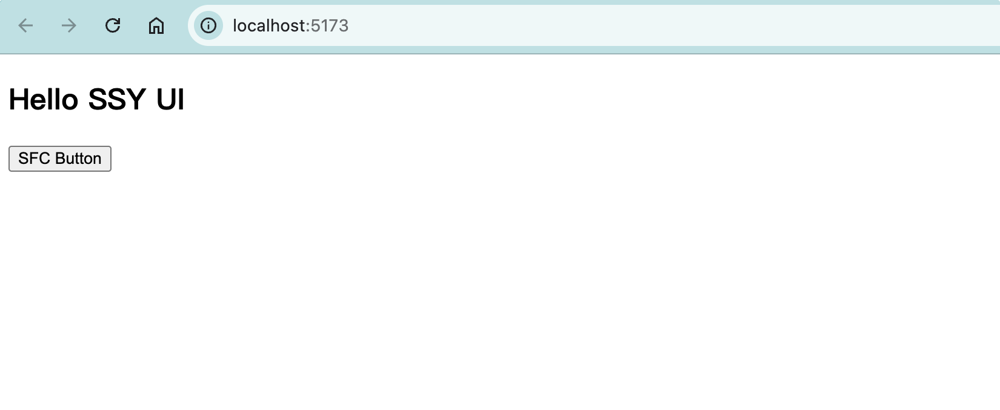

**JSX 组件**

**JSX 是一种 Javascript 的语法扩展**，最早运用于 React 架构中。JSX 也可以当作一种模板语言使用。虽然有人会质疑利用 JSX 语法编写 Vue3 代码是否合理， 比如 JSX 语法是否兼容 Vue3 的静态提升特性。但是现在很多基于 Vue 的组件库都大量使用 JSX 语法，对于工程化搭建，还是以开发者的使用习惯优先。

想要支持 JSX 语法，需要转译工具的支持，一般会使用 Babel。

在 Vite 里，已经有了对应的插件，提供 Vue 3 JSX 支持（通过 [专用的 Babel 转换插件](https://github.com/vuejs/babel-plugin-jsx)）。

只需要安装这个插件就可以了。

```bash
pnpm i @vitejs/plugin-vue-jsx -D
```

修改 vite.config.ts ，添加 JSX 插件支持：

```typescript
import { defineConfig } from "vite";
import vue from "@vitejs/plugin-vue";
import vueJsx from "@vitejs/plugin-vue-jsx";

export default defineConfig({
  plugins: [vue(), vueJsx()],
});
```

新建 src/TSXButton.tsx 组件 ( 使用 TS 语言，所以是 TSX)。

```tsx
import { defineComponent } from "vue";

export default defineComponent({
  name: "TSXButton",
  render() {
    return <button>TSX Button</button>;
  },
});
```

VSCode 编辑器中会提示错误，**这是不支持 JSX 语法造成的。**

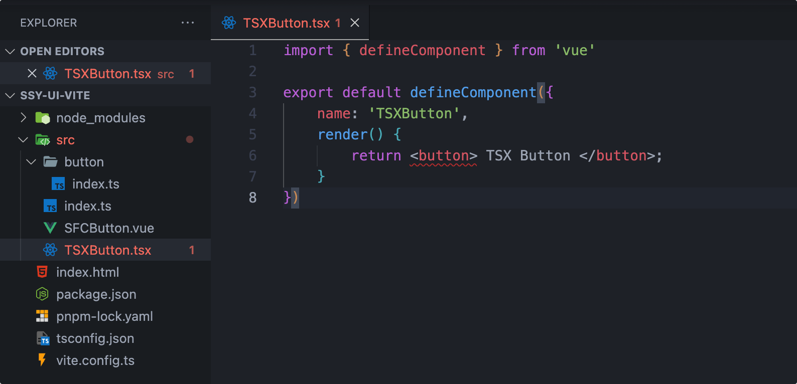

只需要配置一下 jsx 语法支持就行了，在项目根目录新建 tsconfig.json 文件：

```json
{
  "compilerOptions": {
    "jsx": "preserve",
    "jsxImportSource": "vue",
    "lib": ["ES2020", "DOM", "DOM.Iterable"],
    /* Linting */
    "strict": false,
    "noFallthroughCasesInSwitch": true,
    "noUnusedLocals": true,
    "noUnusedParameters": true,
    //
    "declaration": true /* 生成相关的 '.d.ts' 文件。 */,
    "declarationDir": "./dist/types" /* '.d.ts' 文件输出目录 */,
    "allowSyntheticDefaultImports": true,
    "esModuleInterop": true
  },
  "include": ["./**/*.*", "./shims-vue.d.ts"],
  "exclude": ["node_modules"]
}
```

错误即可消失。

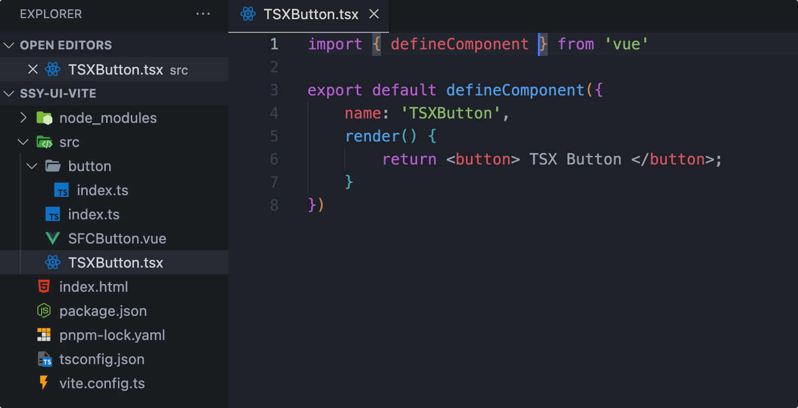

在 src/index.ts 引入 TSXButton 组件：

```typescript
import { createApp } from "vue";
import TSXButton from "./TSXButton";
createApp(TSXButton).mount("#app");
```

运行效果：

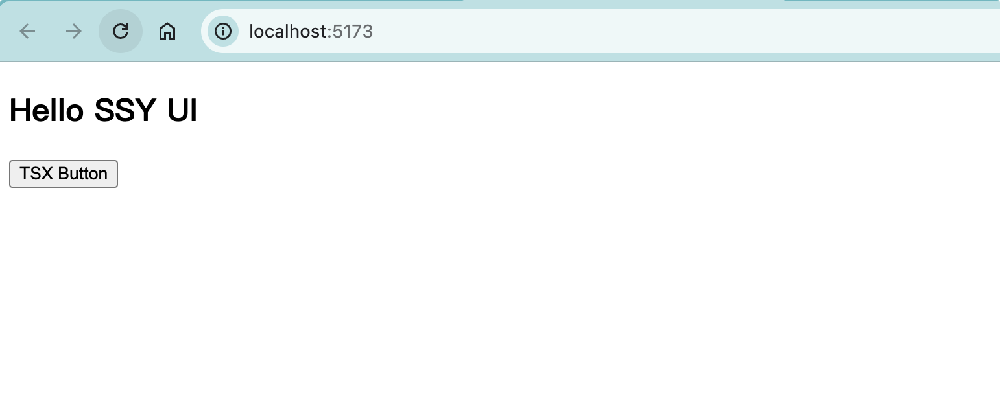

### 库文件封装

为了搞清楚如何封装一个组件库，我们先研究一下 Element 组件库是怎么做的。

参考 Element 的使用指南，可以看到组件库有两种引入形态：

- 完整引入 ：一次性引入全部组件，使用 Vue.use 以 Vue 插件的形式引入；
- 按需引入 ：按需引入，导出单个组件，使用 Vue.component 注册。

所以组件库的形态应该满足以下的要求：

- 默认导出为 Vue 插件；
- 每个组件可以单独导出。

当然，利用 Vite 还有更复杂的自动按需加载方案。

我们首先设计一个入口，包含两个功能：

- 导出全部组件；
- 实现一个 Vue 插件，插件中编写 install 方法，将所有组件安装到 vue 实例中。

新建 `src/entry.ts`

```typescript
import { App } from "vue";
import SButton from "./button";
import SFCButton from "./SFCButton.vue";
import TSXButton from "./TSXButton";

// 导出单独组件
export { SButton, SFCButton, TSXButton };

// 编写一个插件，实现一个 install 方法
export default {
  install(app: App): void {
    app.component(SButton.name, SButton);
    app.component(SFCButton.name, SFCButton);
    app.component(TSXButton.name, TSXButton);
  },
};
```

默认 Vite 就可以支持构建，使用 Vite 的 build 命令就可以打包输出。如果导出的是一个库文件的话，还需要配置【导出模块类型】并确定导出的文件名。

修改 `vite.config.ts` 配置如下:

```typescript
import { defineConfig } from "vite";
import vue from "@vitejs/plugin-vue";
import vueJsx from "@vitejs/plugin-vue-jsx";

const rollupOptions = {
  external: ["vue", "vue-router"],
  output: {
    globals: {
      vue: "Vue",
    },
  },
};

export default defineConfig({
  plugins: [vue(), vueJsx()],
  build: {
    rollupOptions,
    minify: false,
    // 添加库模式配置
    lib: {
      entry: "./src/entry.ts",
      name: "SSYUI",
      fileName: "ssy-ui",
      // 导出模块格式
      formats: ["es", "umd", "iife"],
    },
  },
});
```

接着在 package.json 添加运行 `build` 脚本，方便构建。

```json
{
  "name": "ssy-ui-vite",
  "version": "1.0.0",
  "description": "",
  "main": "index.js",
  "scripts": {
    "test": "echo \"Error: no test specified\" && exit 1",
    "dev": "vite",
    "build": "vite build"
  },
  "keywords": [],
  "author": "",
  "license": "ISC",
  "devDependencies": {
    "@vitejs/plugin-vue": "^5.1.2",
    "@vitejs/plugin-vue-jsx": "^4.0.1",
    "vite": "^5.4.2"
  },
  "dependencies": {
    "vue": "^3.4.38"
  }
}
```

根目录执行命令

```bash
pnpm build
```

看到生成 dist 目录生成就说明正常导出了。

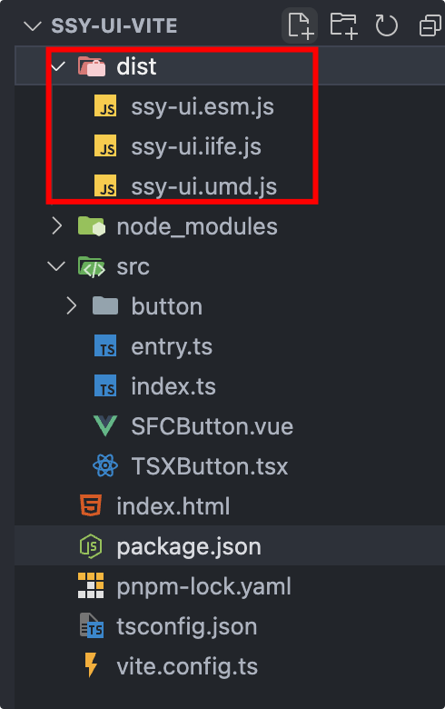

最后编写一个验证页面，测试一下打包结果是否正确。

根目录新建 demo/esm/index.html，测试加载全部组件，引用构建好的的 ssy-ui.js 文件。

```html
<!DOCTYPE html>
<html lang="en">
  <head>
    <meta charset="UTF-8" />
    <meta name="viewport" content="width=device-width, initial-scale=1.0" />
    <title>index</title>
  </head>
  <body>
    <h2>index</h2>
    <div id="app"></div>

    <script src="https://unpkg.com/vue@3/dist/vue.global.js"></script>

    <script type="module">
      const { createApp } = Vue;
      import SSYUI, {
        SButton,
        SFCButton,
        TSXButton,
      } from "../../dist/ssy-ui.js";

      createApp({
        template: `
        <SButton/>
        <SFCButton/>
        <TSXButton/>
        `,
      })
        .component(SButton.name, SButton)
        .component(SFCButton.name, SFCButton)
        .component(TSXButton.name, TSXButton)
        .mount("#app");
    </script>
  </body>
</html>
```

启动 vite

```bash
pnpm dev
```

访问： [http://localhost:5173/demo/esm/index.html](https://link.juejin.cn/?target=http%3A%2F%2Flocalhost%3A5173%2Fdemo%2Fesm%2Findex.html)

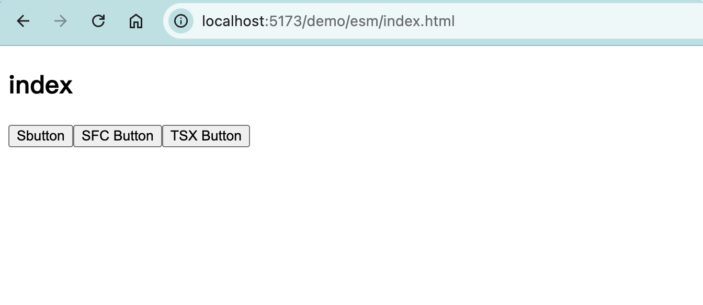

验证结果证明 MVP 已经完成。

## 复盘

这是组件库开发的第一天，旨在搭建一个最小可用系统，了解如何使用 Vite 编写组件库。

目前，这个工程可以实现组件库的【编写】、【调试】、【封装】的整个闭环。

留一些思考题：

- 如何使用 Vite 从零搭建 Vue 开发环境 ？
- 如何让 Vite 支持 SFC 与 JSX 语法 ？
- 组件库的封装形态是什么样子 ？
- 如何使用 Vite 完成库文件的构建 ？
