相信大家在挑选组件库的时候，样式风格都是一个非常重要的考量目标。

本节的任务是给组件库添加样式系统，让组件库可以拥有一套统一风格的样式。

先看看成品的效果。

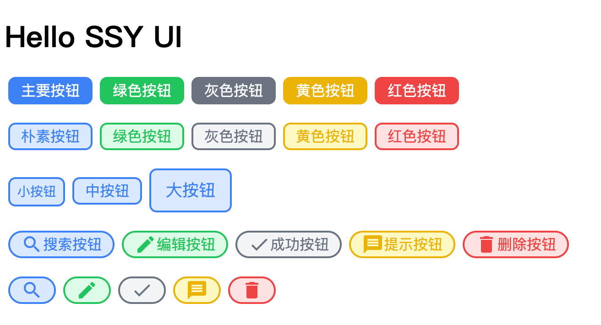

## 用户故事 (UserStory)

通过 UnoCSS 为组件库添加样式系统，可以通过属性定制组件样式。

## 任务分解 (Task)

- 引入 UnoCSS 样式；
- 实现组件属性定制按钮样式；
- 实现 Icon 图标按钮；

## Atomic/Utility-First CSS 与 Semantic CSS 的选择

每个组件库都有一套完备的样式系统，确保组件样式风格的统一。经典的组件库 (ElementUI) 的样式系统都是遵循 Semantic CSS (语义化 CSS ) 搭建的。

组件库通常都需要搭建一个 CSS 子工程，用于实现自己的类型系统。比如 Element 就是基于 Sass + Gulp 搭建的。不过随着原子样式的出现，有了一些替代方案，无需搭建样式系统也可以完成类似效果。

首先先简单介绍原子样式是什么。

2020 年一种叫做 **Atomic CSS** 的组件风格横空出世，代表作就是 **TailwindCSS**。最近两年，TailwindCSS 一直保持高热度。

可以看一下 Vite 的社区模板库，tailwind 几乎就是标配。

https://github.com/vitejs/awesome-vite#templates


从组件库开发角度讲，使用 Tailwind 提供的样式系统，可以很好地降低 UI 库的开发难度。利用原子化风格，就可以高效完成样式的定制，未必一定需要定制一套语义化样式系统。

## 为什么选 UnoCSS 实现 AtomicCSS？

[UnoCSS 的 github 地址](https://github.com/unocss/unocss)

原子样式也有很多选择，最著名的就是 Tailwind。 Tailwind 虽然好，但是性能上有一些不足。由于 Tailwind 会生成大量样式定义。全量的 CSS 文件往往体积会多至数 MB。这个对于页面性能是完全不可接受的。如果在开发时进行动态地按需剪裁，又会影响编译性能，降低开发体验。

为了解决性能问题，开源界的 Antfu 大神设计了 UnoCSS。**UnoCSS 是一个拥有高性能且具灵活性的即时原子化 CSS 引擎，可以兼顾产物体积和开发性能。**

除此以外，UnoCSS 还可以有更强的可定制性和易用性。

- [完全可定制](https://github.com/unocss/unocss#configurations) - 没有核心实用程序，所有功能都通过预设提供
- 无需解析、无需 AST、无需扫描，它是即时的（比 Windi CSS 或 Tailwind JIT 快 200 倍）
- ~3.5kb min+gzip - 零依赖和浏览器友好
- [快捷方式](https://github.com/unocss/unocss#shortcuts) - 动态别名实用程序
- [属性模式](https://github.com/unocss/unocss/tree/main/packages/preset-attributify) - 在属性中分组实用程序
- [纯 CSS 图标](https://github.com/unocss/unocss/tree/main/packages/preset-icons) - 使用任何图标作为单个类
- [检查器](https://github.com/unocss/unocss#inspector) - 以交互方式检查和调试
- [CSS-in-JS 运行时版本](https://github.com/unocss/unocss/tree/main/packages/runtime)
- [CSS Scoping](https://github.com/unocss/unocss#css-scoping)
- CSS 代码拆分 - 为 MPA 提供最小的 CSS
- 库友好 - 随你的组件库提供原子样式并安全地限定范围。

另外， Vite 的良好支持也是选择 UnoCSS 的一个重要原因， UnoCSS 也可以算是 Vite 社区的一个重要的产品。

## 功能实现

https://github.com/unocss/unocss

### 引入 UnoCSS

首先通过 Vite 插件的形式引入 UnoCSS

先安装 UnoCSS

```bash
pnpm i -D unocss
pnpm i -D @iconify-json/ic
```

0.60 版本之后的 unocs 只支持 esm，所以要在 package.json 里添加

"type": "module"

修改 vite.config.ts，添加 UnoCSS 插件

```typescript{5-6,21-23}
import { defineConfig } from "vite";
import vue from "@vitejs/plugin-vue";
import vueJsx from "@vitejs/plugin-vue-jsx";

import { presetUno, presetAttributify, presetIcons } from "unocss";
import Unocss from "unocss/vite";

const rollupOptions = {
  external: ["vue", "vue-router"],
  output: {
    globals: {
      vue: "Vue",
    },
  },
};

export default defineConfig({
  plugins: [
    vue(),
    vueJsx(),
    Unocss({
      presets: [presetUno(), presetAttributify(), presetIcons()],
    }),
  ],
  build: {
    rollupOptions,
    minify: false,
    // 添加库模式配置
    lib: {
      entry: "./src/entry.ts",
      name: "SSYUI",
      fileName: "ssy-ui",
      // 导出模块格式
      formats: ["es", "umd", "iife"],
    },
  },
});
```

然后就可以在插件中引入 UnoCSS 了。加载 Unocss 插件后，Vite 会通过分析 class 的使用状况提供相应的样式定义。

我们在 Button 组件中引入 UnoCSS;

VSCode 添加 UnoCSS 插件，且在 settings.json 里设置模糊匹配方便给出样式提示

```json
{
  "unocss.autocomplete.matchType": "fuzzy" // unocss 模糊匹配
}
```

将 src/button/index.ts 重命名为 src/button/index.tsx

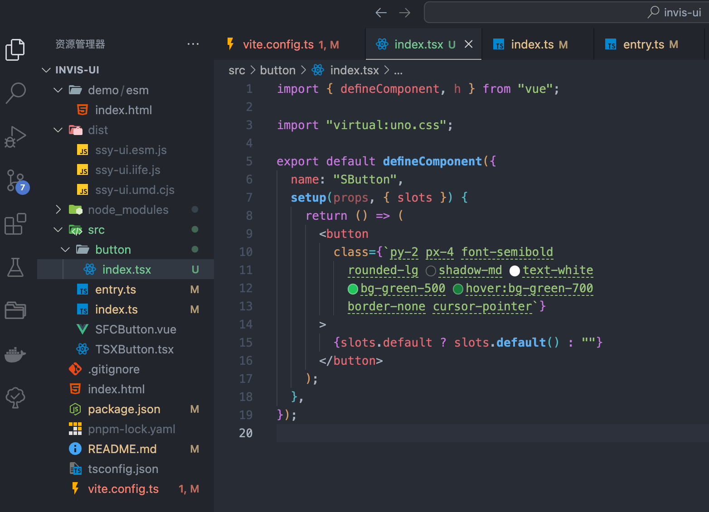

然后在 src/index.ts 中添加测试代码：

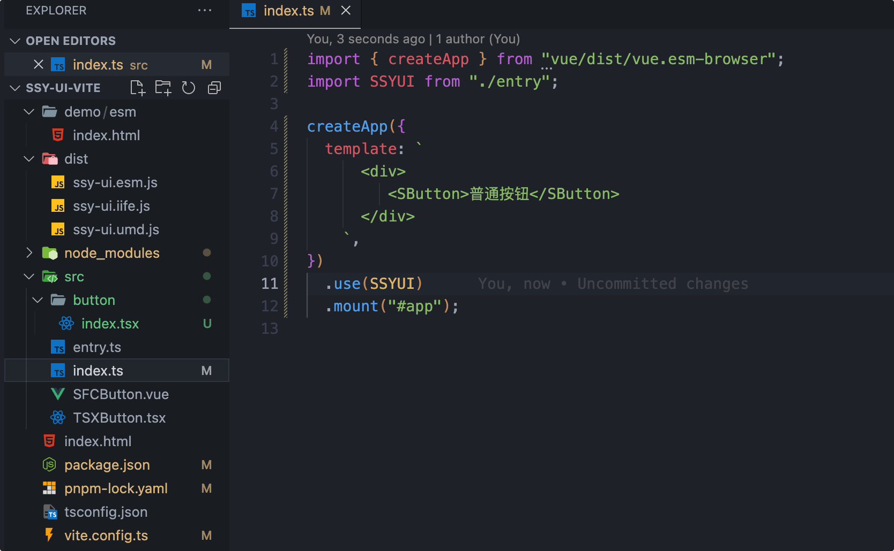

最终呈现的效果：

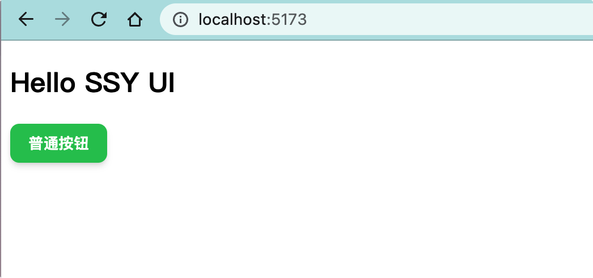

到此为止， UnoCSS 就已经正常引入了。

:::warning
如果用了较高版本的 vue，会出现下面的报错，template 声明的部分无法渲然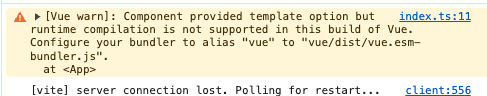

需要在 vite.config.ts 里设置 vue 别名

```typescript{2-6}
export default defineConfig({
  resolve: {
    alias: {
      vue: "vue/dist/vue.esm-bundler",
    },
  },
});
```

:::

### 实现组件属性定制按钮样式

接下来要实现根据属性定制按钮样式功能。比如，通过 color 属性来定制颜色。

首先需要定义组件的属性类型，然后就可以用属性变量来拼装 UnoCSS 了，感受到原子 CSS 的好处。

基本常用的属性定义都可以通过简单的字符串拼装完成，我们修改 button/index.tsx 如下：

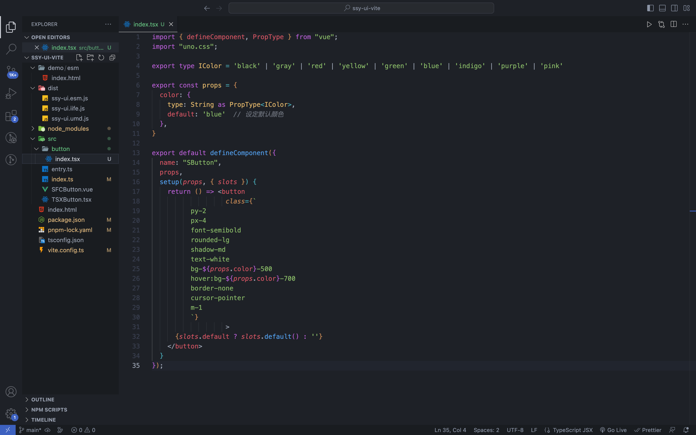

在 src/index.ts 中使用用各种 button 颜色：


**重启项目**，效果如下：

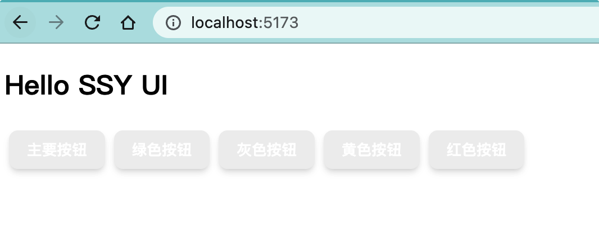

为什么没有颜色呢？

主要原因是 **UnoCSS 默认是按需生成方式**，也就是说只生成代码中使用过的样式。如果在 class 属性中使用变量，是无法分析变量的取值的，所以就无法动态生成样式了。

为了解决这个问题，UnoCSS 提供了安全列表选项。也就是说，把样式定义中变量的取值添加到 Safelist 中去，这样 UnoCSS 就会根据 Safelist 生成样式了。

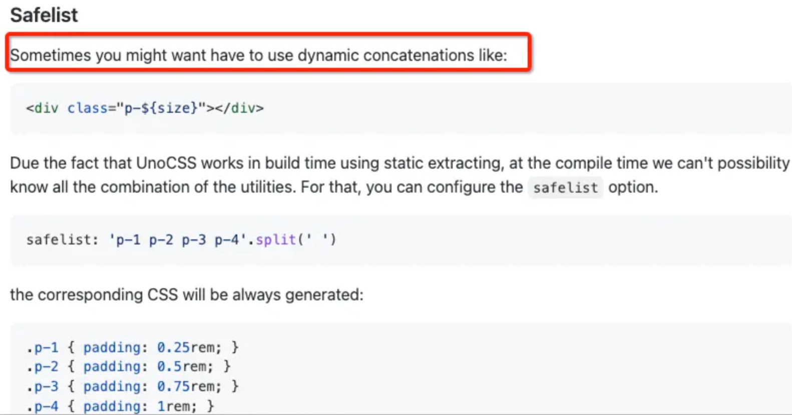

接下来开始定制安全列表。安全列表属性应该定义在 UnoCSS 插件的配置中。

这边要做一个配置上的重构：考虑到后续会在 Safelist 中添加大量配置，所以我们将 UnoCSS 配置拆成一个新的 ts 模块，然后引用到 vite.config.ts 中。

项目在搭建的过程中会不断地进行重构。在开发的过程中，要积极思考如何编写更合理易于维护的代码。

项目根目录，新建 config/unocss.ts，如下：

```tsx :collapsed-lines=8
import { presetUno, presetAttributify } from "unocss";
import Unocss from "unocss/vite";

const colors = [
  "white",
  "black",
  "gray",
  "red",
  "yellow",
  "green",
  "blue",
  "indigo",
  "purple",
  "pink",
];
const safelist = [
  ...colors.map((v) => `bg-${v}-100`),
  ...colors.map((v) => `bg-${v}-400`),
  ...colors.map((v) => `bg-${v}-500`),
  ...colors.map((v) => `hover:bg-${v}-100`),
  ...colors.map((v) => `hover:bg-${v}-300`),
  ...colors.map((v) => `hover:bg-${v}-400`),
  ...colors.map((v) => `hover:bg-${v}-500`),
  ...colors.map((v) => `border-${v}-400`),
  ...colors.map((v) => `border-${v}-500`),
  ...colors.map((v) => `text-${v}-500`),
  ...colors.map((v) => `hover:text-${v}-500`),
  "text-white",
  ...Array.from({ length: 8 }, (_, i) => `px-${i + 1}`),
  ...Array.from({ length: 8 }, (_, i) => `py-${i + 1}`),
  ...["xs", "sm", "base", "lg", "xl", "2xl", "3xl"].map((v) => `text-${v}`),
  ...["rounded-full", "rounded-lg"],
];

export default () =>
  Unocss({
    safelist,
    presets: [presetUno(), presetAttributify()],
  });
```

将 vite.config.ts 中关于 Unocss 的配置修改如下：

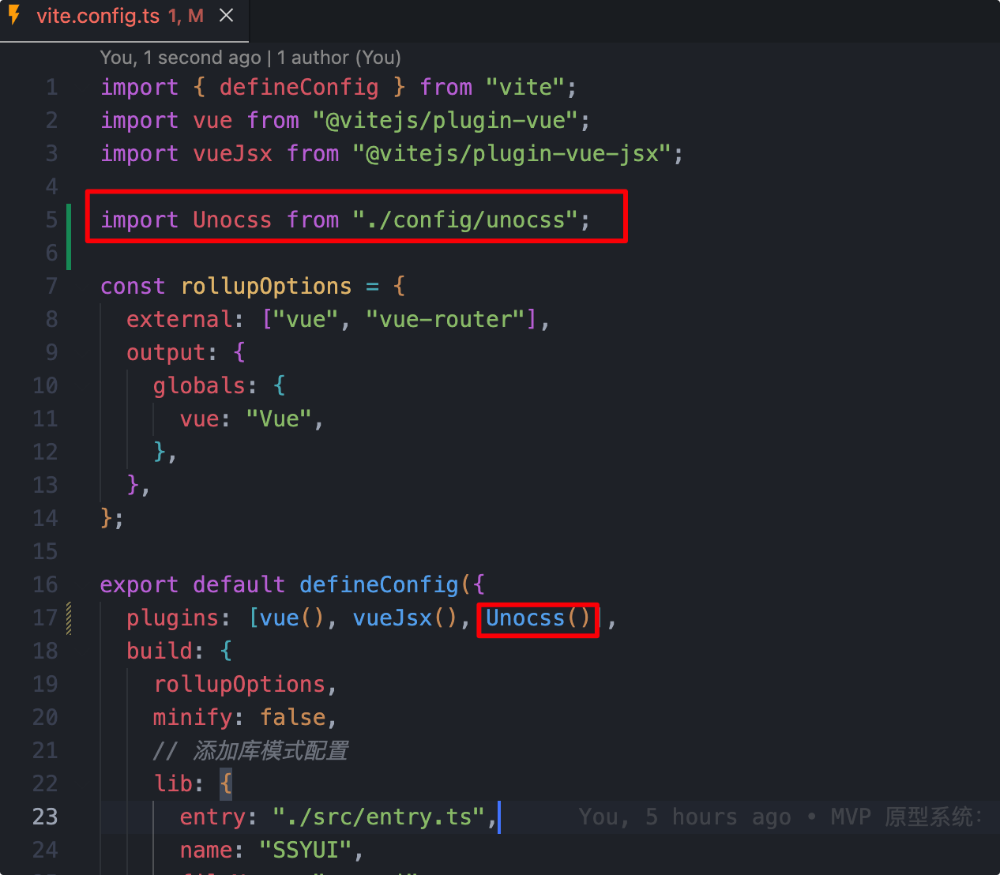

缤纷的颜色就出现了啦～

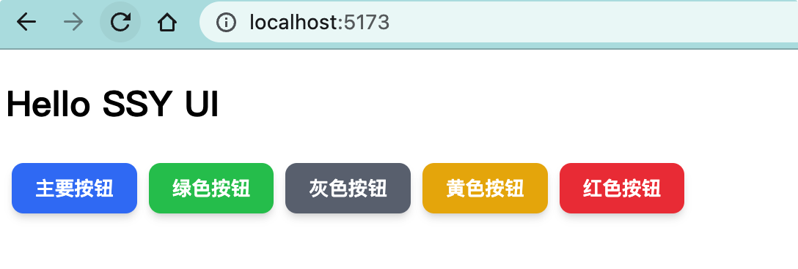

使用同样的方式，我们可以给按钮定制各种样式，增加尺寸、是否圆角、是否扁平等属性，完整的 button/index.tsx 如下：

```tsx :collapsed-lines=8
import { defineComponent, PropType } from "vue";
import "uno.css";

export type ISize = "small" | "medium" | "large";
export type IColor =
  | "black"
  | "gray"
  | "red"
  | "yellow"
  | "green"
  | "blue"
  | "indigo"
  | "purple"
  | "pink";

export const props = {
  // 颜色
  color: {
    type: String as PropType<IColor>,
    default: "blue",
  },

  // 尺寸
  size: {
    type: String as PropType<ISize>,
    default: "medium",
  },

  // 是否圆角
  round: {
    type: Boolean,
    default: false,
  },

  // 是否扁平
  plain: {
    type: Boolean,
    default: false,
  },
} as const;

export default defineComponent({
  name: "SButton",
  props,
  setup(props, { slots }) {
    console.log(`html`, document.querySelector(`#app`)?.innerHTML);

    const size = {
      small: {
        x: "2",
        y: "1",
        text: "sm",
      },
      medium: {
        x: "3",
        y: "1.5",
        text: "base",
      },
      large: {
        x: "4",
        y: "2",
        text: "lg",
      },
    };

    return () => (
      <button
        class={`
          py-${size[props.size].y}
          px-${size[props.size].x}
          ${props.round ? "rounded-full" : "rounded-lg"}
          bg-${props.color}-${props.plain ? "100" : "500"}
          hover:bg-${props.color}-400
          border-${props.color}-${props.plain ? "500" : "500"}
          cursor-pointer
          border-solid
          text-${props.plain ? props.color + "-500" : "white"}
          text-${size[props.size].text}
          hover:text-white
          transition duration-300 ease-in-out transform hover:scale-105
          mx-1
          `}
      >
        {slots.default ? slots.default() : ""}
      </button>
    );
  },
});
```

在 src/index.ts 创建各种按钮：

```typescript :collapsed-lines=8
import { createApp } from "vue/dist/vue.esm-browser";
import SSYUI from "./entry";

createApp({
  template: `
    <div style="margin-bottom:20px;">
        <SButton color="blue">主要按钮</SButton>
        <SButton color="green">绿色按钮</SButton>
        <SButton color="gray">灰色按钮</SButton>
        <SButton color="yellow">黄色按钮</SButton>
        <SButton color="red">红色按钮</SButton>
    </div>
    <div style="margin-bottom:20px;">
        <SButton color="blue" plain>朴素按钮</SButton>
        <SButton color="green" plain>绿色按钮</SButton>
        <SButton color="gray" plain>灰色按钮</SButton>
        <SButton color="yellow" plain>黄色按钮</SButton>
        <SButton color="red" plain>红色按钮</SButton>
    </div>
    <div style="margin-bottom:20px;">
        <SButton size="small" plain>小按钮</SButton>
        <SButton size="medium" plain>中按钮</SButton>
        <SButton size="large" plain>大按钮</SButton>
    </div>
    <div style="margin-bottom:20px;">
        <SButton color="blue" round plain>搜索按钮</SButton>
        <SButton color="green" round plain>编辑按钮</SButton>
        <SButton color="gray" round plain>成功按钮</SButton>
        <SButton color="yellow" round plain>提示按钮</SButton>
        <SButton color="red" round plain>删除按钮</SButton>
    </div>
  `,
})
  .use(SSYUI)
  .mount("#app");
```

效果如下：

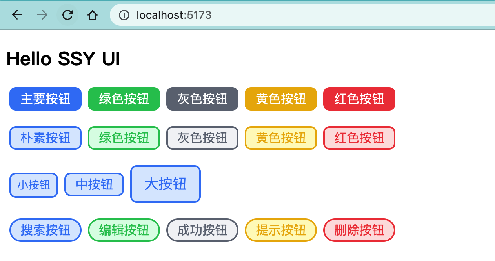

### 图标按钮的实现

接下来要给按钮增加图标定制功能。

首先需要引入字体图标库。

在 UnoCSS 中引入图标，只需要加载 @unocss/preset-icons 预设就可以了。它提供了 iconify 图标框架中大量的图表集。

在 [iconfy](https://icones.js.org/) 网站中有上万个字体图标可以选择。

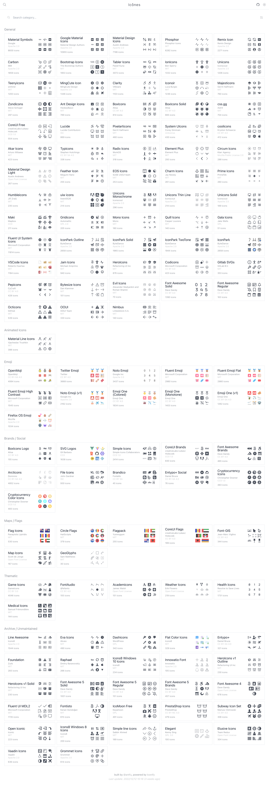

如果你想使用一个 【 🔍 】 搜索，可以在 [iconfy](https://icones.js.org/) 选择一个你喜欢的字体图标集合，如 Goole Material Icons

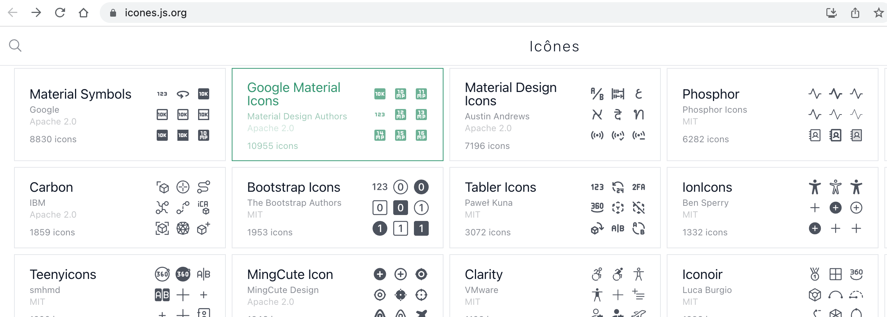

然后搜索关键词 search

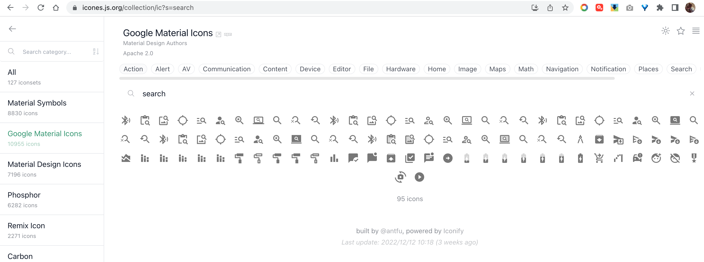

点击你喜欢的那个图标，页面会出现提示信息

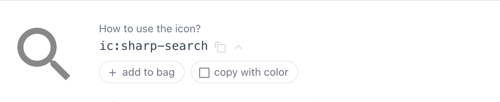

我们在 Uno 中使用 class="ic:sharp-search"，就会自动引用这个图标，非常方便。

下面开始引入这个功能。

首先在 Unocss 插件中添加 presetIcons 预设，修改 config/unocss.ts 内容如下：

```typescript
import { presetUno, presetAttributify, presetIcons } from "unocss";

export default () =>
  Unocss({
    safelist,
    presets: [presetUno(), presetAttributify(), presetIcons()],
  });
```

为了能够在 UnoCSS 中使用变量定义字体图标，需要将使用的图标名加入到 safelist 中，继续修改 config/unocss.ts ，增加 safelist 配置：

```typescript
const safelist = [
  ...[
    "search",
    "edit",
    "check",
    "message",
    "star-off",
    "delete",
    "add",
    "share",
  ].map((v) => `i-ic-baseline-${v}`),
];
```

完整的 config/unocss.ts 如下：

```typescript :collapsed-lines=8
import { presetUno, presetAttributify, presetIcons } from "unocss";
import Unocss from "unocss/vite";

const colors = [
  "white",
  "black",
  "gray",
  "red",
  "yellow",
  "green",
  "blue",
  "indigo",
  "purple",
  "pink",
];
const safelist = [
  ...colors.map((v) => `bg-${v}-100`),
  ...colors.map((v) => `bg-${v}-400`),
  ...colors.map((v) => `bg-${v}-500`),
  ...colors.map((v) => `hover:bg-${v}-100`),
  ...colors.map((v) => `hover:bg-${v}-300`),
  ...colors.map((v) => `hover:bg-${v}-400`),
  ...colors.map((v) => `hover:bg-${v}-500`),
  ...colors.map((v) => `border-${v}-400`),
  ...colors.map((v) => `border-${v}-500`),
  ...colors.map((v) => `text-${v}-500`),
  ...colors.map((v) => `hover:text-${v}-500`),
  "text-white",
  ...Array.from({ length: 8 }, (_, i) => `px-${i + 1}`),
  ...Array.from({ length: 8 }, (_, i) => `py-${i + 1}`),
  ...["xs", "sm", "base", "lg", "xl", "2xl", "3xl"].map((v) => `text-${v}`),
  ...["rounded-full", "rounded-lg"],
  ...[
    "search",
    "edit",
    "check",
    "message",
    "star-off",
    "delete",
    "add",
    "share",
  ].map((v) => `i-ic-baseline-${v}`),
];

export default () =>
  Unocss({
    safelist,
    presets: [presetUno(), presetAttributify(), presetIcons()],
  });
```

最后在 button/index.tsx 中添加图标属性，并在插槽引入字体图标：

```typescript :collapsed-lines=8
import { defineComponent, PropType } from "vue";
import "uno.css";

export type ISize = "small" | "medium" | "large";
export type IColor =
  | "black"
  | "gray"
  | "red"
  | "yellow"
  | "green"
  | "blue"
  | "indigo"
  | "purple"
  | "pink";

export const props = {
  size: {
    type: String as PropType<ISize>,
    default: "medium",
  },

  color: {
    type: String as PropType<IColor>,
    default: "blue",
  },

  round: {
    type: Boolean,
    default: false,
  },

  plain: {
    type: Boolean,
    default: false,
  },

  icon: {
    type: String,
    default: "",
  },
} as const;

export default defineComponent({
  name: "SButton",
  props,
  setup(props, { slots }) {
    const size = {
      small: {
        x: "2",
        y: "1",
        text: "sm",
      },
      medium: {
        x: "3",
        y: "1.5",
        text: "base",
      },
      large: {
        x: "4",
        y: "2",
        text: "lg",
      },
    };

    return () => (
      <button
        class={`
          py-${size[props.size].y}
          px-${size[props.size].x}
          ${props.round ? "rounded-full" : "rounded-lg"}
          bg-${props.color}-${props.plain ? "100" : "500"}
          hover:bg-${props.color}-400
          border-${props.color}-${props.plain ? "500" : "500"}
          cursor-pointer
          border-solid
          text-${props.plain ? props.color + "-500" : "white"}
          text-${size[props.size].text}
          hover:text-white
          transition duration-300 ease-in-out transform hover:scale-105
          mx-1
          `}
      >
        {props.icon !== "" ? (
          <i class={`i-ic-baseline-${props.icon} p-3`}></i>
        ) : (
          ""
        )}
        {slots.default ? slots.default() : ""}
      </button>
    );
  },
});
```

在 src/index.ts 的按钮中加入字体图标样式：

```typescript :collapsed-lines=8
import { createApp } from "vue/dist/vue.esm-browser";
import SSYUI from "./entry";
createApp({
  template: `
      <div style="margin-bottom:20px;">
        <SButton color="blue">主要按钮</SButton>
        <SButton color="green">绿色按钮</SButton>
        <SButton color="gray">灰色按钮</SButton>
        <SButton color="yellow">黄色按钮</SButton>
        <SButton color="red">红色按钮</SButton>
      </div>
      <div style="margin-bottom:20px;">
          <SButton color="blue" plain>朴素按钮</SButton>
          <SButton color="green" plain>绿色按钮</SButton>
          <SButton color="gray" plain>灰色按钮</SButton>
          <SButton color="yellow" plain>黄色按钮</SButton>
          <SButton color="red" plain>红色按钮</SButton>
      </div>
      <div style="margin-bottom:20px;">
          <SButton size="small" plain>小按钮</SButton>
          <SButton size="medium" plain>中按钮</SButton>
          <SButton size="large" plain>大按钮</SButton>
      </div>
      <div style="margin-bottom:20px;">
          <SButton color="blue" round plain icon="search">搜索按钮</SButton>
          <SButton color="green" round plain icon="edit">编辑按钮</SButton>
          <SButton color="gray" round plain icon="check">成功按钮</SButton>
          <SButton color="yellow" round plain icon="message">提示按钮</SButton>
          <SButton color="red" round plain icon="delete">删除按钮</SButton>
      </div>
      <div style="margin-bottom:20px;">
        <SButton color="blue" round plain icon="search"></SButton>
        <SButton color="green" round plain icon="edit"></SButton>
        <SButton color="gray" round plain icon="check"></SButton>
        <SButton color="yellow" round plain icon="message"></SButton>
      </div>
    `,
})
  .use(SSYUI)
  .mount("#app");
```

运行效果：

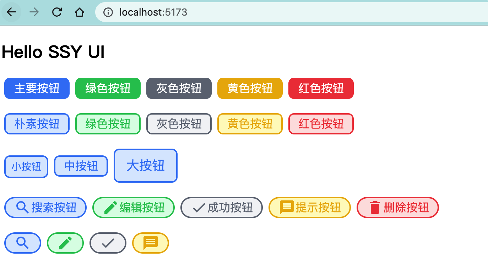

### Build 时单独导出 CSS

在 vite.config.ts 中的 build 部分，将编译选项 cssCodeSplit 配置为 true。cssCodeSplit 这个选项是为了决定在编译的时候是否要独立输出 css。

```typescript
build: {
  rollupOptions,
  minify: false,
  cssCodeSplit: true,
  lib: {
    entry: "./src/entry.ts",
    name: "SSYUI",
    fileName: "ssy-ui",
    formats: ["esm", "umd", "iife"],
  },
},
```

执行 pnpm build ，在 dist 目录可以得到构建的产出物。

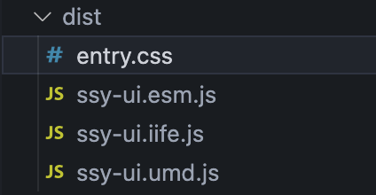

在 demo/esm/index.html 中，调用之前构建生成的 CSS 文件 ，即可让样式生效。

```html :collapsed-lines=8
<!DOCTYPE html>
<html lang="en">
  <head>
    <meta charset="UTF-8" />
    <meta http-equiv="X-UA-Compatible" content="IE=edge" />
    <meta name="viewport" content="width=device-width, initial-scale=1.0" />
    <link rel="stylesheet" href="../../dist/entry.css" />
    <title>index</title>
  </head>

  <body>
    <h1>index</h1>
    <div id="app"></div>

    <script type="module">
      import { createApp } from "vue/dist/vue.esm-bundler.js";

      import { SButton } from "../../dist/ssy-ui.esm.js";

      createApp({
        template: `
          <div style="margin-bottom:20px;">
            <SButton color="blue">主要按钮</SButton>
            <SButton color="green">绿色按钮</SButton>
            <SButton color="gray">灰色按钮</SButton>
            <SButton color="yellow">黄色按钮</SButton>
            <SButton color="red">红色按钮</SButton>
        </div>
     `,
      })
        .component(SButton.name, SButton)
        .mount("#app");
    </script>
  </body>
</html>
```

打开：[ http://localhost:5173/demo/esm/index.html](http://localhost:5173/demo/esm/index.html) ，效果如下：

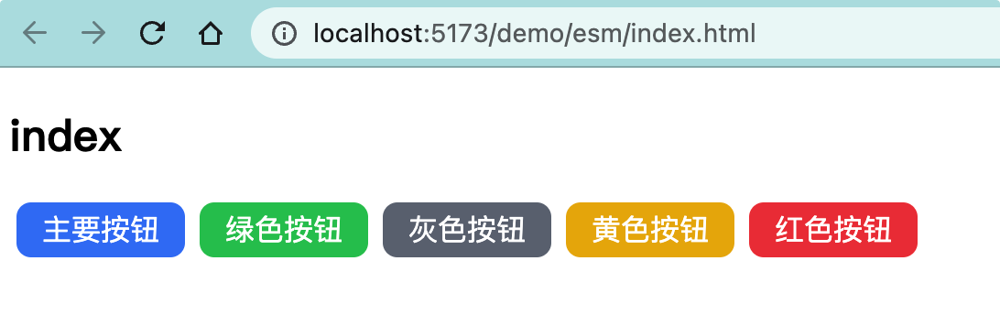

## 复盘

本节主要的内容是为组件库添加样式系统。我们是通过引入 UnoCSS 来实现的。

总结如下：

1. 引入 UnoCSS 实现原子化 CSS 样式；
2. 使用安全列表实现在 UnoCSS 中使用变量定制样式；
3. 引入 @unocss/preset-icons 预设实现字体图标按钮；

随着技术的进步，出现了 UnoCSS 这样的原子化 CSS 引擎，可以让我们类型系统构建变得更加轻松。UnoCSS 配合 JSX 语法也非常具有可读性。

最后留一些思考题：

- Tailwind 与 UnoCSS 的关系 ？
- 怎样在 UnoCSS 中使用变量定制样式 ？
- 怎样在 UnoCSS 中引入字体图标 ？
