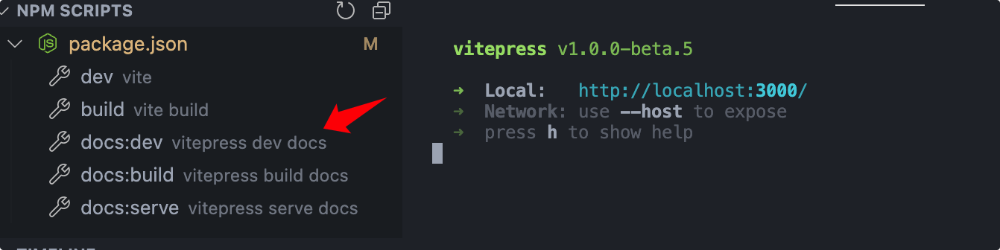
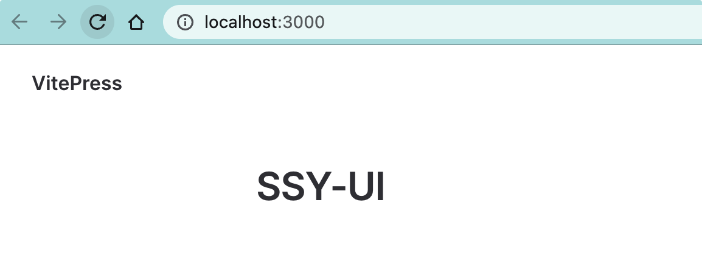
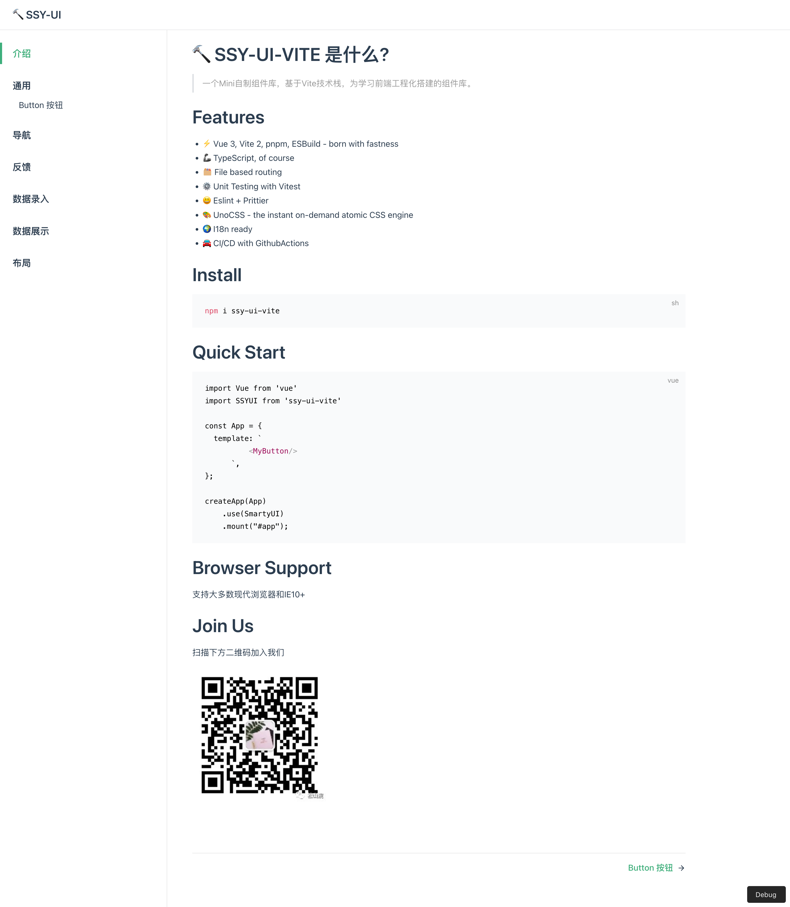
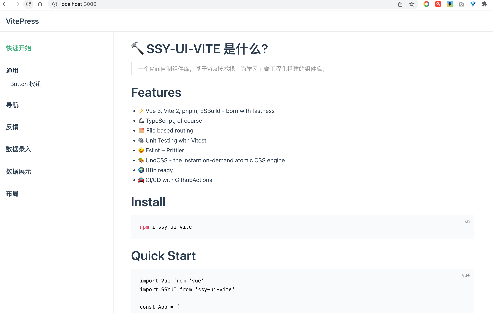
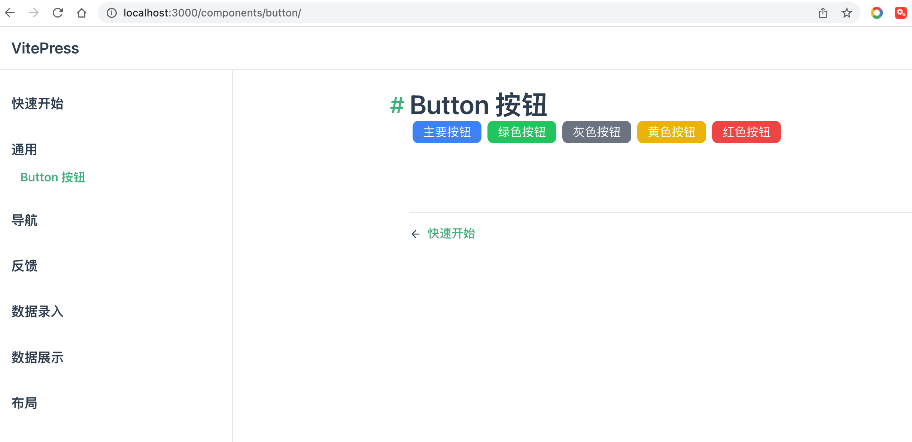

在软件工程中有这样一个概念：**一个完整的软件是文档和代码的组合体**，一堆不知道如何使用的代码没有任何价值。项目文档的建设工作应该越早越好。

## 用户故事 (UserStory)

通过 Vitepress 创建一个文档网站，可以展示组件 Demo 示例、描述、模板代码。

## 功能分解(Task)

- 利用 Vitepress 搭建生成文档网站；
- 引用组件并展示到 Demo；
- 引用 Markdown 插件方便代码 Demo 示例编写；

## 功能实现

文档建设一般会是一个静态网站的形式 ，这次采用 Vitepress 完成文档建设工作。

`Vitepress` 是一款基于 Vite 的静态站点生成工具, 其开发的初衷就是为了建设 Vue 的文档。Vitepress 的方便之处在于，可以使用流行的 Markdown 语法进行编写，也可以直接运行 Vue 的代码。也就是说，它能很方便地完成展示组件 Demo 的任务。

使用 Vitepress 作为文档建设工具还有另外一个好处：由于 Vitepress 是基于 Vite 的，所以它也很好地继承了 Bundless 特性，开发的代码能以“秒级”速度在文档中看到运行效果，完全可以充当调试工具来使用。

下面开始搭建 Vitepress 文档。

### 添加 VitePress 文档

首先需要安装 Vitepress ：

```bash
pnpm i vitepress -D
```

然后配置 Vitepress。默认 Vitepress 是无需配置 vitepress.config.ts 的，但是组件库中需要支持 JSX 语法与 UnoCSS，所以就需要添加配置文件。

**项目根目录新建 `docs/vite.config.ts`，如下：**

```typescript
import { defineConfig } from "vite";
import vueJsx from "@vitejs/plugin-vue-jsx";
import Unocss from "../config/unocss";

export default defineConfig({
  plugins: [
    // 添加JSX插件
    vueJsx(),
    Unocss(),
  ],
  server: {
    port: 3000,
  },
});
```

创建首页文档文档，新建 `docs/index.md`，简单编辑如下：

```markdown
# SSY-UI
```

package.json 增加启动脚本：

```json
{
  "scripts": {
    "docs:dev": "vitepress dev docs",
    "docs:build": "vitepress build docs",
    "docs:serve": "vitepress serve docs"
  }
}
```

启动文档： `pnpm docs:dev`



http://localhost:3000/ 看一下效果：


接着可以尝试用 Markdown 增加一点内容。关于一个开源项目需要编写什么内容，后面会讲解。

我们希望最后实现的效果如下：



### 补充文档

补充 docs/index.md 的内容如下：

````markdown
# 🔨 SSY-UI-VITE 是什么?

> 一个 Mini 自制组件库，基于 Vite 技术栈，为学习前端工程化搭建的组件库。

# Features

- ⚡️ Vue 3, Vite 4, pnpm, ESBuild - born with fastness
- 🦾 TypeScript, of course
- 🗂 File based routing
- ⚙️ Unit Testing with Vitest
- 😃 Eslint + Prittier
- 🎨 UnoCSS - the instant on-demand atomic CSS engine
- 🌍 I18n ready
- 🚘 CI/CD with GithubActions

# Install

```bash
npm i ssy-ui-vite
```

# Quick Start

```vue
import Vue from 'vue' import SSYUI from 'ssy-ui-vite' const App = { template: `
<SButton />
`, }; createApp(App).use(SSYUI) .mount("#app");
```

# Browser Support

支持大多数现代浏览器和 IE10+

# Join Us

扫描下方二维码加入我们


````

### 配置菜单

对于组件库而言，需要将每一个组件的使用方法分一个页面呈现，所以需要配置一下菜单。

新建 `docs/.vitepress/config.ts`

config.ts 配置菜单项的作用：

- 配置菜单项；
- 指定子菜单所对应的 markdwon 文件路径(默认页面 index.md)。

```typescript
import type { DefaultTheme } from "vitepress/theme";

const sidebar: DefaultTheme.Sidebar = {
  "/": [
    { text: "快速开始", link: "/" },
    {
      text: "通用",
      collapsed: true,
      items: [{ text: "Button 按钮", link: "/components/button/" }],
    },
    { text: "导航" },
    { text: "反馈" },
    { text: "数据录入" },
    { text: "数据展示" },
    { text: "布局" },
  ],
};
const config = {
  themeConfig: {
    sidebar,
  },
};
export default config;
```

[http://localhost:3000](http://localhost:3000/components/button/)/ 看下效果：



### 组件 Demo 展示

组件库文档一般都会有展示组件 Demo 的需求。组件的展示实际上就是将组件引用到 markdown 页面中。其实 markdown 是可以直接运行 html 代码的。而 Vitepress 中也含有 Vue 实例，也就是说 Vue 的代码也是可以直接运行的。唯一的问题就是如何将组件库加载。

通过编写一个主题 theme 就可以获取 Vue 实例，只需要在 enhanceApp 方法中注册组件库插件就可以了。

新建 `docs/.vitepress/theme/index.ts`，如下：

```typescript
import Theme from "vitepress/theme";
import SSYUI from "../../../src/entry";

export default {
  ...Theme,
  enhanceApp({ app }) {
    app.use(SSYUI);
  },
};
```

docs 新建 components/button/index.md ，在其中引用组件的代码

```markdown
# Button 按钮

<div style="margin-bottom:20px;">
  <SButton color="blue">主要按钮</SButton>
  <SButton color="green">绿色按钮</SButton>
  <SButton color="gray">灰色按钮</SButton>
  <SButton color="yellow">黄色按钮</SButton>
  <SButton color="red">红色按钮</SButton>
</div>
```

最后看一下运行效果：



## 引入演示插件，优化阅读体验

ElementUI 那种同时演示 Demo 和代码的酷炫效果是怎么做的呢？

其实那个只是一个前端效果，只不过 Element 把它封装为一个 Markdown 插槽，更加容易使用。

什么是 markdown 插槽呢？下面这种语法就是：

```markdown
::: slot name
:::
```

这相当于一种 Markdown 的功能扩展，有兴趣的可以参考这个文档：[VuePress 中文网](https://www.vuepress.cn/guide/markdown-slot.html#为什么需要-markdown-插槽)

Element 实际上就是实现 Markdown 插槽，来实现同时显示 Demo 与代码的。有一个开源项目 **vitepress-theme-demoblock** ，它是模仿了 Element 的这个功能实现的，可以达到类似的效果。

首先安装 `vitepress-theme-demoblock`

```bash
pnpm i vitepress-theme-demoblock@"3.0.7" -D
```

然后配置 `docs/.vitepress/config.ts`

```typescript{1,7-14}
import { demoblockPlugin, demoblockVitePlugin } from 'vitepress-theme-demoblock'
// ...
const config = {
  themeConfig: {
    sidebar,
  },
  markdown: {
    config: (md) => {
      md.use(demoblockPlugin);
    },
  },
  vite: {
    plugins: [demoblockVitePlugin()],
  },
};
export default config;
```

在 `docs/.vitepress/theme/index.ts` 中注册 `vitepress-theme-demoblock` 插件所需的 demo 和 demo-block 组件:

```typescript{4-8,14-15}
import Theme from "vitepress/dist/client/theme-default";
import SSYUI from "../../../src/entry";

// 主题样式
import "vitepress-theme-demoblock/dist/theme/styles/index.css";
// 插件的组件，主要是demo组件
import Demo from "vitepress-theme-demoblock/dist/client/components/Demo.vue";
import DemoBlock from "vitepress-theme-demoblock/dist/client/components/DemoBlock.vue";

export default {
  ...Theme,
  enhanceApp({ app }) {
    app.use(SSYUI);
    app.component("Demo", Demo);
    app.component("DemoBlock", DemoBlock);
  },
};
```

最后在 markdown 文档中编写一段带有 Demo 插槽的 markdown， 修改 docs/components/button/index.md 内容如下：

````markdown
# Button 按钮

常用操作按钮

## 基础用法

基础的函数用法

使用`size`、`color`、`pain`、`round`属性来定义 Button 的样式。

:::demo

```vue
<template>
  <div style="margin-bottom:20px;">
    <SButton color="blue">主要按钮</SButton>
    <SButton color="green">绿色按钮</SButton>
    <SButton color="gray">灰色按钮</SButton>
    <SButton color="yellow">黄色按钮</SButton>
    <SButton color="red">红色按钮</SButton>
  </div>
  <div style="margin-bottom:20px;">
    <SButton color="blue" plain>朴素按钮</SButton>
    <SButton color="green" plain>绿色按钮</SButton>
    <SButton color="gray" plain>灰色按钮</SButton>
    <SButton color="yellow" plain>黄色按钮</SButton>
    <SButton color="red" plain>红色按钮</SButton>
  </div>
  <div style="margin-bottom:20px;">
    <SButton size="small" plain>小按钮</SButton>
    <SButton size="medium" plain>中按钮</SButton>
    <SButton size="large" plain>大按钮</SButton>
  </div>
  <div style="margin-bottom:20px;">
    <SButton color="blue" round plain icon="search">搜索按钮</SButton>
    <SButton color="green" round plain icon="edit">编辑按钮</SButton>
    <SButton color="gray" round plain icon="check">成功按钮</SButton>
    <SButton color="yellow" round plain icon="message">提示按钮</SButton>
    <SButton color="red" round plain icon="delete">删除按钮</SButton>
  </div>
  <div style="margin-bottom:20px;">
    <SButton color="blue" round plain icon="search"></SButton>
    <SButton color="green" round plain icon="edit"></SButton>
    <SButton color="gray" round plain icon="check"></SButton>
    <SButton color="yellow" round plain icon="message"></SButton>
    <SButton color="red" round plain icon="delete"></SButton>
  </div>
</template>
```

:::

## 图标按钮

带图标的按钮可增强辨识度（有文字）或节省空间（无文字）。

设置 icon 属性即可，icon 的列表可以参考 Element 的 icon 组件，也可以设置在文字右边的 icon ，只要使用 i 标签即可，可以使用自定义图标。

:::demo

```vue
<template>
  <div class="flex flex-row">
    <SButton icon="edit" plain></SButton>
    <SButton icon="delete" plain></SButton>
    <SButton icon="share" plain></SButton>
    <SButton round plain icon="search">搜索</SButton>
  </div>
</template>
```
````

看看效果：


## 复盘

本节主要介绍的是如何给组件库使用 Vitepress 进行文档建设。

总结如下：

1. Vitepress 作为静态文档生成器，提供将 Markdown 生成静态网站的能力；
2. 通过配置主题获取 vue 实例，加载组件库，对组件库运行 Demo 进行展示；
3. 通过引用 DemoBlock Markdown 插槽，可以达到同时展示 Demo 和代码块的酷炫效果；

建议尝试一下用 Vitepress 调试代码的开发方式，这种方式非常理想。不但可以方便调试，并且可以同步编写文档。

最后留一些思考题：

- 如何配置 Vitepress 完成文档建设 ？
- 如何在 vitepress 中引用 Vue 组件？
- 什么是 Markdown 插槽 ？
