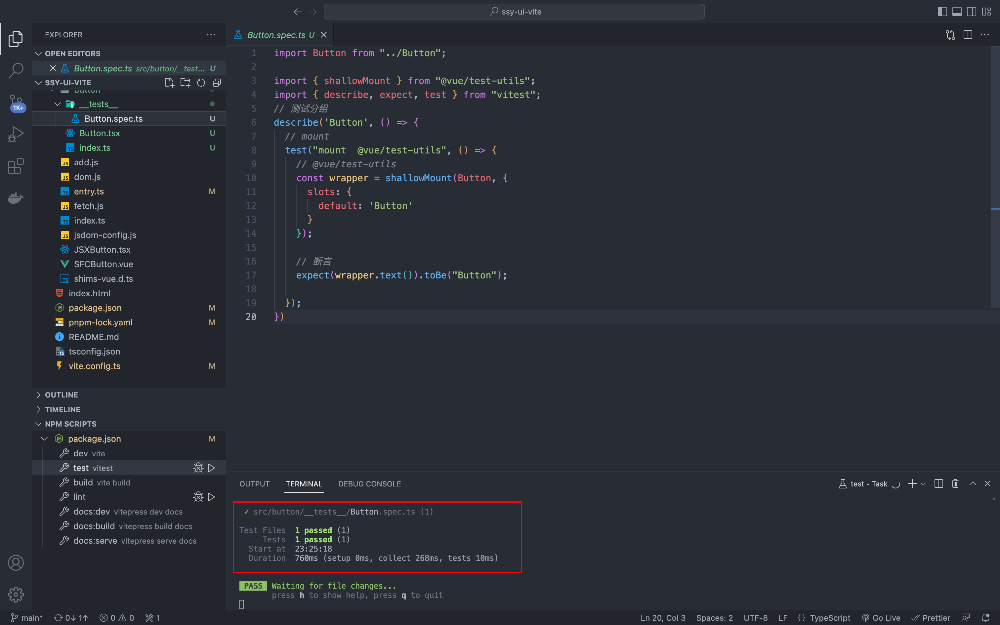
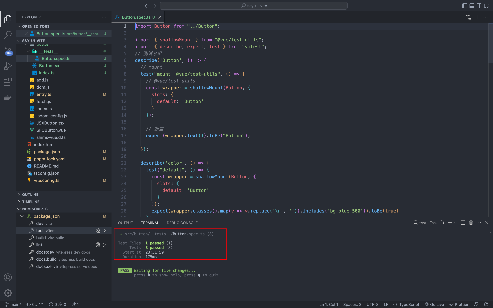

这节我们来学习如何给组件库添加单元测试。

在 Vite 栈的项目中，首推 **Vitest** 作为测试框架。

## 为什么选择 Vitest？

在 Vitest 之前，前端普遍的测试框架是 Jest。Jest 是由 Facebook 开源的一款测试框架，它本身集成了断言库、mock、快照测试、覆盖率报告等功能。比如 Vue3.0， 还有流行的 ElementUI 组件库都是使用 Jest 完成的单元测试。

**Vitest 是一个基于 Vite 的测试框架**，它可以做到与 Vite 通用配置。也就是说，如果你在 Vite 中使用插件支持了 JSX 语法，做单元测试的时候就无需再配置一遍了，这点非常重要。并且 Vite 兼容了大部分 Jest 的使用方法，这样以往 Jest 的使用经验依然可以用在 Vitest 中使用，没有太多的重复学习过程。另外 Vitest 更加注重性能，尽可能多地使用 Worker 线程并发执行，可以提高测试的运行效率。

总结一下 Vitest 的优点：

- 与 Vite 同配置；
- 大量兼容 JestAPI；
- 高执行效率；

## 用户故事 (UserStory)

通过 Vitest 实现对组件的单元测试。

## 任务分解 (Task)

- 搭建 Vitest 单元测试环境。

## 任务实现

### 搭建测试环境

```bash
pnpm i -D vitest@"2.1.2" happy-dom@"15.7.4" @vue/test-utils@"2.4.6"
```

配置 Vitest 测试组件库，需要以下三个库：

- [vitest](https://cn.vitest.dev/) ：测试框架，用于执行整个测试过程并提供断言库、mock、覆盖率；
- [happy-dom](https://github.com/capricorn86/happy-dom)：是用于提供在 Node 环境中的 Dom 仿真模型；
- [@vue/test-utils](https://test-utils.vuejs.org/) 工具库： Vue 推荐的测试工具库；

@vue/test-utils 工具库是为了简化 vue 的测试过程而设计的。实际上使用 jest 或者 vitest 也可以直接对 vue 的进行测试。但是如果每次都需要编写初始化 vue 实例、渲染组件等操作，并且对 Dom 断言也比较繁琐。

比较好的办法是将这些针对 vue 测试的过程进程封装。当然这些封装是针对虽有 vue 项目通用的，这也就是 @vue/test-utils 的来历。

首先，需要在 vite.config.ts 中增加 Vitest 配置。

```typescript{1,6-12}
/// <reference types="vitest/config" />
import { defineConfig } from "vite";

export default defineConfig({
  // ...
  test: {
    // enable jest-like global test APIs
    globals: true,
    // simulate DOM with happy-dom
    // (requires installing happy-dom as a peer dependency)
    environment: "happy-dom",
  },
});
```

解释一下其中的重要属性。

**enviroment** 属性中配置了 happy-dom，用于提供测试所需要的 DOM 仿真。测试是在 node 环境中运行的，而不是浏览器中，需要提供一个 DOM 对象的仿真。

### 代码的小重构

测试之前做一个代码的小重构。就是给每一个组件添加一个入口 index.ts。

将原来 src/button 目录下的 index.tsx 重命名为 Button.tsx，然后在 src/button 目录新建 index.ts 文件，导出 Button 组件：

```typescript
import Button from "./Button";

// 导出Button组件
export default Button;
```

### 编写测试用例

新建 src/button/test/Button.test.ts 测试文件：

```typescript
import Button from "../Button";

import { shallowMount } from "@vue/test-utils";
import { describe, expect, test } from "vitest";
// 测试分组
describe("Button", () => {
  // mount
  test("mount  @vue/test-utils", () => {
    // @vue/test-utils
    const wrapper = shallowMount(Button, {
      slots: {
        default: "Button",
      },
    });

    // 断言
    expect(wrapper.text()).toBe("Button");
  });
});
```

在测试文件中创建一个 describe 分组。在第一个参数中输入【Button】，表明是针对 Button 的测试。编写测试用例 test ，使用 shallowMount 初始化组件，测试按钮是否工作正常，只需要断言判断按钮中的字符串是否正确就可以了。

在 package.json 中增加测试运行脚本：

```json
{
  "scripts": {
    "test": "vitest"
  }
}
```

然后就可以启动 Vitest 单元测试了：

```bash
pnpm test
```

测试结果：

上面的测试只是测试了按钮的默认状态。

对于按钮组件来讲，它的主要逻辑是：**根据不同的 props 属性来定制不同的样式**。

下面我们针对这些逻辑继续编写测试。

比如： color 属性是根据传入的不同条件定义不同的颜色，只需要让断言判断是否加载不同的属性就行了。

- Color: default

| **输入：color** | **输出：css** |
| --------------- | ------------- |
| 空(默认)        | bg-blue-500   |
| red             | bg-red-500    |

完善 Button.test.ts 文件如下：

```typescript
import Button from "../Button";

import { shallowMount } from "@vue/test-utils";
import { describe, expect, test } from "vitest";
// 测试分组
describe("Button", () => {
  // mount
  test("mount  @vue/test-utils", () => {
    // @vue/test-utils
    const wrapper = shallowMount(Button, {
      slots: {
        default: "Button",
      },
    });

    // 断言
    expect(wrapper.text()).toBe("Button");
  });

  describe("color", () => {
    test("default", () => {
      const wrapper = shallowMount(Button, {
        slots: {
          default: "Button",
        },
      });
      expect(
        wrapper
          .classes()
          .map((v) => v.replace("\n", ""))
          .includes("bg-blue-500")
      ).toBe(true);
    });

    test("red", () => {
      const wrapper = shallowMount(Button, {
        slots: {
          default: "Button",
        },
        props: {
          color: "red",
        },
      });

      expect(
        wrapper
          .classes()
          .map((v) => v.replace("\n", ""))
          .includes("bg-red-500")
      ).toBe(true);
    });
  });

  describe("round", () => {
    test("default", () => {
      const wrapper = shallowMount(Button, {
        slots: {
          default: "Button",
        },
      });

      expect(
        wrapper
          .classes()
          .map((v) => v.replace("\n", ""))
          .includes("rounded-lg")
      ).toBe(true);
    });

    test("round:true", () => {
      const wrapper = shallowMount(Button, {
        slots: {
          default: "Button",
        },
        props: {
          round: true,
        },
      });

      expect(
        wrapper
          .classes()
          .map((v) => v.replace("\n", ""))
          .includes("rounded-full")
      ).toBe(true);
    });
  });

  describe("plain", () => {
    test("default", () => {
      const wrapper = shallowMount(Button, {
        slots: {
          default: "Button",
        },
      });

      expect(
        wrapper
          .classes()
          .map((v) => v.replace("\n", ""))
          .includes("bg-blue-500")
      ).toBe(true);
    });

    test("plain:true", () => {
      const wrapper = shallowMount(Button, {
        slots: {
          default: "Button",
        },
        props: {
          plain: true,
        },
      });

      expect(
        wrapper
          .classes()
          .map((v) => v.replace("\n", ""))
          .includes("bg-blue-100")
      ).toBe(true);
    });
  });

  test("icon", () => {
    const wrapper = shallowMount(Button, {
      slots: {
        default: "Button",
      },
      props: {
        icon: "edit",
      },
    });

    expect(
      wrapper
        .find("i")
        .classes()
        .map((v) => v.replace("\n", ""))
        .includes("i-ic-baseline-edit")
    ).toBe(true);
  });
});
```

重新运行，测试结果中可看到有 8 个测试实例通过



编写测试的时候，使用 describe 创建一个子分组，用于测试 color 属性。然后设置不同的 color 属性值，用断言来判断是否输出对应的 css 样式。

剩余的属性测试和 color 的测试非常类似，就不再赘述。

**在代码编写阶段，建议只对重点功能进行测试，没必要一定追求过高的测试覆盖率**，因为前期过度地测试也会提高开发成本，拖慢开发进度。关于测试覆盖率的问题，会在后续介绍。

到目前为止，我们就把组件库的测试框架搭好了。

## 复盘

本节我们主要讲了组件库添加测试环境，引入**Vitest** 实现，整体上 Vitest 和 Jest 风格非常类似。基本上可以 0 学习成本切换。而且得益于通属于 Vite 生态，可以做到通用配置和更好的执行效率。

对于 Vue 框架开发代码的测试，当然可以使用原始的的测试框架进行测试。但是，为了简化测试，也会有人将执行过程和测试断言做进一步的封装， 比如 Vue Test Unit 这样的工具库，利用工具库封装了执行过程可以简化单元测试的编写。

要认真编写描述字符串和合理的使用 **describe 测试分组**。描述字符串会在测试不通过的时候直接显示到命令行中，直接告诉哪个组件的什么功能没有通过测试，**好的测试分组可以有效提高测试的可读性**。

最后留一些思考题：

- 如何配置 Vitest 环境？
- 如何使用 @vue/test-utils 完成 Vue3 项目的测试？
