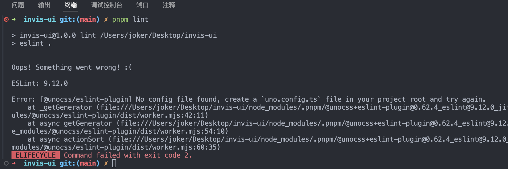
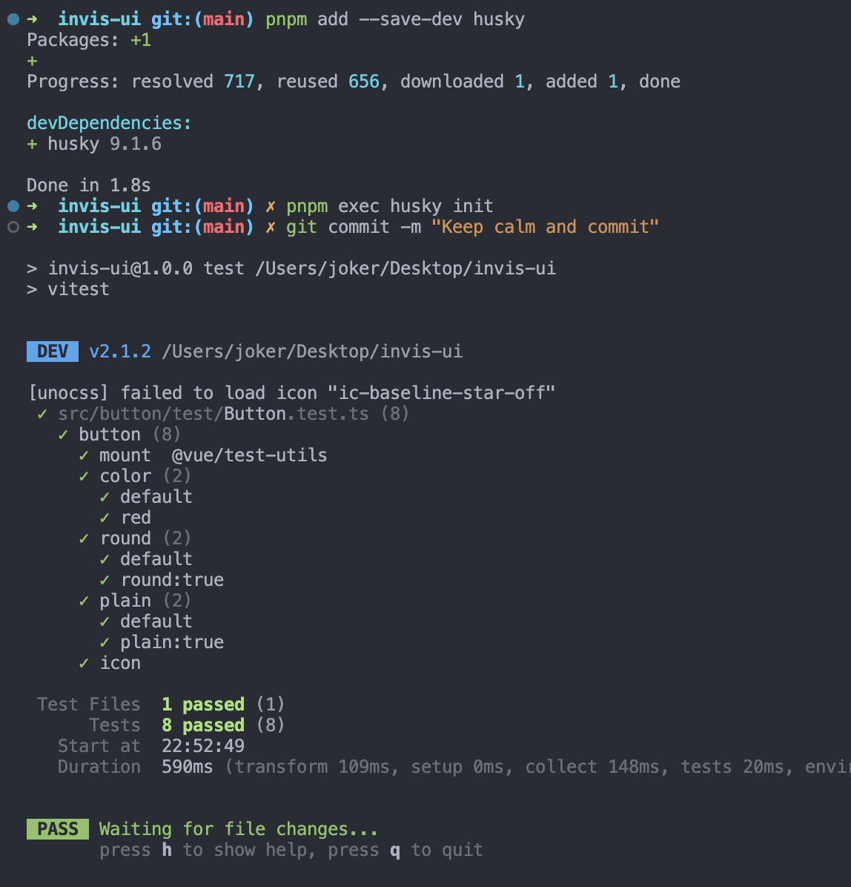
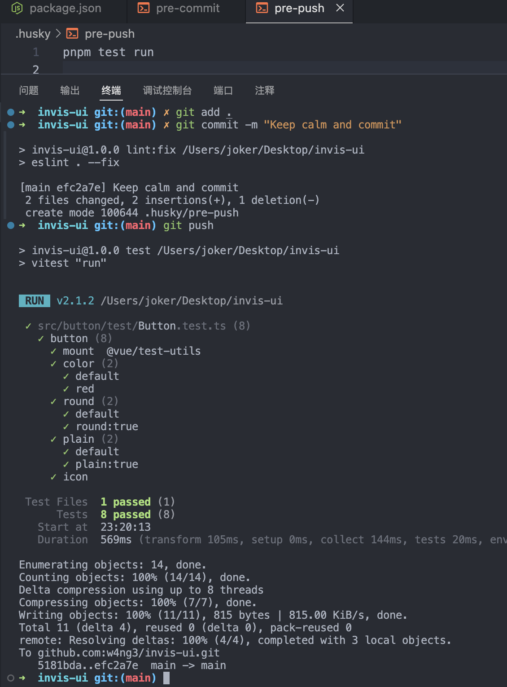
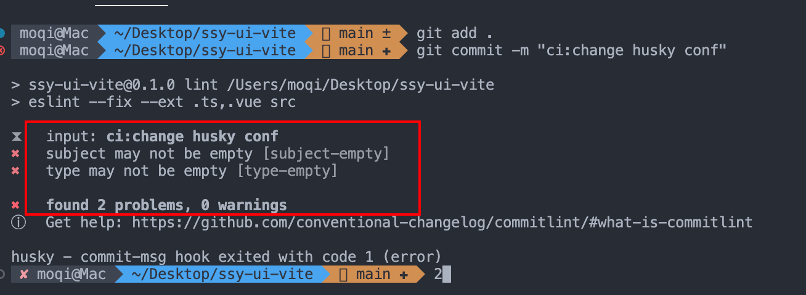
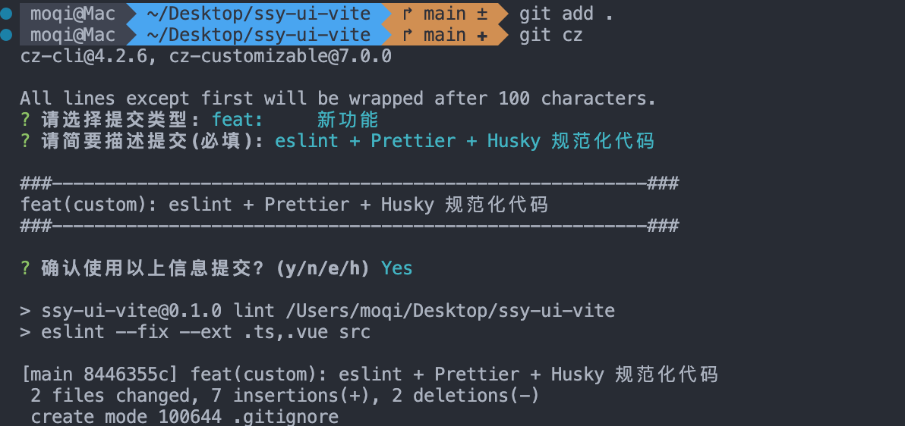

为了项目能够长期健康的发展，代码的规范性建设非常重要。
规范制定容易，执行的难度很大。代码检查任务繁琐又缺乏技术含量，没有人愿意干这个苦差事，一般都是交给程序完成，这样才能成功地推行下去。
本节我们来学习用工具实现前端工程的规范化。

本节我们来学习用工具实现前端工程的规范化。
项目规范可以分为：

- 编码规范；
- 项目结构规范；
- 文件命名规范；
- git commit 版本规范；
- 工作流 workflow 规范；

本节先只考虑前四部分。关于工作流部分，涉及到社区和团队合作，后面再说。

## 用户故事 (UserStory)

引入项目规范，配置自动化检查工具，避免代码架构退化。

## 任务分解 (Task)

- 编码与项目结构规范；
- Eslint 代码检查工具、代码格式化工具；
- Git commit 提交检查脚本；
- Husky + git hook 提交前校验；

## 任务实现

### 编码规范

- JS 代码规范

- [airbnb-中文版](https://github.com/lin-123/javascript)
- [standard (24.5k star) 中文版](https://github.com/standard/standard/blob/master/docs/README-zhcn.md)
- [百度前端编码规范 3.9k](https://github.com/ecomfe/spec)

- CSS 代码规范

- [styleguide 2.3k](https://github.com/fex-team/styleguide/blob/master/css.md)
- [spec 3.9k](https://github.com/ecomfe/spec/blob/master/css-style-guide.md)

对于编码规范，通常会依赖 **eslint** 这种代码检查工具。

**eslint 提供了 airbnb 、google、eslint 默认三种编码规范**。无论选择哪一种规则都可以很好地保证代码的可读性，所以大家使用 eslint 默认规则就好。

另外还有目录规范和文件命名规范也一并罗列出来。

### 目录规范

```text
.
├── config               # 配置文件
├── coverage             # 覆盖率报告
├── demo                 # 代码范例
├── docs                 # 文档
├── node_modules
├── scripts              # 脚本 发布、提交信息检查
├── src                  # 组件代码
└── types                # TS类型定义
```

### 文件命名规范

- 包名：小写 + 中划线
- 统一入口文件： index.ts
- 组件代码： 大驼峰
- 测试用例代码 ： 测试对象名+ .test.ts
- ...

### ESLint

从 ESLint v9.0.0 开始，平面配置文件格式将成为默认的配置文件格式，配置文件名不再是`eslintrc`，而是`eslint.config.mjs`

- [为什么我不使用 Prettier —— Anthony fu ](https://antfu.me/posts/why-not-prettier-zh)

- [ESLint 配置迁移指南](https://zh-hans.eslint.org/docs/latest/use/configure/migration-guide)

除了按照官方文档迁移，还可以使用 antfu 的 [eslint-config](https://github.com/antfu/eslint-config)，开箱即用。

- 添加依赖

```json
{
  "devDependencies": {
    "@antfu/eslint-config": "^3.7.3",
    "@unocss/eslint-plugin": "^0.62.4",
    "eslint": "^9.11.1",
    "eslint-plugin-format": "^0.1.2",
    "typescript": "5.5.4",
    "unocss": "^0.63.3"
  }
}
```

在你的项目根目录下创建 `eslint.config.mjs`

```js
import antfu from "@antfu/eslint-config";

export default antfu({
  unocss: true,
  vue: true,
  typescript: true,
  // 在Flat配置中不再支持' .eslintignore '，请使用' ignore '代替
  ignores: ["**/test"],
  // 取消 Anthony 喜好的一些固执己见的规则。
  lessOpinionated: true,

  formatters: {
    css: true,
    html: true,
  },
});
```

如果你仍然使用旧 eslintrc 格式的一些配置，你可以使用@eslint/eslintrc 包将它们转换为平面配置。

```js :collapsed-lines=5
// eslint.config.mjs
import antfu from "@antfu/eslint-config";
import { FlatCompat } from "@eslint/eslintrc";

const compat = new FlatCompat();

export default antfu(
  {
    ignores: [],
  },

  // Legacy config
  ...compat.config({
    extends: [
      "eslint:recommended",
      // Other extends...
    ],
  })

  // Other flat configs...
);
```

为 `package.json` 添加脚本

```json
{
  "scripts": {
    "lint": "eslint .",
    "lint:fix": "eslint . --fix"
  }
}
```

[IDE 支持 (保存时自动格式化)](https://github.com/antfu/eslint-config?tab=readme-ov-file#ide-support-auto-fix-on-save)

创建`.vscode/settings.json`文件，将以下设置添加到其中:

```json :collapsed-lines=8
{
  "unocss.autocomplete.matchType": "fuzzy",
  // Disable the default formatter, use eslint instead
  "prettier.enable": false,
  "editor.formatOnSave": false,

  // Auto fix
  "editor.codeActionsOnSave": {
    "source.fixAll.eslint": "explicit",
    "source.organizeImports": "never"
  },

  // Silent the stylistic rules in you IDE, but still auto fix them
  "eslint.rules.customizations": [
    { "rule": "style/*", "severity": "off", "fixable": true },
    { "rule": "format/*", "severity": "off", "fixable": true },
    { "rule": "*-indent", "severity": "off", "fixable": true },
    { "rule": "*-spacing", "severity": "off", "fixable": true },
    { "rule": "*-spaces", "severity": "off", "fixable": true },
    { "rule": "*-order", "severity": "off", "fixable": true },
    { "rule": "*-dangle", "severity": "off", "fixable": true },
    { "rule": "*-newline", "severity": "off", "fixable": true },
    { "rule": "*quotes", "severity": "off", "fixable": true },
    { "rule": "*semi", "severity": "off", "fixable": true }
  ],

  // Enable eslint for all supported languages
  "eslint.validate": [
    "javascript",
    "javascriptreact",
    "typescript",
    "typescriptreact",
    "vue",
    "html",
    "markdown",
    "json",
    "jsonc",
    "yaml",
    "toml",
    "xml",
    "gql",
    "graphql",
    "astro",
    "css",
    "less",
    "scss",
    "pcss",
    "postcss"
  ]
}
```

现在，运行`pnpm lint` 检查错误

运行`pnpm lint:fix`修复错误

:::tip 提示

现在检查会查出没有`uno.config.ts`文件的错误，需要把代码重构一下，将之前的`config/unocss.ts`文件删掉，在根目录添加`uno.config.ts`文件。
:::

```ts :collapsed-lines=8
import {
  defineConfig,
  presetAttributify,
  presetIcons,
  presetUno,
  transformerAttributifyJsx,
  transformerDirectives,
  transformerVariantGroup,
} from "unocss";

const colors = [
  "white",
  "black",
  "gray",
  "red",
  "yellow",
  "green",
  "blue",
  "indigo",
  "purple",
  "pink",
];
const safelist = [
  ...colors.map((v) => `bg-${v}-100`),
  ...colors.map((v) => `bg-${v}-400`),
  ...colors.map((v) => `bg-${v}-500`),
  ...colors.map((v) => `hover:bg-${v}-100`),
  ...colors.map((v) => `hover:bg-${v}-300`),
  ...colors.map((v) => `hover:bg-${v}-400`),
  ...colors.map((v) => `hover:bg-${v}-500`),
  ...colors.map((v) => `border-${v}-400`),
  ...colors.map((v) => `border-${v}-500`),
  ...colors.map((v) => `text-${v}-500`),
  ...colors.map((v) => `hover:text-${v}-500`),
  "text-white",
  ...Array.from({ length: 8 }, (_, i) => `px-${i + 1}`),
  ...Array.from({ length: 8 }, (_, i) => `py-${i + 1}`),
  ...["xs", "sm", "base", "lg", "xl", "2xl", "3xl"].map((v) => `text-${v}`),
  ...["rounded-full", "rounded-lg"],
  ...[
    "search",
    "edit",
    "check",
    "message",
    "star",
    "delete",
    "add",
    "share",
  ].map((v) => `i-ic-baseline-${v}`),
];

export default defineConfig({
  safelist,
  presets: [presetAttributify({}), presetUno(), presetIcons({ warn: true })],
  transformers: [
    transformerDirectives(),
    transformerAttributifyJsx(),
    transformerVariantGroup(),
  ],
});
```

还有修改根目录和`doc`文件夹下的两个 vite.config.ts 文件里的 UnoCSS 引入

```ts
import UnoCSS from "unocss/vite";
```

### Husky + git hooks 自动化提交验证

为了确保只有合格的代码才能够提交到仓库，我们需要配置自动化脚本，确保代码在提交前，通过了代码验证工具的检验。

实际上 git 本身就设计了生命周期钩子来完成这个任务，但是设置过程比较复杂，所以通常情况下会使用 husky 来简化配置。

首先安装 husky

```bash
pnpm add --save-dev husky
```

husky init

> init 命令简化了项目中的 husky 设置。它会在 .husky/ 中创建 pre-commit 脚本，并更新 package.json 中的 prepare 脚本。随后可根据你的工作流进行修改。

```bash
pnpm exec husky init
```

会在根目录多出一个`.husky`文件夹，且会在 package.json 的脚本多出`"prepare": "husky"`

恭喜你！你已经成功地用一个命令设置了你的第一个 Git 钩子 🎉。让我们测试一下：

```bash
git commit -m "Keep calm and commit"
# 测试脚本会在每次提交时运行
```



现在来添加新 Hook，要求是在 commit 前，必须执行`lint`代码校验，在 push 前必须通过 vitest 测试

```bash
echo "pnpm lint" > .husky/pre-commit
echo "pnpm test run" > .husky/pre-push
```

现在可以去查看`.husky/pre-commit`和`.husky/pre-push`文件的内容，

配置完成后，commit 提交一次代码，测试一下是否有效。



### Git commit 提交规范

提交规范主要是为了让开发者提交完整的更新信息，方便查阅，拥有清晰 commit 信息非常有助于查阅代码。

可以围观一下 Vue 的 Github 提交记录：


目前最为流行的提交信息规范来自于 Angular 团队。

规范中，主要就是要求提交内容要进行分类并填写内容，更为严格的规定是要求标注开发模块。

- type：commit 的类型；
- feat：新功能、新特性；
- fix: 修改 bug；
- perf：更改代码，以提高性能；
- refactor：代码重构（重构，在不影响代码内部行为、功能下的代码修改）；
- docs：文档修改；
- style：代码格式修改, 注意不是 css 修改（例如分号修改）；
- test：测试用例新增、修改；
- build：影响项目构建或依赖项修改；
- revert：恢复上一次提交；
- ci：持续集成相关文件修改；
- chore：其他修改（不在上述类型中的修改）；
- release：发布新版本；
- workflow：工作流相关文件修改；

示例：

```markdown
# 示例 1

fix(global):修复 checkbox 不能复选的问题

# 示例 2 下面圆括号里的 common 为通用管理的名称

fix(common): 修复字体过小的 BUG，将通用管理下所有页面的默认字体大小修改为 14px

# 示例 3

fix: value.length -> values.length
```

接下来配置一个工具，用于在提交时自动检查 commit 信息是否符合要求。

安装工具验证脚本 commitlint，并且配置一个 commitlint 内容插件来确定一种 msg 风格。

```bash
# 安装commitlint
pnpm add --save-dev @commitlint/{cli,config-conventional}

# Configure commitlint to use conventional config
echo "export default { extends: ['@commitlint/config-conventional'] };" > commitlint.config.js
```

会在根目录生成`commitlint.config.js`文件。

将 commitlint 脚本添加到 githooks 中， 让每次提交前都验证信息是否正常。

```bash
echo "" > .husky/commit-msg
```

修改 `.husky/commit-msg`

```bash
npx --no -- commitlint --edit "$1"
```

配置完成后，可以测试一下。

当提交代码没有按照规范填写 commit message 时（还是按原来的 git commit -m"提交信息"），就会出现报错，并且阻止你提交代码。



### Commitizen 助你规范化提交代码

严格按照 [约定式提交规范](https://www.conventionalcommits.org/zh-hans/v1.0.0/) 来手动进行代码提交的话，是一件非常痛苦的事情，但是 **git 提交规范**又势在必行，那怎么办呢？
有一种叫做 **git 提交规范化工具** 的东西，而 commitizen 就是其中的佼佼者！
commitizen 仓库名为 [cz-cli](https://github.com/commitizen/cz-cli) ，它提供了一个 git cz 的指令用于代替 git commit，简单一句话介绍它：
当你使用 commitizen 进行代码提交（git commit）时，commitizen 会提交你在提交时填写所有必需的提交字段。
下面我们就来安装并且使用一下 commitizen ，使用完之后自然就明白了。

1. 全局安装 `Commitizen`

```bash
pnpm install -g commitizen
```

2. 当前项目安装并配置 `cz-customizable` 插件

- 安装

```bash
pnpm i cz-customizable --save-dev
```

- 添加以下配置到 `package.json` 中

```json
 "config": {
    "commitizen": {
      "path": "node_modules/cz-customizable"
    },
    "cz-customizable": {
      "config": ".cz-config.cjs"
    }
  }
```

3. 项目根目录下创建 `.cz-config.cjs` 自定义提示文件

```javascript
module.exports = {
  // 可选类型
  types: [
    { value: "feat", name: "feat:     新功能" },
    { value: "fix", name: "fix:      修复" },
    { value: "docs", name: "docs:     文档变更" },
    { value: "style", name: "style:    代码格式(不影响代码运行的变动)" },
    {
      value: "refactor",
      name: "refactor: 重构(既不是增加feature，也不是修复bug)",
    },
    { value: "perf", name: "perf:     性能优化" },
    { value: "test", name: "test:     增加测试" },
    { value: "chore", name: "chore:    构建过程或辅助工具的变动" },
    { value: "revert", name: "revert:   回退" },
    { value: "build", name: "build:    打包" },
  ],
  // 消息步骤
  messages: {
    type: "请选择提交类型:",
    customScope: "请输入修改范围(可选):",
    subject: "请简要描述提交(必填):",
    body: "请输入详细描述(可选):",
    footer: "请输入要关闭的issue(可选):",
    confirmCommit: "确认使用以上信息提交？(y/n/e/h)",
  },
  // 跳过问题
  skipQuestions: ["body", "footer"],
  // subject文字长度默认是72
  subjectLimit: 72,
};
```

1. 使用 git cz 代替 git commit

现在再来提交一次吧！



## 复盘

本节是给组件库确定开发规范并且添加规范化检查工具。
代码规范大体可以分为目录规范、编码规范、提交规范，更重要的内容是介绍如何使用相应的工具来检查代码规范，保证项目的健康性。

大体归纳如下：

- 编码规范： ESLint（语法和格式检查）+ Husky (提交时自动检查)；
- 提交 Message ： commitlint(提交信息样式检查) + Husky (提交时自动检查)。

ESLint 是通过对 AST 语法树的分析完成的检查，具有很好的扩展性，可以扩展很多功能，比如 vue2 与 vue3 语法的不兼容性也可以通过相应的插件进行检测。甚至 Prettier 也是作为 ESLint 的插件执行的。假设在实际开发中有自定义规则，也推荐使用编写 ESLint 插件的形式完成。

代码规范的作用是为了提高代码的可读性，毕竟代码是人与机器的沟通媒介，机器可以不厌其烦的工作，而人类精力和记忆力都有限，需要更优秀的结构和形式来提高阅读效率。基于人类的有限的精力，代码规范化这个东西如果全部让人类手工完成并不合理，不合理就很难被推行下去，不过聪明的人类可以想到使用规范化工具，让机器来解决这个问题。

对于具体规范化规则的制定，一定要考虑到实现成本和收益。比如某个规则特别的复杂，但是对可读性没有明显的提高，而且不能使用现成的工具来实现，那这样的规则实际上不应该提倡。

最后留一些思考题：

- Git commit Message 的规范是什么 ？
- 如何设置 githooks ？
