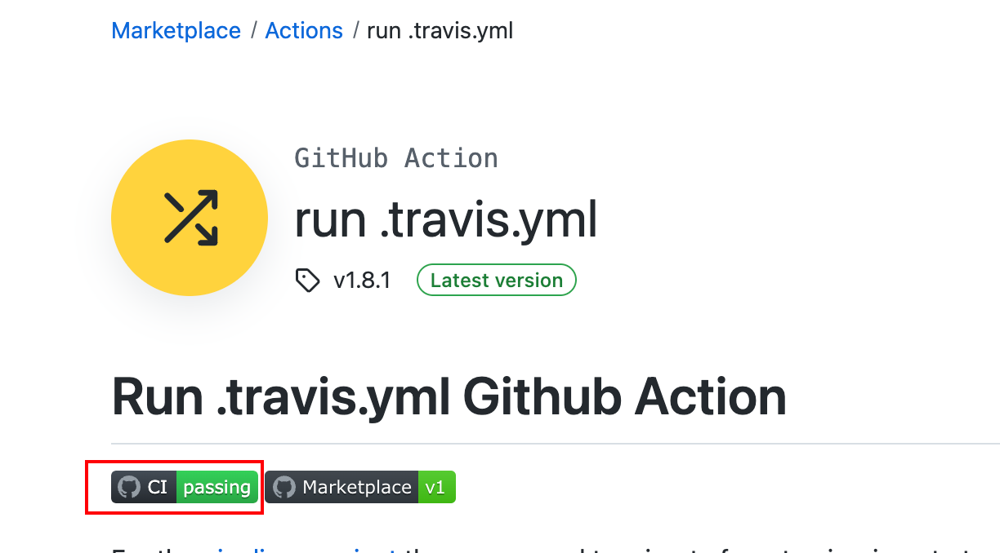
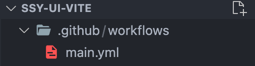
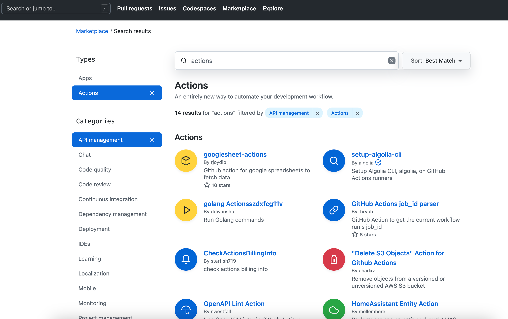
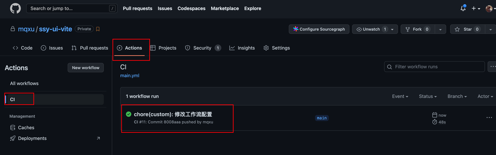
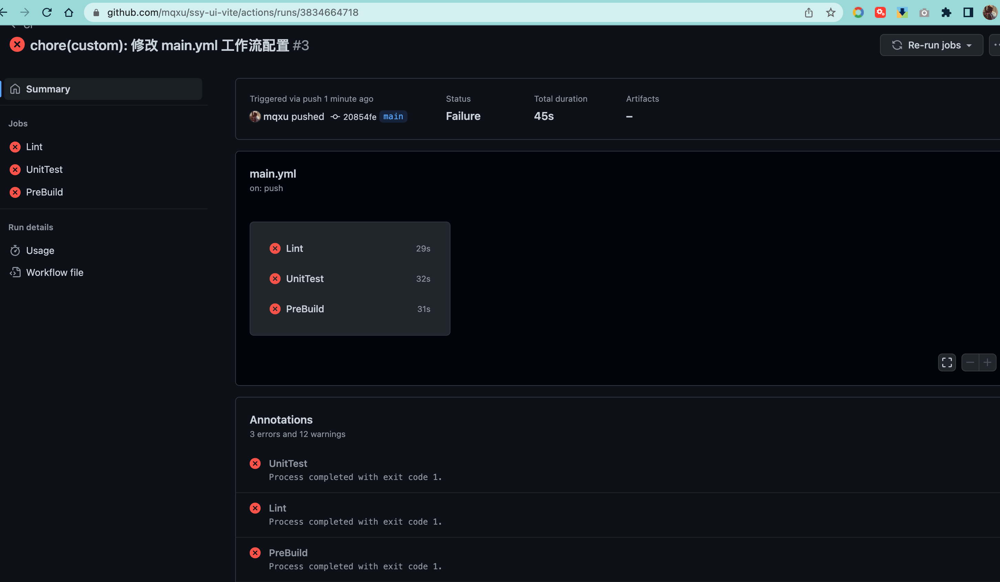
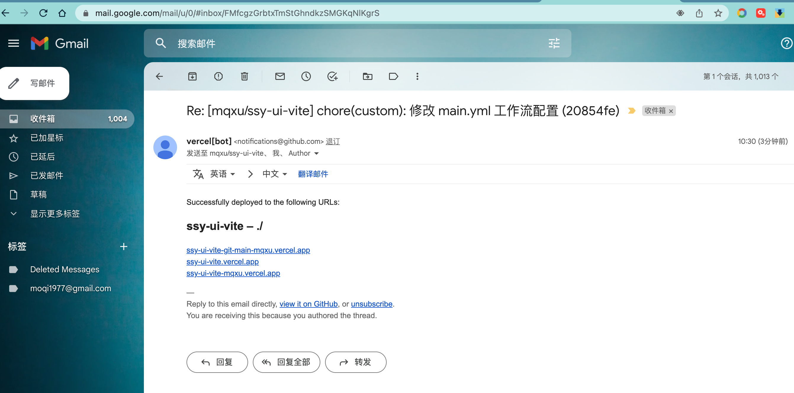

开箱即用是一个开源产品最基本的要求，估计谁也不希望让用户下载一个不能使用的代码。为了达到这个目的，我们引入了单元测试，也使用 github hooks 保证在提交前确保代码能够通过所有的单元测试。

但是，还是有很多因素会导致版本库中的代码出现问题影响使用，比如依赖库的升级，或者开发者的开发环境不同，又或者有人使用强制提交的方式跳过了单元测试检查。

为了完全起见，需要一种独立的验证机制，去除开发环境和开发者的影响。这种机制需要在每次提交后触发，并且使用一个全新的系统运行，并执行需要的验证动作。如果验证通过会直接颁发徽章，并且实时反映到 Github 的 README 上面。比如下面这个 CI passing 的徽章就代表目前这个库是可以通过验证的。



其实，上面所描述的东西就是持续集成服务。

持续集成可以认为是一种优秀的开发实践，它可以在代码变更的时候及时反映代码状态。持续集成需要服务器的支持，可以考虑通过 gitlib ci 或者 jenkins 自己搭建持续集成服务器，**更好的办法是使用第三方的持续集成服务**，目前比较流行的有：

- Travis CI
- CircleCI
- Github Action

这三个服务使用方法大同小异，选用 Github Action ，就是因为它是 Github 内置的，方便而已。

对于开源项目来讲由于代码无需闭源，完全可以使用第三方持续集成服务。

## 用户故事(UserStory)

为组件库添加持续集成，实现提交代码后，调用回归测试验证代码。

## 任务分解(Task)

- 创建工作流 Workflow
- 创建 Job
- 运行 CI 服务
- 颁发 CI 徽章

## 任务实现

Github Action 是一个集成服务，你可以认为它是一台远程运行的服务器。为了让同一台服务器为不同用户提供独立的配置，互不干扰，需要通过容器化技术实现虚拟机。也就是说使用 Github Action，其实就是在使用虚拟机。更准确地讲，其实就是在配置一个容器，它的配置非常类似于配置 Docker 容器配置。

### 创建 Workflow

按如下结构创建目录和文件：



Github Action 的配置文件需要放在项目根目录下的 .github/workflows 中，每一个配置文件是一个工作流 Workflow 。一个工作流是可以配置多个自动化任务 (Job) 的。

比如，组件库的持续集成分为两个任务 (Job) 。一个任务是运行单元测试进行回归校验，另外一个是自动运行 lint 脚本校验代码风格。 这两个任务之间并没有先后关系，而且可以并行运行。这个时候就可以新建一个工作流并且配置两个任务。

### 创建 Job

然后要具体配置每一个 Job，Job 其实是一个运行任务，我们以 UnitTest 单元测试任务举例。

首先需要确定 Job 的 name，接着要设定 runs-on 属性。run-on 是为了指定运行环境（Linux or Mac），其实你可以认为是这个任务虚拟机的环境，Github 可用的虚拟机有：

- windows-(xxx version)
- ubuntu-(xxx version)
- Macos-(xxx version)

每一个 job 又包含多个 step， 每一个 step 是串行执行的。

你可以假定，在一个空的操作系统上，如果你想进行单元测试，则需要完成如下任务:

- 安装 git 软件；
- 检出 checkout 项目代码；
- 安装 pnpm 软件；
- 使用 pnpm 安装项目代码的依赖库；
- 运行 pnpm run test；

编写 step 可以使用下面三个方式：

- run： 执行 shell 命令行命令；
- env: 设置环境变量；
- uses： 运行第三方 Action 脚本。

命令行是一种最好理解的执行方式，比如运行测试：

```bash
pnpm run test run
```

你就可以这样设置：

```yaml
- name: Run Test
  run: pnpm run test run
```

但是对于一些比较复杂过程，自己配置起来就比较繁琐了，比如安装 git。

首先要考虑不同系统，也需要确定是否有比如 apt-get 或 yum 等包管理工具。还需要运行安装并配置相应的环境变量。好在这些复杂操作大多数还是通用过程，这个时候就会用到 uses 来显神威了。

uses 可以用于 Action。Action 可以认为是 Github 提前写好的一些常用的脚本，当然这些脚本也支持自己定义。可以在下面网址查找：

https://github.com/marketplace?type=actions&query=actions


常见的通用操作包括：

- 部署 (AWS 、App Engine 等各种云)；
- 代码 Review ；
- 代码质量检测；
- 监控；
- 通知 （短信、飞书通知、钉钉）;

每个项目都遇到的常用操作，比如 checkout 检出代码、安装 pnpm 依赖等等，这些步骤显然不需要自己编写，直接使用脚本就可以了。

最后编写完的 main.yml 配置是这样的：

```yaml
# .github/workflows/main.yml
# This is a basic workflow to help you get started with Actions

name: CI

# Controls when the action will run. Triggers the workflow on push or pull request
# events but only for the master branch
on:
  push:
    branches: [main]
  pull_request:
    branches: [main]

# A workflow run is made up of one or more jobs that can run sequentially or in parallel
jobs:
  # This workflow contains a single job called "build"
  Lint:
    # The type of runner that the job will run on
    runs-on: ubuntu-latest
    # Steps represent a sequence of tasks that will be executed as part of the job
    steps:
      - uses: actions/checkout@v4
      - uses: pnpm/action-setup@v3
        with:
          version: 9.8.0
      - name: Install modules
        run: pnpm install
      - name: Run Lint
        run: pnpm run lint
  UnitTest:
    # The type of runner that the job will run on
    runs-on: ubuntu-latest
    # Steps represent a sequence of tasks that will be executed as part of the job
    steps:
      - uses: actions/checkout@v4
      - uses: pnpm/action-setup@v3
        with:
          version: 9.8.0
      - name: Install modules
        run: pnpm install
      - name: Run Test
        run: pnpm run test run
  PreBuild:
    # The type of runner that the job will run on
    runs-on: ubuntu-latest
    # Steps represent a sequence of tasks that will be executed as part of the job
    steps:
      - uses: actions/checkout@v4
      - uses: pnpm/action-setup@v3
        with:
          version: 9.8.0
      - name: Install modules
        run: pnpm install
      - name: Run Lint
        run: pnpm run build
```

### 运行 CI 服务

运行 GitHub Action 比较简单，只需要将工作流配置文件提交并且 push 到 Github 就可以了。

根据触发器的配置，持续集成脚本会在每次提交 push 代码的时候触发，运行成功的话会显示绿色对钩。




如果失败，那么就会显示 ❌ 并且自动发送邮件通知。




可以查看错误日志来确定错误并加以修正。

把 CI 的运行结果实时公布到自己的 Github 页面上，可以引用一个徽章，后续会讲解如何实现。

## 复盘

本节是给组件库添加自动回归验证机制，自动回归验证是前端持续集成的一个重要任务。

Github Action 也是最方便的一种持续集成实现手段。除了上面这些，包括自动通知、部署测试环境等操作也都可以通过持续集成实现。如果希望搭建私有持续集成服务可以考虑使用 gitlab CI ，使用方法和 Action 类似。

最后留一些思考题：

- 持续集成的定义是什么？
- 工作流 workflow、任务 Job、Action 都是什么？
- 如何获得 CI 徽章？
